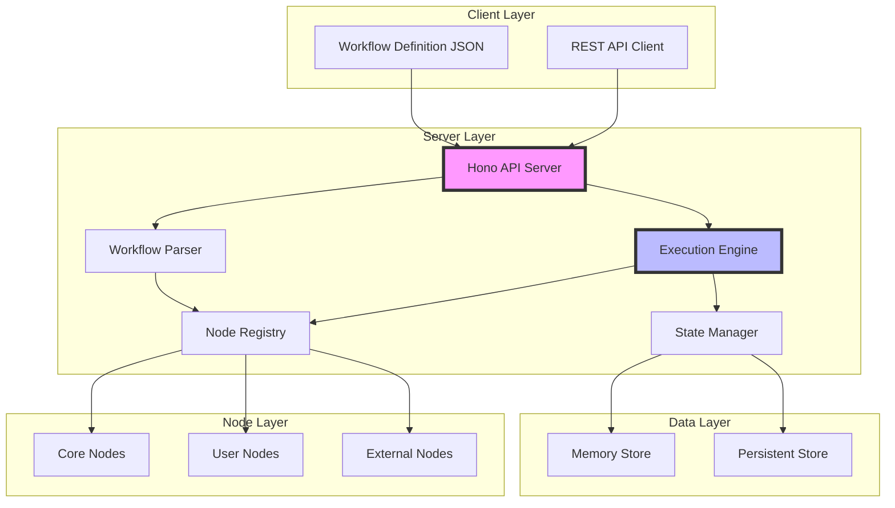
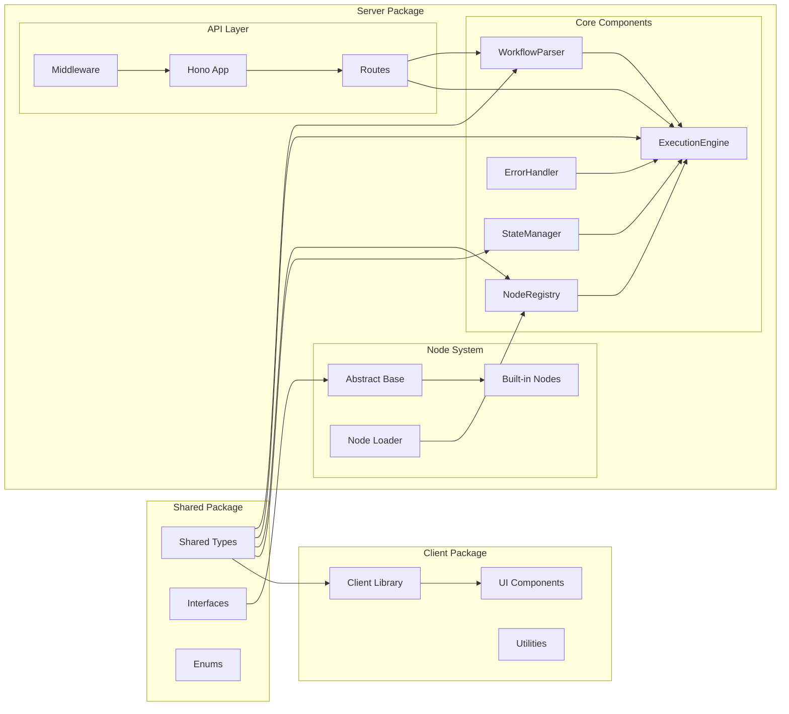
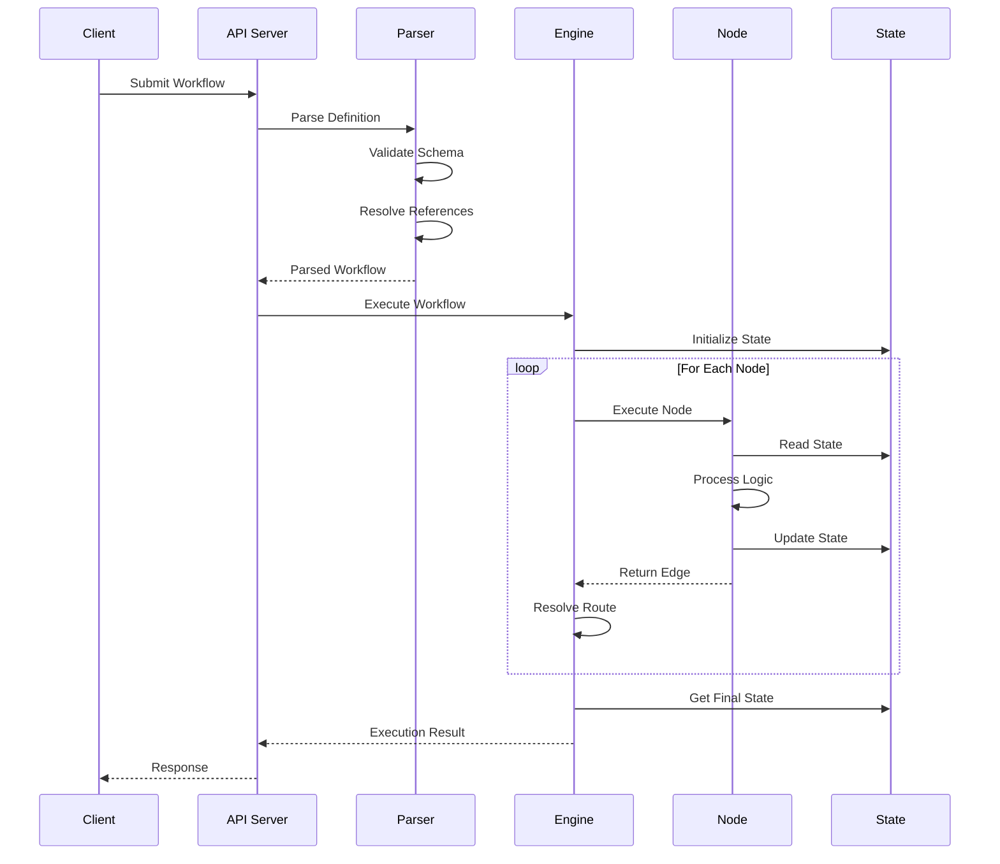

# Design Document

## Overview

The Agentic Workflow Engine is a sophisticated, node-based workflow execution system designed to process JSON-defined workflows with dynamic routing capabilities. The architecture leverages TypeScript's type system for compile-time safety while providing runtime flexibility through an abstract node system and edge-based routing. The engine enables complex business logic orchestration through a declarative JSON format, making workflow creation accessible to non-programmers while maintaining the power and extensibility needed for complex enterprise scenarios.

The system is built on a modular, event-driven architecture that separates concerns into distinct components: workflow parsing and validation, node registry and discovery, execution orchestration, and state management. Each component is designed to be independently testable and scalable, following SOLID principles and leveraging modern TypeScript patterns. The monorepo structure ensures type safety across packages while enabling independent deployment and versioning of components.

## Architecture

### High-Level Architecture

The Agentic Workflow Engine follows a layered architecture pattern with clear separation between the presentation layer (JSON workflows), business logic layer (execution engine and nodes), and data layer (state management). The system is designed for both standalone deployment and integration into larger systems.



### Component Architecture

The system is organized as a monorepo with three main packages: shared types, server implementation, and client utilities. Each package has specific responsibilities and dependencies.



## Components and Interfaces

### Core Interfaces (shared/src/types/)

#### WorkflowNode Abstract Class
```typescript
// shared/src/types/WorkflowNode.ts
export interface NodeMetadata {
  id: string;
  name: string;
  description?: string;
  version: string;
  inputs?: string[];
  outputs?: string[];
}

export interface ExecutionContext {
  state: Record<string, any>;
  inputs: Record<string, any>;
  workflowId: string;
  nodeId: string;
  executionId: string;
}

export type EdgeFunction = (context: ExecutionContext) => any;
export type EdgeMap = Record<string, EdgeFunction>;

export abstract class WorkflowNode {
  abstract metadata: NodeMetadata;
  
  abstract execute(
    context: ExecutionContext,
    config?: Record<string, any>
  ): Promise<EdgeMap>;
}
```

#### Workflow Definition Types
```typescript
// shared/src/types/WorkflowDefinition.ts
export interface WorkflowDefinition {
  id: string;
  name: string;
  version: string;
  initialState?: Record<string, any>;
  workflow: NodeConfiguration[];
}

export type NodeConfiguration = Record<string, NodeConfigValue>;
export type NodeConfigValue = 
  | string 
  | string[] 
  | Record<string, any>
  | NodeConfiguration;

export interface ParsedNode {
  nodeId: string;
  config: Record<string, any>;
  edges: Record<string, EdgeRoute>;
}

export type EdgeRoute = 
  | string 
  | string[] 
  | NodeConfiguration;
```

### Node Registry (server/src/registry/)

#### NodeRegistry Class
```typescript
// server/src/registry/NodeRegistry.ts
export class NodeRegistry {
  private nodes: Map<string, NodeRegistration> = new Map();
  private instances: Map<string, WorkflowNode> = new Map();

  interface NodeRegistration {
    nodeClass: typeof WorkflowNode;
    metadata: NodeMetadata;
    singleton: boolean;
  }

  async register(
    nodeClass: typeof WorkflowNode,
    options?: { singleton?: boolean }
  ): Promise<void> {
    const instance = new nodeClass();
    const metadata = instance.metadata;
    
    this.nodes.set(metadata.id, {
      nodeClass,
      metadata,
      singleton: options?.singleton ?? false
    });
  }

  async discover(directory: string): Promise<void> {
    const files = await glob(`${directory}/**/*.ts`);
    for (const file of files) {
      const module = await import(file);
      if (module.default && module.default.prototype instanceof WorkflowNode) {
        await this.register(module.default);
      }
    }
  }

  getInstance(nodeId: string): WorkflowNode {
    const registration = this.nodes.get(nodeId);
    if (!registration) {
      throw new NodeNotFoundError(nodeId);
    }

    if (registration.singleton) {
      if (!this.instances.has(nodeId)) {
        this.instances.set(nodeId, new registration.nodeClass());
      }
      return this.instances.get(nodeId)!;
    }

    return new registration.nodeClass();
  }

  getMetadata(nodeId: string): NodeMetadata {
    const registration = this.nodes.get(nodeId);
    if (!registration) {
      throw new NodeNotFoundError(nodeId);
    }
    return registration.metadata;
  }

  listNodes(): NodeMetadata[] {
    return Array.from(this.nodes.values()).map(r => r.metadata);
  }
}
```

### Workflow Parser (server/src/parser/)

#### WorkflowParser Class
```typescript
// server/src/parser/WorkflowParser.ts
export class WorkflowParser {
  constructor(
    private registry: NodeRegistry,
    private schema: JSONSchema
  ) {}

  async parse(definition: any): Promise<ParsedWorkflow> {
    // Validate against JSON schema
    const validation = await this.validateSchema(definition);
    if (!validation.valid) {
      throw new ValidationError(validation.errors);
    }

    const parsed: ParsedWorkflow = {
      id: definition.id,
      name: definition.name,
      version: definition.version,
      initialState: definition.initialState || {},
      nodes: []
    };

    // Parse each node configuration
    for (const nodeConfig of definition.workflow) {
      const parsedNodes = await this.parseNodeConfig(nodeConfig);
      parsed.nodes.push(...parsedNodes);
    }

    // Validate node references
    await this.validateNodeReferences(parsed);

    return parsed;
  }

  private async parseNodeConfig(
    config: NodeConfiguration
  ): Promise<ParsedNode[]> {
    const result: ParsedNode[] = [];

    for (const [key, value] of Object.entries(config)) {
      const nodeId = key.replace(/\?$/, '');
      const { params, edges } = this.separateParamsAndEdges(value);

      // Validate node exists in registry
      this.registry.getMetadata(nodeId);

      result.push({
        nodeId,
        config: params,
        edges
      });

      // Recursively parse nested configurations
      for (const edge of Object.values(edges)) {
        if (typeof edge === 'object' && !Array.isArray(edge)) {
          const nested = await this.parseNodeConfig(edge);
          result.push(...nested);
        }
      }
    }

    return result;
  }

  private separateParamsAndEdges(
    value: NodeConfigValue
  ): { params: Record<string, any>, edges: Record<string, EdgeRoute> } {
    const params: Record<string, any> = {};
    const edges: Record<string, EdgeRoute> = {};

    if (typeof value === 'object' && !Array.isArray(value)) {
      for (const [k, v] of Object.entries(value)) {
        if (k.endsWith('?')) {
          edges[k.slice(0, -1)] = v;
        } else {
          params[k] = v;
        }
      }
    }

    return { params, edges };
  }
}
```

### Execution Engine (server/src/engine/)

#### ExecutionEngine Class
```typescript
// server/src/engine/ExecutionEngine.ts
export class ExecutionEngine {
  constructor(
    private registry: NodeRegistry,
    private stateManager: StateManager,
    private errorHandler: ErrorHandler
  ) {}

  async execute(workflow: ParsedWorkflow): Promise<ExecutionResult> {
    const executionId = generateId();
    const context = this.createInitialContext(workflow, executionId);

    try {
      // Initialize state
      await this.stateManager.initialize(executionId, workflow.initialState);

      // Execute nodes in sequence
      let currentIndex = 0;
      while (currentIndex < workflow.nodes.length) {
        const node = workflow.nodes[currentIndex];
        const result = await this.executeNode(node, context);

        if (result.edge && node.edges[result.edge]) {
          // Handle edge routing
          const route = node.edges[result.edge];
          currentIndex = await this.resolveEdgeRoute(route, workflow, context);
        } else {
          // Continue to next node
          currentIndex++;
        }

        // Handle loop detection
        if (result.edge === 'loop') {
          context.loopCount = (context.loopCount || 0) + 1;
          if (context.loopCount > MAX_LOOP_ITERATIONS) {
            throw new LoopLimitError(node.nodeId);
          }
        } else {
          context.loopCount = 0;
        }
      }

      const finalState = await this.stateManager.getState(executionId);
      return {
        executionId,
        status: 'completed',
        finalState
      };

    } catch (error) {
      return this.errorHandler.handle(error, context);
    }
  }

  private async executeNode(
    node: ParsedNode,
    context: ExecutionContext
  ): Promise<NodeExecutionResult> {
    const instance = this.registry.getInstance(node.nodeId);
    
    // Update context for this node
    const nodeContext = {
      ...context,
      nodeId: node.nodeId,
      state: await this.stateManager.getState(context.executionId)
    };

    try {
      const edgeMap = await instance.execute(nodeContext, node.config);
      
      // Find which edge was taken
      let edgeTaken: string | null = null;
      let edgeData: any = null;

      for (const [edge, func] of Object.entries(edgeMap)) {
        const data = func(nodeContext);
        if (data !== undefined) {
          edgeTaken = edge;
          edgeData = data;
          break;
        }
      }

      // Update state with edge data
      if (edgeData) {
        await this.stateManager.updateState(
          context.executionId,
          { [`${node.nodeId}_output`]: edgeData }
        );
      }

      return { edge: edgeTaken, data: edgeData };

    } catch (error) {
      // Try error edge if available
      if (node.edges.error) {
        return { edge: 'error', data: error };
      }
      throw error;
    }
  }

  private async resolveEdgeRoute(
    route: EdgeRoute,
    workflow: ParsedWorkflow,
    context: ExecutionContext
  ): Promise<number> {
    if (typeof route === 'string') {
      // Find index of target node
      return workflow.nodes.findIndex(n => n.nodeId === route);
    } else if (Array.isArray(route)) {
      // Execute sequence and return to current position
      await this.executeSequence(route, context);
      return workflow.nodes.length; // End workflow
    } else {
      // Execute nested configuration
      const nested = await this.parseAndExecuteNested(route, context);
      return workflow.nodes.length; // End workflow
    }
  }
}
```

### State Manager (server/src/state/)

#### StateManager Class
```typescript
// server/src/state/StateManager.ts
export class StateManager {
  private states: Map<string, WorkflowState> = new Map();

  interface WorkflowState {
    data: Record<string, any>;
    version: number;
    lastModified: Date;
    locks: Set<string>;
  }

  async initialize(
    executionId: string,
    initialState: Record<string, any>
  ): Promise<void> {
    this.states.set(executionId, {
      data: { ...initialState },
      version: 0,
      lastModified: new Date(),
      locks: new Set()
    });
  }

  async getState(executionId: string): Promise<Record<string, any>> {
    const state = this.states.get(executionId);
    if (!state) {
      throw new StateNotFoundError(executionId);
    }
    return { ...state.data };
  }

  async updateState(
    executionId: string,
    updates: Record<string, any>
  ): Promise<void> {
    const state = this.states.get(executionId);
    if (!state) {
      throw new StateNotFoundError(executionId);
    }

    // Apply updates atomically
    state.data = { ...state.data, ...updates };
    state.version++;
    state.lastModified = new Date();
  }

  async lockKeys(
    executionId: string,
    keys: string[]
  ): Promise<() => void> {
    const state = this.states.get(executionId);
    if (!state) {
      throw new StateNotFoundError(executionId);
    }

    // Check if any keys are already locked
    for (const key of keys) {
      if (state.locks.has(key)) {
        throw new StateLockError(key);
      }
    }

    // Lock all keys
    keys.forEach(key => state.locks.add(key));

    // Return unlock function
    return () => {
      keys.forEach(key => state.locks.delete(key));
    };
  }
}
```

### Error Handler (server/src/errors/)

#### ErrorHandler Class
```typescript
// server/src/errors/ErrorHandler.ts
export class ErrorHandler {
  async handle(
    error: Error,
    context: ExecutionContext
  ): Promise<ExecutionResult> {
    const errorInfo = this.classifyError(error);

    // Log error with context
    console.error({
      executionId: context.executionId,
      workflowId: context.workflowId,
      nodeId: context.nodeId,
      error: {
        type: errorInfo.type,
        message: error.message,
        stack: error.stack,
        details: errorInfo.details
      }
    });

    return {
      executionId: context.executionId,
      status: 'failed',
      error: errorInfo,
      partialState: context.state
    };
  }

  private classifyError(error: Error): ErrorInfo {
    if (error instanceof ValidationError) {
      return {
        type: 'validation',
        severity: 'error',
        recoverable: false,
        details: error.validationErrors
      };
    } else if (error instanceof NodeNotFoundError) {
      return {
        type: 'configuration',
        severity: 'error',
        recoverable: false,
        details: { nodeId: error.nodeId }
      };
    } else if (error instanceof StateError) {
      return {
        type: 'state',
        severity: 'error',
        recoverable: true,
        details: { stateKey: error.key }
      };
    } else {
      return {
        type: 'runtime',
        severity: 'critical',
        recoverable: false,
        details: { message: error.message }
      };
    }
  }
}
```

## Data Models

### Workflow Definition Schema

```json
{
  "$schema": "http://json-schema.org/draft-07/schema#",
  "type": "object",
  "required": ["id", "name", "version", "workflow"],
  "properties": {
    "id": {
      "type": "string",
      "pattern": "^[a-zA-Z0-9-_]+$"
    },
    "name": {
      "type": "string",
      "minLength": 1
    },
    "version": {
      "type": "string",
      "pattern": "^\\d+\\.\\d+\\.\\d+$"
    },
    "initialState": {
      "type": "object"
    },
    "workflow": {
      "type": "array",
      "minItems": 1,
      "items": {
        "type": "object",
        "patternProperties": {
          "^[a-zA-Z0-9-_]+\\??$": {
            "oneOf": [
              { "type": "string" },
              { "type": "array" },
              { "type": "object" }
            ]
          }
        }
      }
    }
  }
}
```

### Runtime Data Models

```typescript
// Execution tracking
interface ExecutionRecord {
  id: string;
  workflowId: string;
  startTime: Date;
  endTime?: Date;
  status: 'running' | 'completed' | 'failed' | 'cancelled';
  currentNode?: string;
  executionPath: NodeExecution[];
  finalState?: Record<string, any>;
  error?: ErrorInfo;
}

interface NodeExecution {
  nodeId: string;
  startTime: Date;
  endTime: Date;
  config: Record<string, any>;
  edgeTaken?: string;
  outputData?: any;
  error?: Error;
}

// Performance metrics
interface PerformanceMetrics {
  executionId: string;
  totalDuration: number;
  nodeMetrics: Record<string, NodeMetric>;
  stateOperations: number;
  memoryUsage: MemorySnapshot[];
}

interface NodeMetric {
  executionCount: number;
  totalDuration: number;
  averageDuration: number;
  errors: number;
}
```

### Data Flow



## Key Design Patterns

### Template Method Pattern for Node Execution

The WorkflowNode abstract class uses the Template Method pattern to define the structure of node execution while allowing subclasses to implement specific behavior:

```typescript
// Example concrete node implementation
export class DataTransformNode extends WorkflowNode {
  metadata = {
    id: 'data-transform',
    name: 'Data Transform Node',
    version: '1.0.0',
    inputs: ['data', 'rules'],
    outputs: ['transformed']
  };

  async execute(
    context: ExecutionContext,
    config?: Record<string, any>
  ): Promise<EdgeMap> {
    const { data, rules } = context.inputs;
    
    try {
      const transformed = this.applyRules(data, rules);
      
      // Update state with result
      context.state.transformed = transformed;
      
      return {
        success: () => ({ transformed }),
        validation_failed: () => ({ errors: this.validationErrors })
      };
    } catch (error) {
      return {
        error: () => ({ error: error.message })
      };
    }
  }
}
```

### State Management with Memento Pattern

The StateManager implements a variation of the Memento pattern to provide state snapshots and rollback capabilities:

```typescript
class StateSnapshot {
  constructor(
    public readonly data: Record<string, any>,
    public readonly version: number,
    public readonly timestamp: Date
  ) {}
}

class StateManager {
  private snapshots: Map<string, StateSnapshot[]> = new Map();

  async createSnapshot(executionId: string): Promise<string> {
    const state = await this.getState(executionId);
    const snapshot = new StateSnapshot(
      { ...state },
      this.states.get(executionId)!.version,
      new Date()
    );
    
    const snapshots = this.snapshots.get(executionId) || [];
    snapshots.push(snapshot);
    this.snapshots.set(executionId, snapshots);
    
    return snapshot.timestamp.toISOString();
  }

  async rollback(executionId: string, snapshotId: string): Promise<void> {
    const snapshots = this.snapshots.get(executionId);
    const snapshot = snapshots?.find(
      s => s.timestamp.toISOString() === snapshotId
    );
    
    if (!snapshot) {
      throw new SnapshotNotFoundError(snapshotId);
    }
    
    await this.setState(executionId, snapshot.data);
  }
}
```

### Edge Resolution Algorithm

```typescript
class EdgeResolver {
  async resolve(
    edge: string,
    routes: Record<string, EdgeRoute>,
    workflow: ParsedWorkflow
  ): Promise<ExecutionPlan> {
    const route = routes[edge];
    
    if (!route) {
      // No route defined - continue sequentially
      return { type: 'continue' };
    }
    
    if (typeof route === 'string') {
      // Direct node reference
      const index = workflow.nodes.findIndex(n => n.nodeId === route);
      return { type: 'jump', targetIndex: index };
    }
    
    if (Array.isArray(route)) {
      // Sequence of nodes
      const plan = route.map(item => {
        if (typeof item === 'string') {
          return { type: 'node', nodeId: item };
        } else {
          return { type: 'nested', config: item };
        }
      });
      return { type: 'sequence', steps: plan };
    }
    
    // Nested configuration
    return { type: 'nested', config: route };
  }
}
```

### Loop Detection and Prevention

```typescript
class LoopDetector {
  private executionHistory: Map<string, NodeVisit[]> = new Map();

  recordVisit(executionId: string, nodeId: string): void {
    const history = this.executionHistory.get(executionId) || [];
    history.push({
      nodeId,
      timestamp: Date.now(),
      iteration: this.countIterations(history, nodeId) + 1
    });
    this.executionHistory.set(executionId, history);
  }

  detectInfiniteLoop(executionId: string, nodeId: string): boolean {
    const history = this.executionHistory.get(executionId) || [];
    const iterations = this.countIterations(history, nodeId);
    
    // Check for rapid repeated execution
    const recentVisits = history
      .filter(v => v.nodeId === nodeId)
      .slice(-5);
    
    if (recentVisits.length >= 5) {
      const timeSpan = recentVisits[4].timestamp - recentVisits[0].timestamp;
      if (timeSpan < 1000) { // 5 visits in 1 second
        return true;
      }
    }
    
    return iterations > MAX_LOOP_ITERATIONS;
  }

  private countIterations(history: NodeVisit[], nodeId: string): number {
    return history.filter(v => v.nodeId === nodeId).length;
  }
}
```

## Error Handling

### Error Categories

1. **Validation Errors**: Schema violations, invalid JSON, missing required fields
2. **Configuration Errors**: Unknown nodes, invalid parameters, circular dependencies
3. **Runtime Errors**: Node execution failures, state conflicts, resource exhaustion
4. **System Errors**: Network failures, storage errors, memory limits

### Error Handling Strategy

The system implements a multi-level error handling strategy:

```typescript
// Error hierarchy
abstract class WorkflowError extends Error {
  abstract readonly code: string;
  abstract readonly recoverable: boolean;
}

class ValidationError extends WorkflowError {
  code = 'VALIDATION_ERROR';
  recoverable = false;
  
  constructor(
    message: string,
    public validationErrors: ValidationIssue[]
  ) {
    super(message);
  }
}

class NodeExecutionError extends WorkflowError {
  code = 'NODE_EXECUTION_ERROR';
  recoverable = true;
  
  constructor(
    public nodeId: string,
    public originalError: Error
  ) {
    super(`Node ${nodeId} failed: ${originalError.message}`);
  }
}

// Recovery strategies
interface RecoveryStrategy {
  canRecover(error: WorkflowError): boolean;
  recover(error: WorkflowError, context: ExecutionContext): Promise<void>;
}

class RetryStrategy implements RecoveryStrategy {
  canRecover(error: WorkflowError): boolean {
    return error.recoverable && error instanceof NodeExecutionError;
  }
  
  async recover(
    error: NodeExecutionError,
    context: ExecutionContext
  ): Promise<void> {
    // Implement exponential backoff retry
  }
}
```

### Recovery Mechanisms

1. **Automatic Retry**: Transient errors trigger automatic retry with exponential backoff
2. **Error Routes**: Workflow-defined error handling paths
3. **State Rollback**: Revert to previous state snapshot on critical errors
4. **Circuit Breaker**: Prevent cascading failures by stopping problematic nodes

## Testing Strategy

### Unit Testing

Focus on testing individual components in isolation:

```typescript
// Example node test
describe('DataTransformNode', () => {
  let node: DataTransformNode;
  let mockContext: ExecutionContext;
  
  beforeEach(() => {
    node = new DataTransformNode();
    mockContext = createMockContext({
      inputs: { data: testData, rules: testRules }
    });
  });
  
  it('should transform data according to rules', async () => {
    const edges = await node.execute(mockContext, {});
    const result = edges.success(mockContext);
    
    expect(result.transformed).toEqual(expectedOutput);
    expect(mockContext.state.transformed).toEqual(expectedOutput);
  });
  
  it('should return validation_failed edge on invalid data', async () => {
    mockContext.inputs.data = invalidData;
    const edges = await node.execute(mockContext, {});
    
    expect(edges.validation_failed).toBeDefined();
    expect(edges.success).not.toBeDefined();
  });
});
```

### Integration Testing

Test component interactions and workflow execution:

```typescript
// Workflow execution test
describe('WorkflowEngine Integration', () => {
  let engine: ExecutionEngine;
  let registry: NodeRegistry;
  
  beforeEach(async () => {
    registry = new NodeRegistry();
    await registry.discover('./test-nodes');
    
    engine = new ExecutionEngine(
      registry,
      new StateManager(),
      new ErrorHandler()
    );
  });
  
  it('should execute complete workflow', async () => {
    const workflow = await loadTestWorkflow('data-pipeline.json');
    const result = await engine.execute(workflow);
    
    expect(result.status).toBe('completed');
    expect(result.finalState.outputFile).toBeDefined();
  });
});
```

### Test Data Strategy

```typescript
// Test data factory
class TestDataFactory {
  static createWorkflow(options: Partial<WorkflowDefinition>): WorkflowDefinition {
    return {
      id: 'test-workflow',
      name: 'Test Workflow',
      version: '1.0.0',
      initialState: {},
      workflow: [],
      ...options
    };
  }
  
  static createExecutionContext(
    overrides: Partial<ExecutionContext>
  ): ExecutionContext {
    return {
      state: {},
      inputs: {},
      workflowId: 'test-workflow',
      nodeId: 'test-node',
      executionId: generateId(),
      ...overrides
    };
  }
}
```

### Performance Testing

```typescript
// Performance benchmarks
describe('Performance', () => {
  it('should handle 1000 node executions under 10 seconds', async () => {
    const workflow = createLargeWorkflow(1000);
    const start = Date.now();
    
    const result = await engine.execute(workflow);
    
    const duration = Date.now() - start;
    expect(duration).toBeLessThan(10000);
    expect(result.status).toBe('completed');
  });
  
  it('should maintain memory usage under 100MB', async () => {
    const initialMemory = process.memoryUsage().heapUsed;
    
    for (let i = 0; i < 100; i++) {
      await engine.execute(testWorkflow);
    }
    
    const finalMemory = process.memoryUsage().heapUsed;
    const increase = finalMemory - initialMemory;
    
    expect(increase).toBeLessThan(100 * 1024 * 1024);
  });
});
```

## API Design

### REST Endpoints

```yaml
openapi: 3.0.0
info:
  title: Workflow Engine API
  version: 1.0.0

paths:
  /workflows:
    post:
      summary: Submit workflow for execution
      requestBody:
        content:
          application/json:
            schema:
              $ref: '#/components/schemas/WorkflowDefinition'
      responses:
        '202':
          description: Workflow accepted
          content:
            application/json:
              schema:
                type: object
                properties:
                  executionId:
                    type: string
                  status:
                    type: string
                  links:
                    type: object

  /executions/{executionId}:
    get:
      summary: Get execution status
      parameters:
        - name: executionId
          in: path
          required: true
          schema:
            type: string
      responses:
        '200':
          description: Execution details
          content:
            application/json:
              schema:
                $ref: '#/components/schemas/ExecutionResult'

  /executions/{executionId}/state:
    get:
      summary: Get current execution state
      parameters:
        - name: executionId
          in: path
          required: true
          schema:
            type: string
      responses:
        '200':
          description: Current state
          content:
            application/json:
              schema:
                type: object

  /nodes:
    get:
      summary: List available nodes
      responses:
        '200':
          description: Node list
          content:
            application/json:
              schema:
                type: array
                items:
                  $ref: '#/components/schemas/NodeMetadata'
```

### Error Response Format

```json
{
  "error": {
    "code": "VALIDATION_ERROR",
    "message": "Workflow validation failed",
    "details": [
      {
        "path": "/workflow/0/process-data",
        "message": "Unknown node: process-data",
        "line": 15,
        "column": 8
      }
    ],
    "timestamp": "2024-01-15T10:30:00Z",
    "executionId": "exec-123",
    "requestId": "req-456"
  }
}
```

## Implementation Considerations

### Performance Optimizations

1. **Node Pool Management**: Reuse node instances for stateless nodes
2. **State Batching**: Batch state updates to reduce I/O operations
3. **Parallel Execution**: Execute independent branches concurrently
4. **Lazy Loading**: Load nodes only when needed
5. **Caching**: Cache parsed workflows and node metadata

```typescript
// Node pool implementation
class NodePool {
  private pools: Map<string, WorkflowNode[]> = new Map();
  private maxPoolSize = 10;
  
  acquire(nodeId: string): WorkflowNode {
    const pool = this.pools.get(nodeId) || [];
    
    if (pool.length > 0) {
      return pool.pop()!;
    }
    
    return this.registry.getInstance(nodeId);
  }
  
  release(nodeId: string, instance: WorkflowNode): void {
    const pool = this.pools.get(nodeId) || [];
    
    if (pool.length < this.maxPoolSize) {
      pool.push(instance);
      this.pools.set(nodeId, pool);
    }
  }
}
```

### Security Considerations

1. **Input Sanitization**: Validate all workflow definitions against schema
2. **Execution Isolation**: Run nodes in isolated contexts
3. **Resource Limits**: Enforce memory and CPU limits per execution
4. **Access Control**: Implement role-based access to workflows
5. **Audit Trail**: Log all workflow executions and state changes

```typescript
// Security middleware
class SecurityMiddleware {
  async validateWorkflow(
    workflow: WorkflowDefinition,
    user: User
  ): Promise<void> {
    // Check user permissions
    if (!user.canExecute(workflow.id)) {
      throw new UnauthorizedError();
    }
    
    // Validate against whitelist
    for (const node of workflow.workflow) {
      const nodeId = Object.keys(node)[0];
      if (!this.isWhitelisted(nodeId, user)) {
        throw new ForbiddenNodeError(nodeId);
      }
    }
    
    // Check resource limits
    if (workflow.workflow.length > MAX_NODES_PER_WORKFLOW) {
      throw new ResourceLimitError('Too many nodes');
    }
  }
}
```

### Scalability Design

1. **Distributed Execution**: Support execution across multiple workers
2. **Event-Driven Architecture**: Use message queues for node communication
3. **Horizontal Scaling**: Stateless design enables easy scaling
4. **Database Sharding**: Partition execution data by workflow ID
5. **Load Balancing**: Distribute workflows across execution nodes

```typescript
// Distributed execution adapter
class DistributedExecutor {
  constructor(
    private queue: MessageQueue,
    private workers: WorkerPool
  ) {}
  
  async executeDistributed(
    workflow: ParsedWorkflow
  ): Promise<ExecutionResult> {
    const executionId = generateId();
    
    // Split workflow into tasks
    const tasks = this.createExecutionTasks(workflow);
    
    // Queue tasks for workers
    for (const task of tasks) {
      await this.queue.publish({
        executionId,
        task,
        priority: this.calculatePriority(task)
      });
    }
    
    // Wait for completion
    return this.waitForCompletion(executionId);
  }
}
```

### Development Workflow

1. **Local Development**: `bun run dev` for hot-reloading development
2. **Testing**: Comprehensive test suite with coverage requirements
3. **CI/CD Pipeline**: Automated testing and deployment
4. **Documentation**: Auto-generated API docs from TypeScript
5. **Monitoring**: OpenTelemetry integration for observability

```typescript
// Development configuration
export const devConfig = {
  server: {
    port: process.env.PORT || 3000,
    host: 'localhost',
    cors: {
      origin: '*',
      credentials: true
    }
  },
  engine: {
    maxConcurrentExecutions: 10,
    defaultTimeout: 30000,
    enableProfiling: true
  },
  monitoring: {
    enableTracing: true,
    enableMetrics: true,
    exportInterval: 10000
  }
};
```

## Technology Stack

### Core Technologies
- **Runtime**: Bun 1.x - Fast JavaScript runtime with native TypeScript support
- **Language**: TypeScript 5.x - Type safety and modern JavaScript features
- **Server Framework**: Hono 3.x - Lightweight, fast web framework
- **Validation**: Ajv 8.x - JSON Schema validation
- **Testing**: Vitest - Fast, Vite-powered test runner

### Development Tools
- **Build Tool**: Bun's built-in bundler
- **Linting**: ESLint with TypeScript plugin
- **Formatting**: Prettier with consistent code style
- **Documentation**: TypeDoc for API documentation
- **Version Control**: Git with conventional commits

### Infrastructure
- **Container**: Docker with multi-stage builds
- **Orchestration**: Kubernetes for production deployment
- **Message Queue**: Redis Streams for distributed execution
- **Database**: PostgreSQL for persistent state storage
- **Cache**: Redis for temporary state and caching

### Monitoring and Observability
- **Tracing**: OpenTelemetry for distributed tracing
- **Metrics**: Prometheus for metrics collection
- **Logging**: Pino for structured logging
- **Dashboards**: Grafana for visualization
- **Alerting**: AlertManager for incident management