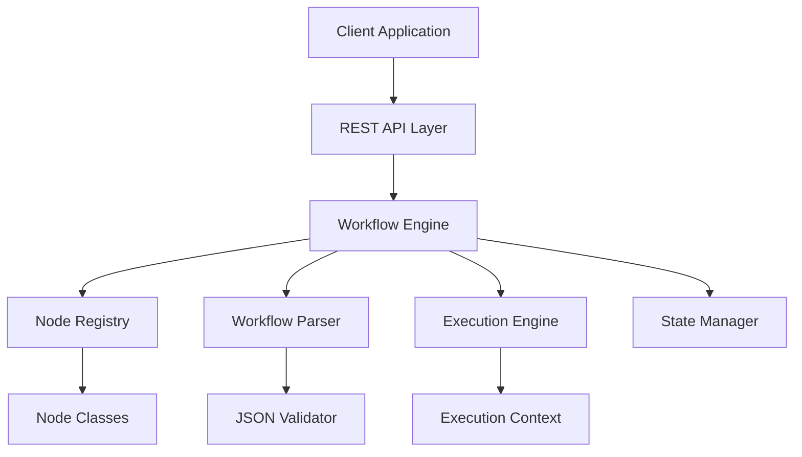
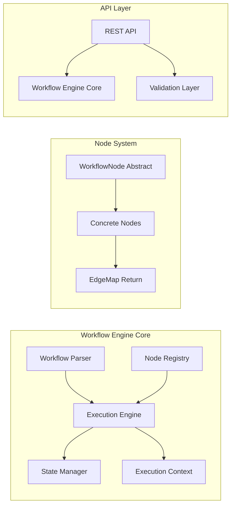
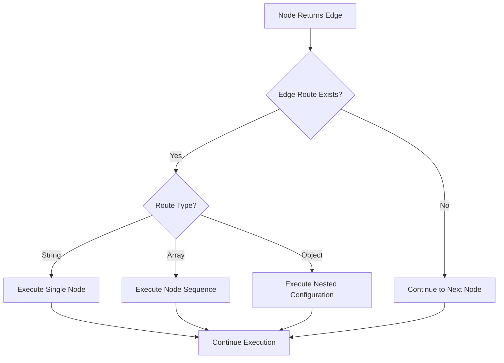

# Design Document

## Overview

The JSON-based agentic workflow execution engine is designed as a TypeScript/Bun application using a monorepo architecture. The system consists of core execution components, a REST API layer, and a flexible node registry system. The engine processes JSON workflow definitions and executes them through a node-based architecture with edge routing for flow control.

## Architecture

### High-Level Architecture



### Monorepo Structure

The system leverages the existing monorepo structure:

- **shared/**: Core types, interfaces, and utilities shared across all packages
- **server/**: Hono-based REST API and workflow execution engine
- **client/**: React-based workflow management interface (future enhancement)

### Core Components Architecture



## Components and Interfaces

### Core Interfaces (shared/src/types/)

#### WorkflowNode Abstract Class
```typescript
export abstract class WorkflowNode {
  abstract metadata: NodeMetadata;
  
  abstract execute(
    context: ExecutionContext, 
    config?: Record<string, any>
  ): Promise<EdgeMap>;
}
```

#### Supporting Types
```typescript
export interface NodeMetadata {
  id: string;
  name: string;
  description?: string;
  version: string;
  inputs?: string[];
  outputs?: string[];
}

export interface ExecutionContext {
  state: Record<string, any>;
  inputs: Record<string, any>;
  workflowId: string;
  nodeId: string;
  executionId: string;
}

export type EdgeMap = Record<string, () => any>;

export interface WorkflowDefinition {
  id: string;
  name: string;
  version: string;
  initialState?: Record<string, any>;
  workflow: Record<string, NodeConfiguration>;
}

export type NodeConfiguration = Record<string, any>;

export interface ExecutionResult {
  executionId: string;
  workflowId: string;
  status: 'running' | 'completed' | 'failed';
  finalState?: Record<string, any>;
  error?: string;
  startTime: Date;
  endTime?: Date;
}
```

### Node Registry (server/src/registry/)

#### NodeRegistry Class
```typescript
export class NodeRegistry {
  private nodes: Map<string, typeof WorkflowNode>;
  
  register(nodeClass: typeof WorkflowNode): void;
  get(nodeId: string): typeof WorkflowNode | undefined;
  getMetadata(nodeId: string): NodeMetadata | undefined;
  listAll(): NodeMetadata[];
  discover(): Promise<void>; // Auto-discover nodes from filesystem
}
```

### Workflow Parser (server/src/parser/)

#### WorkflowParser Class
```typescript
export class WorkflowParser {
  validate(workflow: unknown): ValidationResult;
  parse(workflowJson: string): WorkflowDefinition;
  resolveNodeReferences(workflow: WorkflowDefinition): ResolvedWorkflow;
  validateNodeConfigurations(workflow: WorkflowDefinition): ValidationResult;
}

export interface ValidationResult {
  valid: boolean;
  errors: ValidationError[];
}

export interface ValidationError {
  path: string;
  message: string;
  code: string;
}
```

### Execution Engine (server/src/engine/)

#### ExecutionEngine Class
```typescript
export class ExecutionEngine {
  private registry: NodeRegistry;
  private stateManager: StateManager;
  private activeExecutions: Map<string, ExecutionState>;
  
  async execute(workflow: WorkflowDefinition): Promise<string>; // Returns execution ID
  async getStatus(executionId: string): Promise<ExecutionResult>;
  private async executeNode(nodeId: string, context: ExecutionContext): Promise<EdgeMap>;
  private async handleEdgeRouting(edge: string, edgeMap: EdgeMap, context: ExecutionContext): Promise<void>;
  private async handleLoopExecution(loopConfig: any, context: ExecutionContext): Promise<void>;
}

interface ExecutionState {
  workflowId: string;
  currentNode: string;
  state: Record<string, any>;
  status: 'running' | 'completed' | 'failed';
  startTime: Date;
  endTime?: Date;
  error?: string;
}
```

### State Manager (server/src/state/)

#### StateManager Class
```typescript
export class StateManager {
  private states: Map<string, Record<string, any>>;
  
  initialize(executionId: string, initialState?: Record<string, any>): void;
  get(executionId: string): Record<string, any>;
  update(executionId: string, updates: Record<string, any>): void;
  cleanup(executionId: string): void;
}
```

## Data Models

### Workflow Definition Schema

```json
{
  "$schema": "http://json-schema.org/draft-07/schema#",
  "type": "object",
  "required": ["id", "name", "version", "workflow"],
  "properties": {
    "id": {
      "type": "string",
      "pattern": "^[a-zA-Z0-9-_]+$"
    },
    "name": {
      "type": "string"
    },
    "version": {
      "type": "string",
      "pattern": "^\\d+\\.\\d+\\.\\d+$"
    },
    "initialState": {
      "type": "object"
    },
    "workflow": {
      "type": "object",
      "patternProperties": {
        "^[a-zA-Z0-9-_]+$": {
          "type": "object"
        }
      }
    }
  }
}
```

### Node Configuration Patterns

The system supports three types of node configurations:

1. **Simple Configuration**: Direct parameter mapping
2. **Edge Routing**: Parameters with optional edge routes (keys ending with '?')
3. **Nested Configuration**: Complex routing with embedded node configurations

### Edge Routing Resolution



## Error Handling

### Error Categories

1. **Validation Errors**: JSON schema violations, missing nodes, invalid configurations
2. **Runtime Errors**: Node execution failures, state corruption, system errors
3. **Flow Control Errors**: Circular references, infinite loops, invalid edge routing

### Error Handling Strategy

```typescript
export interface WorkflowError {
  type: 'validation' | 'runtime' | 'flow_control';
  code: string;
  message: string;
  nodeId?: string;
  executionId?: string;
  context?: Record<string, any>;
}

export class ErrorHandler {
  handle(error: WorkflowError, context: ExecutionContext): Promise<void>;
  logError(error: WorkflowError): void;
  createErrorResponse(error: WorkflowError): ApiResponse;
}
```

### Recovery Mechanisms

- **Graceful Degradation**: Continue execution when possible
- **Error Edge Routing**: Route to error handling nodes when defined
- **State Preservation**: Maintain state for debugging and recovery
- **Execution Termination**: Clean shutdown on unrecoverable errors

## Testing Strategy

### Unit Testing

- **Node Classes**: Test individual node implementations with mock contexts
- **Core Components**: Test registry, parser, engine, and state manager in isolation
- **Edge Cases**: Test error conditions, invalid inputs, and boundary conditions

### Integration Testing

- **Workflow Execution**: End-to-end testing of complete workflow scenarios
- **API Endpoints**: Test REST API with various workflow definitions
- **State Management**: Test state persistence and sharing across nodes

### Test Data Strategy

```typescript
// Test workflow definitions for different scenarios
export const testWorkflows = {
  simple: { /* Basic linear workflow */ },
  branching: { /* Conditional routing workflow */ },
  looping: { /* Iterative processing workflow */ },
  error: { /* Error handling workflow */ },
  complex: { /* Multi-pattern workflow */ }
};

// Mock node implementations for testing
export class MockNode extends WorkflowNode {
  // Configurable behavior for testing different scenarios
}
```

### Performance Testing

- **Concurrent Executions**: Test multiple simultaneous workflow executions
- **Large Workflows**: Test workflows with many nodes and complex routing
- **Memory Usage**: Monitor state management and cleanup
- **Response Times**: Measure API response times under load

## API Design

### REST Endpoints

```typescript
// POST /api/workflows/execute
interface ExecuteWorkflowRequest {
  workflow: WorkflowDefinition;
}

interface ExecuteWorkflowResponse {
  executionId: string;
  status: 'started';
}

// GET /api/workflows/executions/:id
interface GetExecutionResponse {
  executionId: string;
  workflowId: string;
  status: 'running' | 'completed' | 'failed';
  finalState?: Record<string, any>;
  error?: string;
  startTime: string;
  endTime?: string;
}

// GET /api/nodes
interface ListNodesResponse {
  nodes: NodeMetadata[];
}

// POST /api/workflows/validate
interface ValidateWorkflowRequest {
  workflow: WorkflowDefinition;
}

interface ValidateWorkflowResponse {
  valid: boolean;
  errors: ValidationError[];
}
```

### Error Response Format

```typescript
interface ApiErrorResponse {
  success: false;
  error: {
    type: string;
    code: string;
    message: string;
    details?: Record<string, any>;
  };
}
```

## Implementation Considerations

### Performance Optimizations

- **Node Caching**: Cache node instances for reuse across executions
- **State Optimization**: Efficient state storage and retrieval mechanisms
- **Concurrent Execution**: Support for parallel workflow execution
- **Memory Management**: Automatic cleanup of completed executions

### Security Considerations

- **Input Validation**: Comprehensive validation of workflow definitions
- **Execution Isolation**: Prevent nodes from accessing system resources inappropriately
- **Resource Limits**: Prevent infinite loops and resource exhaustion
- **Access Control**: Future authentication and authorization mechanisms

### Scalability Design

- **Stateless Execution**: Design for horizontal scaling
- **External State Storage**: Support for Redis or database state persistence
- **Load Balancing**: API design compatible with load balancers
- **Monitoring**: Built-in metrics and observability hooks

### Development Workflow

- **Hot Reloading**: Development server with automatic node discovery
- **Debugging Support**: Comprehensive logging and execution tracing
- **Node Development**: Simple process for creating and testing new nodes
- **Documentation**: Auto-generated API documentation and node catalogs