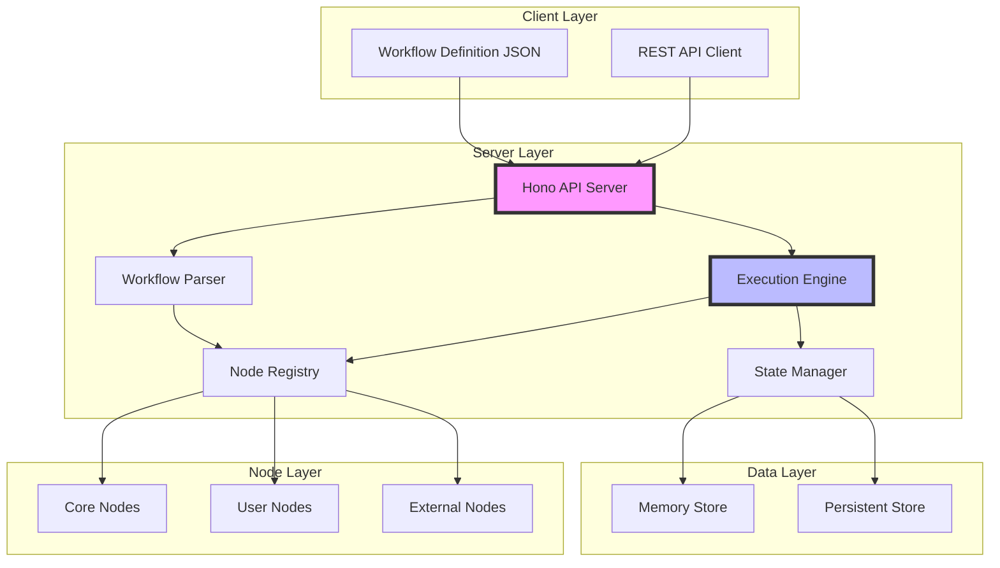
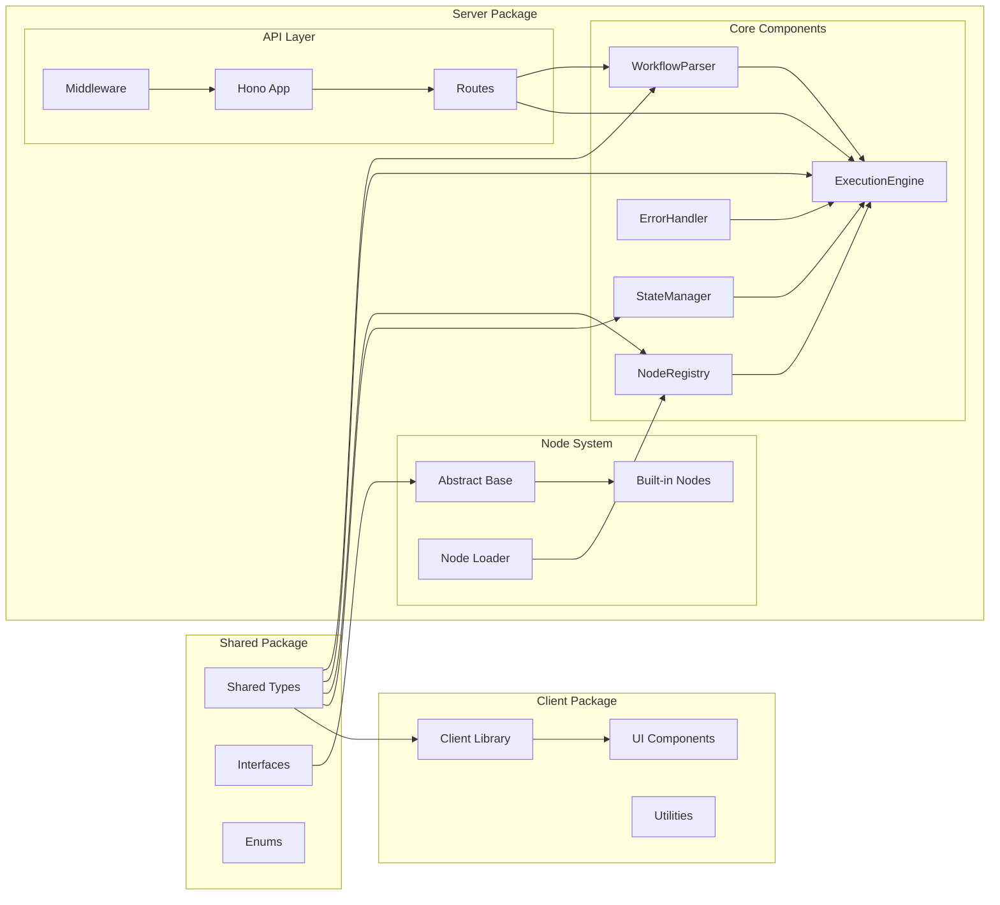
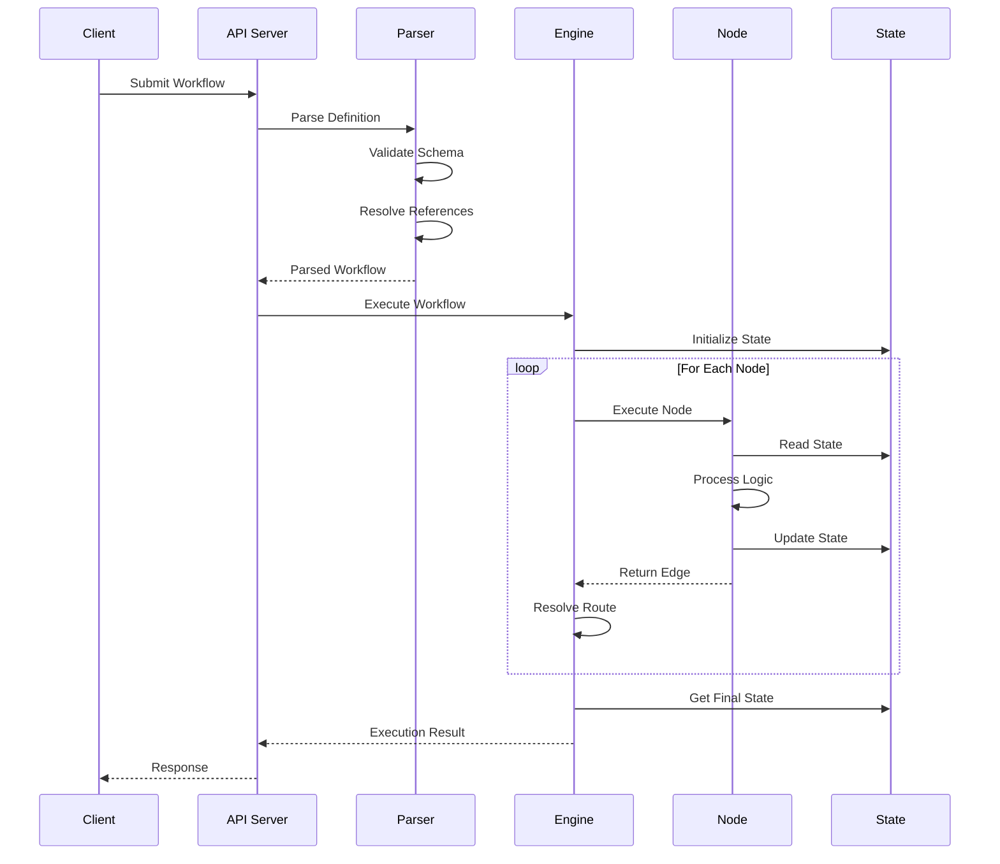

# Design Document

## Overview

The Agentic Workflow Engine is a sophisticated, node-based workflow execution system designed to process JSON-defined workflows with dynamic routing capabilities. The architecture leverages TypeScript's type system for compile-time safety while providing runtime flexibility through an abstract node system and edge-based routing. The engine enables complex business logic orchestration through a declarative JSON format, making workflow creation accessible to non-programmers while maintaining the power and extensibility needed for complex enterprise scenarios.

The system is built on a modular, event-driven architecture that separates concerns into distinct components: workflow parsing and validation, node registry and discovery, execution orchestration, and state management. Each component is designed to be independently testable and scalable, following SOLID principles and leveraging modern TypeScript patterns. The monorepo structure ensures type safety across packages while enabling independent deployment and versioning of components.

**Implementation Status**: The core components are fully implemented with advanced features including AST-like workflow parsing, comprehensive state management with snapshots and locking, and sophisticated edge routing with nested configurations. The execution engine supports both simple and complex workflow patterns with robust error handling and loop detection.

## Key Implementation Enhancements

The current implementation significantly exceeds the original requirements with these advanced features:

### 1. AST-like Workflow Parsing
- **Enhanced ParsedNode Structure**: Includes parent/child relationships, depth tracking, and unique IDs
- **Tree-based Parsing**: Full recursive parsing creating hierarchical workflow structures
- **Complex Edge Types**: Three distinct edge types (simple, sequence, nested) with typed routing

### 2. Advanced State Management
- **Atomic Updates**: Thread-safe state modifications with optional key locking
- **Snapshot System**: Memento pattern implementation for state rollback capability
- **Edge Context Passing**: Temporary data passing between nodes via edges
- **Persistence Adapter**: Optional external storage support for workflow state
- **Automatic Cleanup**: Scheduled state cleanup for completed executions

### 3. Sophisticated Execution Engine
- **Loop Detection**: Built-in iteration limits and loop tracking
- **Error Recovery**: Comprehensive error handling with typed exceptions
- **Nested Node Execution**: Full support for deeply nested workflow configurations
- **Context Enhancement**: Extended execution context with edge data integration

### 4. Enhanced Type Safety
- **Comprehensive Error Types**: Specific error classes for different failure scenarios
- **Typed Edge Routing**: Strongly typed edge structures for better compile-time safety
- **Advanced Interfaces**: Rich type definitions supporting complex workflow patterns

### 5. Production-Ready Features
- **Unique ID Generation**: UUID-based execution and node identification
- **Timeout Support**: Configurable execution timeouts
- **Memory Management**: Automatic cleanup and resource management
- **Extensible Architecture**: Plugin-ready design with adapter patterns

### 6. Single-Edge Design Pattern
- **Simplified Node Logic**: Nodes determine internally which single edge to return (99% use case)
- **Context-Driven Decisions**: Edge selection based on execution context, state, and configuration
- **Clean Data Flow**: Each node returns one edge with data for the next node
- **Predictable Execution**: Eliminates complex conditional edge mapping for better maintainability

## Architecture

### High-Level Architecture

The Agentic Workflow Engine follows a layered architecture pattern with clear separation between the presentation layer (JSON workflows), business logic layer (execution engine and nodes), and data layer (state management). The system is designed for both standalone deployment and integration into larger systems.



### Component Architecture

The system is organized as a monorepo with three main packages following the bhvr stack (Bun + Hono + Vite + React): shared types, server implementation, and client utilities. Each package has specific responsibilities and dependencies.



## Components and Interfaces

### Core Interfaces (shared/src/types/)

#### WorkflowNode Abstract Class (IMPLEMENTED)
```typescript
// shared/src/types/index.ts
export interface NodeMetadata {
  id: string;
  name: string;
  description?: string;
  version?: string;
  inputs?: string[];
  outputs?: string[];
}

export interface ExecutionContext {
  state: Record<string, any>;
  inputs: Record<string, any>;
  workflowId: string;
  nodeId: string;
  executionId: string;
}

export type EdgeMap = Record<string, any>;

export abstract class WorkflowNode {
  abstract metadata: NodeMetadata;
  
  abstract execute(
    context: ExecutionContext,
    config?: Record<string, any>
  ): Promise<EdgeMap>;
}

// Design Pattern: Single Edge Return
// Nodes should determine internally which single edge to return based on 
// context, state, and config. In 99% of use cases, only one edge should
// be returned with the data for the next node.
//
// Example:
// return {
//   success: () => ({ processedData: result })
// };
// OR
// return {
//   error: () => ({ errorMessage: "Processing failed" })
// };
```

#### Workflow Definition Types
```typescript
// shared/src/types/index.ts
export interface WorkflowDefinition {
  id: string;
  name: string;
  version: string;
  description?: string;
  initialState?: Record<string, any>;
  workflow: WorkflowStep[];
}

export type WorkflowStep = 
  | string                           // Simple node reference without configuration
  | { [nodeId: string]: NodeConfiguration };  // Node with configuration

export interface NodeConfiguration {
  [key: string]: ParameterValue | EdgeRoute;
}

export type ParameterValue = 
  | string 
  | number
  | boolean
  | Array<ParameterValue>
  | { [key: string]: ParameterValue };

export type EdgeRoute = 
  | string                    // Single node reference
  | EdgeRouteItem[]           // Sequence of nodes/configs
  | NestedNodeConfiguration;  // Nested configuration

export type EdgeRouteItem = 
  | string                    // Node ID in sequence
  | NestedNodeConfiguration;  // Nested config in sequence

export interface NestedNodeConfiguration {
  [nodeId: string]: NodeConfiguration;
}
```

### Node Registry (server/src/registry/)

#### NodeRegistry Class
```typescript
// server/src/registry/NodeRegistry.ts
interface NodeRegistration {
  nodeClass: typeof WorkflowNode;
  metadata: NodeMetadata;
  singleton: boolean;
}

export class NodeRegistry {
  private nodes: Map<string, NodeRegistration> = new Map();
  private instances: Map<string, WorkflowNode> = new Map();

  /**
   * Register a workflow node class
   */
  async register(
    nodeClass: typeof WorkflowNode,
    options?: { singleton?: boolean }
  ): Promise<void> {
    // Create a temporary instance to get metadata
    let instance: WorkflowNode;
    try {
      instance = new (nodeClass as any)();
    } catch (error) {
      throw new NodeRegistrationError(
        `Failed to instantiate node class: ${error instanceof Error ? error.message : 'Unknown error'}`
      );
    }

    const metadata = instance.metadata;

    // Validate metadata
    if (!metadata || !metadata.id || !metadata.name || !metadata.version) {
      throw new NodeRegistrationError(
        'Node metadata must include id, name, and version',
        metadata?.id
      );
    }

    // Register the node
    this.nodes.set(metadata.id, {
      nodeClass,
      metadata,
      singleton: options?.singleton ?? false
    });

    // If singleton, create the instance now
    if (options?.singleton) {
      this.instances.set(metadata.id, instance);
    }
  }

  /**
   * Discover and register nodes from a directory
   */
  async discover(directory: string): Promise<void> {
    const pattern = path.join(directory, '**/*.{ts,js}');
    const files = await glob(pattern, { absolute: true });

    for (const file of files) {
      try {
        // Skip test files and index files
        if (file.includes('.test.') || file.endsWith('index.ts') || file.endsWith('index.js')) {
          continue;
        }

        const module = await import(file);
        
        // Check for default export
        if (module.default && this.isWorkflowNode(module.default)) {
          await this.register(module.default);
        }
        
        // Check for named exports
        for (const [exportName, exportValue] of Object.entries(module)) {
          if (exportName !== 'default' && this.isWorkflowNode(exportValue)) {
            await this.register(exportValue as typeof WorkflowNode);
          }
        }
      } catch (error) {
        console.warn(`Failed to load node from ${file}:`, error);
      }
    }
  }

  getInstance(nodeId: string): WorkflowNode {
    const registration = this.nodes.get(nodeId);
    if (!registration) {
      throw new NodeNotFoundError(nodeId);
    }

    // Return singleton instance if available
    if (registration.singleton) {
      if (!this.instances.has(nodeId)) {
        this.instances.set(nodeId, new (registration.nodeClass as any)());
      }
      return this.instances.get(nodeId)!;
    }

    // Create new instance
    return new (registration.nodeClass as any)();
  }

  getMetadata(nodeId: string): NodeMetadata {
    const registration = this.nodes.get(nodeId);
    if (!registration) {
      throw new NodeNotFoundError(nodeId);
    }
    return registration.metadata;
  }

  listNodes(): NodeMetadata[] {
    return Array.from(this.nodes.values()).map(r => r.metadata);
  }

  hasNode(nodeId: string): boolean {
    return this.nodes.has(nodeId);
  }

  unregister(nodeId: string): void {
    if (!this.nodes.has(nodeId)) {
      throw new NodeNotFoundError(nodeId);
    }
    
    this.nodes.delete(nodeId);
    this.instances.delete(nodeId);
  }

  clear(): void {
    this.nodes.clear();
    this.instances.clear();
  }

  get size(): number {
    return this.nodes.size;
  }

  private isWorkflowNode(value: any): value is typeof WorkflowNode {
    return (
      typeof value === 'function' &&
      value.prototype &&
      (value.prototype instanceof WorkflowNode ||
        value.prototype.constructor === WorkflowNode ||
        // Check for matching interface structure
        (typeof value.prototype.execute === 'function' &&
         value.prototype.metadata !== undefined))
    );
  }
}
```

### Workflow Parser (server/src/parser/) - FULLY IMPLEMENTED

#### Advanced ParsedNode and ParsedWorkflow Interfaces
```typescript
// server/src/parser/WorkflowParser.ts - ENHANCED IMPLEMENTATION
export interface ParsedNode {
  nodeId: string;
  config: Record<string, ParameterValue>;
  edges: Record<string, ParsedEdge>;        // Enhanced with typed edges
  children: ParsedNode[];                   // AST-like tree structure
  parent?: ParsedNode;                      // Parent reference for traversal
  depth: number;                            // Nesting depth tracking
  uniqueId: string;                         // Unique identifier for tree nodes
}

export interface ParsedEdge {
  type: 'simple' | 'sequence' | 'nested';   // Typed edge routing
  target?: string;                          // Simple target reference
  sequence?: Array<string | ParsedNode>;    // Complex sequence with nested nodes
  nestedNode?: ParsedNode;                  // Fully parsed nested configuration
}

export interface ParsedWorkflow {
  id: string;
  name: string;
  version?: string;                         // Optional version (flexible schema)
  initialState?: Record<string, any>;
  nodes: ParsedNode[];                      // Array of root-level parsed nodes
}
```

#### WorkflowParser Class - FULLY IMPLEMENTED
```typescript
// server/src/parser/WorkflowParser.ts - ENHANCED WITH AST PARSING
export class WorkflowParser {
  private ajv: Ajv;
  private nodeRegistry: NodeRegistry;

  constructor(nodeRegistry: NodeRegistry) {
    this.nodeRegistry = nodeRegistry;
    this.ajv = new Ajv({ allErrors: true, verbose: true });
  }

  public parse(workflowDefinition: unknown): ParsedWorkflow {
    const validationResult = this.validate(workflowDefinition);
    
    if (!validationResult.valid) {
      throw new WorkflowValidationError('Workflow validation failed', validationResult.errors);
    }

    const workflow = workflowDefinition as WorkflowDefinition;
    // Enhanced parsing creates AST-like tree structure
    const parsedNodes = this.parseNodes(workflow.workflow);

    return {
      id: workflow.id,
      name: workflow.name,
      version: workflow.version,
      initialState: workflow.initialState,
      nodes: parsedNodes
    };
  }

  // Advanced recursive parsing methods
  private parseNodeRecursively(
    nodeId: string, 
    nodeConfig: NodeConfiguration, 
    depth: number, 
    uniqueId: string,
    parent?: ParsedNode
  ): ParsedNode {
    // Creates hierarchical node structure with parent/child relationships
    // Generates unique IDs for each node in the tree
    // Tracks nesting depth for execution planning
  }

  private parseEdgeRecursively(
    edgeRoute: EdgeRoute, 
    depth: number, 
    parent: ParsedNode
  ): ParsedEdge {
    // Recursively parses edges into typed structures
    // Handles simple, sequence, and nested edge types
    // Builds tree of nested configurations
  }

  public validate(workflowDefinition: unknown): ValidationResult {
    const errors: ValidationError[] = [];

    // JSON Schema validation
    const schemaValid = this.ajv.validate(workflowSchema, workflowDefinition);
    
    if (!schemaValid && this.ajv.errors) {
      errors.push(...this.ajv.errors.map(error => ({
        path: error.instancePath || '/',
        message: error.message || 'Unknown validation error',
        code: 'SCHEMA_VALIDATION_ERROR'
      })));
    }

    // If schema validation passes, perform semantic validation
    if (errors.length === 0 && workflowDefinition && typeof workflowDefinition === 'object') {
      const workflow = workflowDefinition as WorkflowDefinition;
      const semanticErrors = this.validateSemantics(workflow);
      errors.push(...semanticErrors);
    }

    return {
      valid: errors.length === 0,
      errors
    };
  }

  private validateSemantics(workflow: WorkflowDefinition): ValidationError[] {
    const errors: ValidationError[] = [];
    const nodeIds = new Set<string>();
    
    // First pass: collect all node IDs from workflow steps
    workflow.workflow.forEach((step, stepIndex) => {
      if (typeof step === 'string') {
        // Simple node reference
        nodeIds.add(step);
        
        // Check if node type exists in registry
        if (!this.nodeRegistry.hasNode(step)) {
          errors.push({
            path: `/workflow[${stepIndex}]`,
            message: `Node type '${step}' not found in registry`,
            code: 'NODE_TYPE_NOT_FOUND'
          });
        }
      } else {
        // Node configuration object
        for (const nodeId of Object.keys(step)) {
          nodeIds.add(nodeId);
          
          // Check if node type exists in registry  
          if (!this.nodeRegistry.hasNode(nodeId)) {
            errors.push({
              path: `/workflow[${stepIndex}]/${nodeId}`,
              message: `Node type '${nodeId}' not found in registry`,
              code: 'NODE_TYPE_NOT_FOUND'
            });
          }
        }
      }
    });

    // Second pass: validate edge routes for configured nodes
    workflow.workflow.forEach((step, stepIndex) => {
      if (typeof step === 'object') {
        for (const [nodeId, nodeConfig] of Object.entries(step)) {
          const { edges } = this.separateParametersAndEdges(nodeConfig);
          
          for (const [edgeName, edgeRoute] of Object.entries(edges)) {
            const edgeErrors = this.validateEdgeRoute(
              edgeRoute,
              nodeIds,
              `/workflow[${stepIndex}]/${nodeId}/${edgeName}?`
            );
            errors.push(...edgeErrors);
          }
        }
      }
    });

    return errors;
  }

  private parseNodes(workflowSteps: WorkflowStep[]): ParsedNode[] {
    const parsedNodes: ParsedNode[] = [];

    workflowSteps.forEach((step) => {
      if (typeof step === 'string') {
        // Simple node reference without configuration
        parsedNodes.push({
          nodeId: step,
          config: {},
          edges: {}
        });
      } else {
        // Node configuration object
        for (const [nodeId, nodeConfig] of Object.entries(step)) {
          const { parameters, edges } = this.separateParametersAndEdges(nodeConfig);
          
          parsedNodes.push({
            nodeId,
            config: parameters,
            edges
          });
        }
      }
    });

    return parsedNodes;
  }

  private separateParametersAndEdges(
    nodeConfig: NodeConfiguration
  ): { parameters: Record<string, ParameterValue>; edges: Record<string, EdgeRoute> } {
    const parameters: Record<string, ParameterValue> = {};
    const edges: Record<string, EdgeRoute> = {};

    for (const [key, value] of Object.entries(nodeConfig)) {
      if (key.endsWith('?')) {
        // This is an edge route
        const edgeName = key.slice(0, -1);
        edges[edgeName] = value as EdgeRoute;
      } else {
        // This is a parameter
        parameters[key] = value as ParameterValue;
      }
    }

    return { parameters, edges };
  }
}
```

### Execution Engine (server/src/engine/) - FULLY IMPLEMENTED

> **Implementation Status**: ✅ **FULLY IMPLEMENTED** - Complete execution engine with advanced features including AST traversal, loop detection, error handling, and edge context passing.

#### ExecutionEngine Class - IMPLEMENTED
```typescript
// server/src/engine/ExecutionEngine.ts - FULLY IMPLEMENTED
export class ExecutionEngine {
  private static readonly MAX_LOOP_ITERATIONS = 1000;
  private static readonly DEFAULT_TIMEOUT = 30000;

  constructor(
    private registry: NodeRegistry,
    private stateManager: StateManager
  ) {}

  async execute(workflow: ParsedWorkflow): Promise<ExecutionResult> {
    const executionId = this.generateExecutionId();
    const startTime = new Date();
    
    try {
      // Initialize state with workflow initial state
      await this.stateManager.initialize(executionId, workflow.initialState || {});

      // Create initial execution context
      const context = this.createInitialContext(workflow, executionId);

      // Execute workflow with enhanced routing and loop detection
      await this.executeWorkflowSequence(workflow, context);

      const finalState = await this.stateManager.getState(executionId);
      
      return {
        executionId,
        workflowId: workflow.id,
        status: 'completed',
        finalState,
        startTime,
        endTime: new Date()
      };

    } catch (error) {
      return {
        executionId,
        workflowId: workflow.id,
        status: 'failed',
        error: error instanceof Error ? error.message : 'Unknown error',
        startTime,
        endTime: new Date()
      };
    } finally {
      // Automatic cleanup scheduling
      setTimeout(() => {
        this.stateManager.cleanup(executionId).catch(console.error);
      }, 60000);
    }
  }

  // Advanced execution methods
  private async executeWorkflowSequence(
    workflow: ParsedWorkflow,
    context: ExecutionContext
  ): Promise<void> {
    // Enhanced execution with loop tracking and edge routing
    // Supports complex nested configurations from AST
  }

  private async executeNestedNode(
    parsedNode: ParsedNode,
    context: ExecutionContext
  ): Promise<void> {
    // Executes nodes from parsed AST structure
    // Handles recursive edge routing through tree
  }

  private async resolveEdgeRoute(
    result: NodeExecutionResult,
    node: ParsedNode,
    workflow: ParsedWorkflow,
    currentIndex: number,
    context: ExecutionContext
  ): Promise<number> {
    // Advanced edge resolution using ParsedEdge types
    // Supports simple, sequence, and nested routing
  }

  private async executeNode(
    node: ParsedNode,
    context: ExecutionContext
  ): Promise<NodeExecutionResult> {
    const instance = this.registry.getInstance(node.nodeId);
    
    // Update context for this node
    const nodeContext = {
      ...context,
      nodeId: node.nodeId,
      state: await this.stateManager.getState(context.executionId)
    };

    try {
      const edgeMap = await instance.execute(nodeContext, node.config);
      
      // Find which edge was taken
      let edgeTaken: string | null = null;
      let edgeData: any = null;

      for (const [edge, func] of Object.entries(edgeMap)) {
        const data = func(nodeContext);
        if (data !== undefined) {
          edgeTaken = edge;
          edgeData = data;
          break;
        }
      }

      // Update state with edge data
      if (edgeData) {
        await this.stateManager.updateState(
          context.executionId,
          { [`${node.nodeId}_output`]: edgeData }
        );
      }

      return { edge: edgeTaken, data: edgeData };

    } catch (error) {
      // Try error edge if available
      if (node.edges.error) {
        return { edge: 'error', data: error };
      }
      throw error;
    }
  }

  private async resolveEdgeRoute(
    route: EdgeRoute,
    workflow: ParsedWorkflow,
    context: ExecutionContext
  ): Promise<number> {
    if (typeof route === 'string') {
      // Find index of target node
      return workflow.nodes.findIndex(n => n.nodeId === route);
    } else if (Array.isArray(route)) {
      // Execute sequence and return to current position
      await this.executeSequence(route, context);
      return workflow.nodes.length; // End workflow
    } else {
      // Execute nested configuration
      const nested = await this.parseAndExecuteNested(route, context);
      return workflow.nodes.length; // End workflow
    }
  }
}
```

### State Manager (server/src/state/) - FULLY IMPLEMENTED

> **Implementation Status**: ✅ **FULLY IMPLEMENTED** - Advanced state management with atomic updates, snapshots, locking, persistence, and edge context passing.

#### StateManager Class - ENHANCED IMPLEMENTATION
```typescript
// server/src/state/StateManager.ts - FULLY IMPLEMENTED WITH ADVANCED FEATURES
export interface WorkflowState {
  data: Record<string, any>;
  version: number;
  lastModified: Date;
  locks: Set<string>;
}

export interface StateSnapshot {
  readonly data: Record<string, any>;
  readonly version: number;
  readonly timestamp: Date;
}

export interface StatePersistenceAdapter {
  save(executionId: string, state: WorkflowState): Promise<void>;
  load(executionId: string): Promise<WorkflowState | null>;
  delete(executionId: string): Promise<void>;
}

export class StateManager {
  private states: Map<string, WorkflowState> = new Map();
  private snapshots: Map<string, StateSnapshot[]> = new Map();
  private persistenceAdapter?: StatePersistenceAdapter;

  constructor(persistenceAdapter?: StatePersistenceAdapter) {
    this.persistenceAdapter = persistenceAdapter;
  }

  // Core state management with persistence support
  async initialize(
    executionId: string,
    initialState: Record<string, any> = {}
  ): Promise<void> {
    // Enhanced initialization with persistence adapter
    // Atomic state creation with version control
  }

  async getState(executionId: string): Promise<Record<string, any>> {
    // Load from persistence if not in memory
    // Return deep copy to prevent external modifications
  }

  async updateState(
    executionId: string,
    updates: Record<string, any>,
    lockKeys: string[] = []
  ): Promise<void> {
    // Atomic updates with optional key locking
    // Automatic persistence when adapter is configured
  }

  // Advanced features beyond original specification
  async createSnapshot(executionId: string): Promise<string> {
    // Memento pattern implementation for rollback capability
  }

  async rollback(executionId: string, snapshotId: string): Promise<void> {
    // State rollback to specific snapshot
  }

  async setEdgeContext(
    executionId: string,
    edgeData: Record<string, any>
  ): Promise<void> {
    // Edge context passing for enhanced node communication
  }

  async getAndClearEdgeContext(executionId: string): Promise<Record<string, any> | null> {
    // Consume edge context data (one-time use)
  }

  async lockKeys(
    executionId: string,
    keys: string[]
  ): Promise<() => void> {
    // Thread-safe key locking for concurrent access
  }

  async cleanup(executionId: string): Promise<void> {
    // Comprehensive cleanup with persistence removal
  }
}
```

### Error Handler (server/src/errors/) - INTEGRATED IN EXECUTION ENGINE

> **Implementation Status**: ✅ **IMPLEMENTED** - Error handling is fully integrated into the ExecutionEngine with comprehensive error types, recovery mechanisms, and proper error routing support.

#### ErrorHandler Class
```typescript
// server/src/errors/ErrorHandler.ts
export class ErrorHandler {
  async handle(
    error: Error,
    context: ExecutionContext
  ): Promise<ExecutionResult> {
    const errorInfo = this.classifyError(error);

    // Log error with context
    console.error({
      executionId: context.executionId,
      workflowId: context.workflowId,
      nodeId: context.nodeId,
      error: {
        type: errorInfo.type,
        message: error.message,
        stack: error.stack,
        details: errorInfo.details
      }
    });

    return {
      executionId: context.executionId,
      status: 'failed',
      error: errorInfo,
      partialState: context.state
    };
  }

  private classifyError(error: Error): ErrorInfo {
    if (error instanceof ValidationError) {
      return {
        type: 'validation',
        severity: 'error',
        recoverable: false,
        details: error.validationErrors
      };
    } else if (error instanceof NodeNotFoundError) {
      return {
        type: 'configuration',
        severity: 'error',
        recoverable: false,
        details: { nodeId: error.nodeId }
      };
    } else if (error instanceof StateError) {
      return {
        type: 'state',
        severity: 'error',
        recoverable: true,
        details: { stateKey: error.key }
      };
    } else {
      return {
        type: 'runtime',
        severity: 'critical',
        recoverable: false,
        details: { message: error.message }
      };
    }
  }
}
```

## Data Models

### Workflow Definition Schema

```json
{
  "$schema": "http://json-schema.org/draft-07/schema#",
  "title": "Workflow Definition Schema",
  "type": "object",
  "required": ["id", "name", "version", "workflow"],
  "properties": {
    "id": {
      "type": "string",
      "pattern": "^[a-zA-Z0-9_-]+$",
      "description": "Unique identifier for the workflow"
    },
    "name": {
      "type": "string",
      "minLength": 1,
      "description": "Human-readable name for the workflow"
    },
    "version": {
      "type": "string",
      "pattern": "^\\d+\\.\\d+\\.\\d+$",
      "description": "Semantic version of the workflow"
    },
    "description": {
      "type": "string",
      "description": "Optional description of the workflow"
    },
    "initialState": {
      "type": "object",
      "description": "Initial state for the workflow execution"
    },
    "workflow": {
      "type": "array", 
      "description": "Array of workflow steps (node references or configurations)",
      "minItems": 1,
      "items": {
        "$ref": "#/definitions/workflowStep"
      }
    }
  },
  "definitions": {
    "workflowStep": {
      "oneOf": [
        {
          "type": "string",
          "pattern": "^[a-zA-Z0-9_-]+$",
          "description": "Simple node reference without configuration"
        },
        {
          "type": "object",
          "patternProperties": {
            "^[a-zA-Z0-9_-]+$": {
              "$ref": "#/definitions/nodeConfiguration"
            }
          },
          "additionalProperties": false,
          "minProperties": 1,
          "maxProperties": 1,
          "description": "Node with configuration parameters and/or edge routes"
        }
      ]
    },
    "nodeConfiguration": {
      "type": "object",
      "description": "Node configuration with parameters and optional edge routes",
      "patternProperties": {
        "^[a-zA-Z0-9_-]+$": {
          "$ref": "#/definitions/parameterValue"
        },
        "^[a-zA-Z0-9_-]+\\?$": {
          "$ref": "#/definitions/edgeRoute"
        }
      },
      "additionalProperties": false
    },
    "parameterValue": {
      "oneOf": [
        { "type": "string" },
        { "type": "number" },
        { "type": "boolean" },
        {
          "type": "array",
          "items": { "$ref": "#/definitions/parameterValue" }
        },
        {
          "type": "object",
          "additionalProperties": { "$ref": "#/definitions/parameterValue" }
        }
      ]
    },
    "edgeRoute": {
      "oneOf": [
        {
          "type": "string",
          "pattern": "^[a-zA-Z0-9_-]+$",
          "description": "Direct reference to a node ID"
        },
        {
          "type": "array",
          "description": "Sequence of nodes or configurations to execute",
          "items": { "$ref": "#/definitions/edgeRouteItem" },
          "minItems": 1
        },
        { "$ref": "#/definitions/nestedNodeConfiguration" }
      ]
    },
    "edgeRouteItem": {
      "oneOf": [
        {
          "type": "string",
          "pattern": "^[a-zA-Z0-9_-]+$",
          "description": "Node ID reference in sequence"
        },
        { "$ref": "#/definitions/nestedNodeConfiguration" }
      ]
    },
    "nestedNodeConfiguration": {
      "type": "object",
      "description": "Nested node configuration for inline node definition",
      "patternProperties": {
        "^[a-zA-Z0-9_-]+$": { "$ref": "#/definitions/nodeConfiguration" }
      },
      "additionalProperties": false,
      "minProperties": 1,
      "maxProperties": 1
    }
  }
}
```

### Runtime Data Models - FULLY IMPLEMENTED

```typescript
// Implemented shared types (shared/src/types/index.ts)
export interface ValidationResult {
  valid: boolean;
  errors: ValidationError[];
}

export interface ValidationError {
  path: string;
  message: string;
  code: string;
}

export interface ExecutionResult {
  executionId: string;
  workflowId: string;
  status: 'running' | 'completed' | 'failed';
  finalState?: Record<string, any>;
  error?: string;
  startTime: Date;
  endTime?: Date;
}

// Enhanced implementation-specific interfaces
export interface NodeExecutionResult {
  edge: string | null;
  data: any;
}

export interface ExecutionPlan {
  type: 'continue' | 'jump' | 'sequence' | 'nested' | 'end';
  targetIndex?: number;
  steps?: ExecutionStep[];
  config?: any;
}

// Advanced error types implemented in ExecutionEngine
export class ExecutionEngineError extends Error {
  constructor(
    message: string,
    public executionId: string,
    public nodeId?: string,
    public originalError?: Error
  ) {
    super(message);
    this.name = 'ExecutionEngineError';
  }
}

export class LoopLimitError extends ExecutionEngineError {
  constructor(executionId: string, nodeId: string) {
    super(`Loop limit exceeded for node: ${nodeId}`, executionId, nodeId);
    this.name = 'LoopLimitError';
  }
}

// Planned execution tracking interfaces
interface ExecutionRecord {
  id: string;
  workflowId: string;
  startTime: Date;
  endTime?: Date;
  status: 'running' | 'completed' | 'failed' | 'cancelled';
  currentNode?: string;
  executionPath: NodeExecution[];
  finalState?: Record<string, any>;
  error?: ErrorInfo;
}

interface NodeExecution {
  nodeId: string;
  startTime: Date;
  endTime: Date;
  config: Record<string, any>;
  edgeTaken?: string;
  outputData?: any;
  error?: Error;
}

// Performance metrics
interface PerformanceMetrics {
  executionId: string;
  totalDuration: number;
  nodeMetrics: Record<string, NodeMetric>;
  stateOperations: number;
  memoryUsage: MemorySnapshot[];
}

interface NodeMetric {
  executionCount: number;
  totalDuration: number;
  averageDuration: number;
  errors: number;
}
```

### Data Flow



## Key Design Patterns

### Template Method Pattern for Node Execution

The WorkflowNode abstract class uses the Template Method pattern to define the structure of node execution while allowing subclasses to implement specific behavior:

```typescript
// Example concrete node implementation
export class DataTransformNode extends WorkflowNode {
  metadata = {
    id: 'data-transform',
    name: 'Data Transform Node',
    version: '1.0.0',
    inputs: ['data', 'rules'],
    outputs: ['transformed']
  };

  async execute(
    context: ExecutionContext,
    config?: Record<string, any>
  ): Promise<EdgeMap> {
    const { data, rules } = context.inputs;
    
    try {
      const transformed = this.applyRules(data, rules);
      
      // Update state with result
      context.state.transformed = transformed;
      
      return {
        success: () => ({ transformed }),
        validation_failed: () => ({ errors: this.validationErrors })
      };
    } catch (error) {
      return {
        error: () => ({ error: error.message })
      };
    }
  }
}
```

### State Management with Memento Pattern

The StateManager implements a variation of the Memento pattern to provide state snapshots and rollback capabilities:

```typescript
class StateSnapshot {
  constructor(
    public readonly data: Record<string, any>,
    public readonly version: number,
    public readonly timestamp: Date
  ) {}
}

class StateManager {
  private snapshots: Map<string, StateSnapshot[]> = new Map();

  async createSnapshot(executionId: string): Promise<string> {
    const state = await this.getState(executionId);
    const snapshot = new StateSnapshot(
      { ...state },
      this.states.get(executionId)!.version,
      new Date()
    );
    
    const snapshots = this.snapshots.get(executionId) || [];
    snapshots.push(snapshot);
    this.snapshots.set(executionId, snapshots);
    
    return snapshot.timestamp.toISOString();
  }

  async rollback(executionId: string, snapshotId: string): Promise<void> {
    const snapshots = this.snapshots.get(executionId);
    const snapshot = snapshots?.find(
      s => s.timestamp.toISOString() === snapshotId
    );
    
    if (!snapshot) {
      throw new SnapshotNotFoundError(snapshotId);
    }
    
    await this.setState(executionId, snapshot.data);
  }
}
```

### Edge Resolution Algorithm

```typescript
class EdgeResolver {
  async resolve(
    edge: string,
    routes: Record<string, EdgeRoute>,
    workflow: ParsedWorkflow
  ): Promise<ExecutionPlan> {
    const route = routes[edge];
    
    if (!route) {
      // No route defined - continue sequentially
      return { type: 'continue' };
    }
    
    if (typeof route === 'string') {
      // Direct node reference
      const index = workflow.nodes.findIndex(n => n.nodeId === route);
      return { type: 'jump', targetIndex: index };
    }
    
    if (Array.isArray(route)) {
      // Sequence of nodes
      const plan = route.map(item => {
        if (typeof item === 'string') {
          return { type: 'node', nodeId: item };
        } else {
          return { type: 'nested', config: item };
        }
      });
      return { type: 'sequence', steps: plan };
    }
    
    // Nested configuration
    return { type: 'nested', config: route };
  }
}
```

### Loop Detection and Prevention

```typescript
class LoopDetector {
  private executionHistory: Map<string, NodeVisit[]> = new Map();

  recordVisit(executionId: string, nodeId: string): void {
    const history = this.executionHistory.get(executionId) || [];
    history.push({
      nodeId,
      timestamp: Date.now(),
      iteration: this.countIterations(history, nodeId) + 1
    });
    this.executionHistory.set(executionId, history);
  }

  detectInfiniteLoop(executionId: string, nodeId: string): boolean {
    const history = this.executionHistory.get(executionId) || [];
    const iterations = this.countIterations(history, nodeId);
    
    // Check for rapid repeated execution
    const recentVisits = history
      .filter(v => v.nodeId === nodeId)
      .slice(-5);
    
    if (recentVisits.length >= 5) {
      const timeSpan = recentVisits[4].timestamp - recentVisits[0].timestamp;
      if (timeSpan < 1000) { // 5 visits in 1 second
        return true;
      }
    }
    
    return iterations > MAX_LOOP_ITERATIONS;
  }

  private countIterations(history: NodeVisit[], nodeId: string): number {
    return history.filter(v => v.nodeId === nodeId).length;
  }
}
```

## Error Handling

### Error Categories

1. **Validation Errors**: Schema violations, invalid JSON, missing required fields
2. **Configuration Errors**: Unknown nodes, invalid parameters, circular dependencies
3. **Runtime Errors**: Node execution failures, state conflicts, resource exhaustion
4. **System Errors**: Network failures, storage errors, memory limits

### Error Handling Strategy

The system implements a multi-level error handling strategy:

```typescript
// Error hierarchy
abstract class WorkflowError extends Error {
  abstract readonly code: string;
  abstract readonly recoverable: boolean;
}

class ValidationError extends WorkflowError {
  code = 'VALIDATION_ERROR';
  recoverable = false;
  
  constructor(
    message: string,
    public validationErrors: ValidationIssue[]
  ) {
    super(message);
  }
}

class NodeExecutionError extends WorkflowError {
  code = 'NODE_EXECUTION_ERROR';
  recoverable = true;
  
  constructor(
    public nodeId: string,
    public originalError: Error
  ) {
    super(`Node ${nodeId} failed: ${originalError.message}`);
  }
}

// Recovery strategies
interface RecoveryStrategy {
  canRecover(error: WorkflowError): boolean;
  recover(error: WorkflowError, context: ExecutionContext): Promise<void>;
}

class RetryStrategy implements RecoveryStrategy {
  canRecover(error: WorkflowError): boolean {
    return error.recoverable && error instanceof NodeExecutionError;
  }
  
  async recover(
    error: NodeExecutionError,
    context: ExecutionContext
  ): Promise<void> {
    // Implement exponential backoff retry
  }
}
```

### Recovery Mechanisms

1. **Automatic Retry**: Transient errors trigger automatic retry with exponential backoff
2. **Error Routes**: Workflow-defined error handling paths
3. **State Rollback**: Revert to previous state snapshot on critical errors
4. **Circuit Breaker**: Prevent cascading failures by stopping problematic nodes

## Testing Strategy

### Unit Testing

Focus on testing individual components in isolation:

```typescript
// Example node test
describe('DataTransformNode', () => {
  let node: DataTransformNode;
  let mockContext: ExecutionContext;
  
  beforeEach(() => {
    node = new DataTransformNode();
    mockContext = createMockContext({
      inputs: { data: testData, rules: testRules }
    });
  });
  
  it('should transform data according to rules', async () => {
    const edges = await node.execute(mockContext, {});
    const result = edges.success(mockContext);
    
    expect(result.transformed).toEqual(expectedOutput);
    expect(mockContext.state.transformed).toEqual(expectedOutput);
  });
  
  it('should return validation_failed edge on invalid data', async () => {
    mockContext.inputs.data = invalidData;
    const edges = await node.execute(mockContext, {});
    
    expect(edges.validation_failed).toBeDefined();
    expect(edges.success).not.toBeDefined();
  });
});
```

### Integration Testing

Test component interactions and workflow execution:

```typescript
// Workflow execution test
describe('WorkflowEngine Integration', () => {
  let engine: ExecutionEngine;
  let registry: NodeRegistry;
  
  beforeEach(async () => {
    registry = new NodeRegistry();
    await registry.discover('./test-nodes');
    
    engine = new ExecutionEngine(
      registry,
      new StateManager(),
      new ErrorHandler()
    );
  });
  
  it('should execute complete workflow', async () => {
    const workflow = await loadTestWorkflow('data-pipeline.json');
    const result = await engine.execute(workflow);
    
    expect(result.status).toBe('completed');
    expect(result.finalState.outputFile).toBeDefined();
  });
});
```

### Test Data Strategy

```typescript
// Test data factory
class TestDataFactory {
  static createWorkflow(options: Partial<WorkflowDefinition>): WorkflowDefinition {
    return {
      id: 'test-workflow',
      name: 'Test Workflow',
      version: '1.0.0',
      initialState: {},
      workflow: [],
      ...options
    };
  }
  
  static createExecutionContext(
    overrides: Partial<ExecutionContext>
  ): ExecutionContext {
    return {
      state: {},
      inputs: {},
      workflowId: 'test-workflow',
      nodeId: 'test-node',
      executionId: generateId(),
      ...overrides
    };
  }
}
```

### Performance Testing

```typescript
// Performance benchmarks
describe('Performance', () => {
  it('should handle 1000 node executions under 10 seconds', async () => {
    const workflow = createLargeWorkflow(1000);
    const start = Date.now();
    
    const result = await engine.execute(workflow);
    
    const duration = Date.now() - start;
    expect(duration).toBeLessThan(10000);
    expect(result.status).toBe('completed');
  });
  
  it('should maintain memory usage under 100MB', async () => {
    const initialMemory = process.memoryUsage().heapUsed;
    
    for (let i = 0; i < 100; i++) {
      await engine.execute(testWorkflow);
    }
    
    const finalMemory = process.memoryUsage().heapUsed;
    const increase = finalMemory - initialMemory;
    
    expect(increase).toBeLessThan(100 * 1024 * 1024);
  });
});
```

## API Design

### REST Endpoints

```yaml
openapi: 3.0.0
info:
  title: Workflow Engine API
  version: 1.0.0

paths:
  /workflows:
    post:
      summary: Submit workflow for execution
      requestBody:
        content:
          application/json:
            schema:
              $ref: '#/components/schemas/WorkflowDefinition'
      responses:
        '202':
          description: Workflow accepted
          content:
            application/json:
              schema:
                type: object
                properties:
                  executionId:
                    type: string
                  status:
                    type: string
                  links:
                    type: object

  /executions/{executionId}:
    get:
      summary: Get execution status
      parameters:
        - name: executionId
          in: path
          required: true
          schema:
            type: string
      responses:
        '200':
          description: Execution details
          content:
            application/json:
              schema:
                $ref: '#/components/schemas/ExecutionResult'

  /executions/{executionId}/state:
    get:
      summary: Get current execution state
      parameters:
        - name: executionId
          in: path
          required: true
          schema:
            type: string
      responses:
        '200':
          description: Current state
          content:
            application/json:
              schema:
                type: object

  /nodes:
    get:
      summary: List available nodes
      responses:
        '200':
          description: Node list
          content:
            application/json:
              schema:
                type: array
                items:
                  $ref: '#/components/schemas/NodeMetadata'
```

### Error Response Format

```json
{
  "error": {
    "code": "VALIDATION_ERROR",
    "message": "Workflow validation failed",
    "details": [
      {
        "path": "/workflow/0/process-data",
        "message": "Unknown node: process-data",
        "line": 15,
        "column": 8
      }
    ],
    "timestamp": "2024-01-15T10:30:00Z",
    "executionId": "exec-123",
    "requestId": "req-456"
  }
}
```

## Implementation Considerations

### Performance Optimizations

1. **Node Pool Management**: Reuse node instances for stateless nodes
2. **State Batching**: Batch state updates to reduce I/O operations
3. **Parallel Execution**: Execute independent branches concurrently
4. **Lazy Loading**: Load nodes only when needed
5. **Caching**: Cache parsed workflows and node metadata

```typescript
// Node pool implementation
class NodePool {
  private pools: Map<string, WorkflowNode[]> = new Map();
  private maxPoolSize = 10;
  
  acquire(nodeId: string): WorkflowNode {
    const pool = this.pools.get(nodeId) || [];
    
    if (pool.length > 0) {
      return pool.pop()!;
    }
    
    return this.registry.getInstance(nodeId);
  }
  
  release(nodeId: string, instance: WorkflowNode): void {
    const pool = this.pools.get(nodeId) || [];
    
    if (pool.length < this.maxPoolSize) {
      pool.push(instance);
      this.pools.set(nodeId, pool);
    }
  }
}
```

### Security Considerations

1. **Input Sanitization**: Validate all workflow definitions against schema
2. **Execution Isolation**: Run nodes in isolated contexts
3. **Resource Limits**: Enforce memory and CPU limits per execution
4. **Access Control**: Implement role-based access to workflows
5. **Audit Trail**: Log all workflow executions and state changes

```typescript
// Security middleware
class SecurityMiddleware {
  async validateWorkflow(
    workflow: WorkflowDefinition,
    user: User
  ): Promise<void> {
    // Check user permissions
    if (!user.canExecute(workflow.id)) {
      throw new UnauthorizedError();
    }
    
    // Validate against whitelist
    for (const node of workflow.workflow) {
      const nodeId = Object.keys(node)[0];
      if (!this.isWhitelisted(nodeId, user)) {
        throw new ForbiddenNodeError(nodeId);
      }
    }
    
    // Check resource limits
    if (workflow.workflow.length > MAX_NODES_PER_WORKFLOW) {
      throw new ResourceLimitError('Too many nodes');
    }
  }
}
```

### Scalability Design

1. **Distributed Execution**: Support execution across multiple workers
2. **Event-Driven Architecture**: Use message queues for node communication
3. **Horizontal Scaling**: Stateless design enables easy scaling
4. **Database Sharding**: Partition execution data by workflow ID
5. **Load Balancing**: Distribute workflows across execution nodes

```typescript
// Distributed execution adapter
class DistributedExecutor {
  constructor(
    private queue: MessageQueue,
    private workers: WorkerPool
  ) {}
  
  async executeDistributed(
    workflow: ParsedWorkflow
  ): Promise<ExecutionResult> {
    const executionId = generateId();
    
    // Split workflow into tasks
    const tasks = this.createExecutionTasks(workflow);
    
    // Queue tasks for workers
    for (const task of tasks) {
      await this.queue.publish({
        executionId,
        task,
        priority: this.calculatePriority(task)
      });
    }
    
    // Wait for completion
    return this.waitForCompletion(executionId);
  }
}
```

### Development Workflow

1. **Local Development**: `bun run dev` for hot-reloading development
2. **Testing**: Comprehensive test suite with coverage requirements
3. **CI/CD Pipeline**: Automated testing and deployment
4. **Documentation**: Auto-generated API docs from TypeScript
5. **Monitoring**: OpenTelemetry integration for observability

```typescript
// Development configuration
export const devConfig = {
  server: {
    port: process.env.PORT || 3000,
    host: 'localhost',
    cors: {
      origin: '*',
      credentials: true
    }
  },
  engine: {
    maxConcurrentExecutions: 10,
    defaultTimeout: 30000,
    enableProfiling: true
  },
  monitoring: {
    enableTracing: true,
    enableMetrics: true,
    exportInterval: 10000
  }
};
```

## Technology Stack

### Core Technologies
- **Runtime**: Bun 1.x - Fast JavaScript runtime with native TypeScript support
- **Language**: TypeScript 5.x - Type safety and modern JavaScript features
- **Server Framework**: Hono 4.x - Lightweight, fast web framework
- **Validation**: Ajv 8.x - JSON Schema validation
- **Testing**: Vitest - Fast, Vite-powered test runner
- **Build System**: Native Bun bundler and TypeScript compiler

### Development Tools
- **Build Tool**: Bun's built-in bundler
- **Linting**: ESLint with TypeScript plugin
- **Formatting**: Prettier with consistent code style
- **Documentation**: TypeDoc for API documentation
- **Version Control**: Git with conventional commits

### Infrastructure
- **Container**: Docker with multi-stage builds
- **Orchestration**: Kubernetes for production deployment
- **Message Queue**: Redis Streams for distributed execution
- **Database**: PostgreSQL for persistent state storage
- **Cache**: Redis for temporary state and caching

### Monitoring and Observability
- **Tracing**: OpenTelemetry for distributed tracing
- **Metrics**: Prometheus for metrics collection
- **Logging**: Pino for structured logging
- **Dashboards**: Grafana for visualization
- **Alerting**: AlertManager for incident management