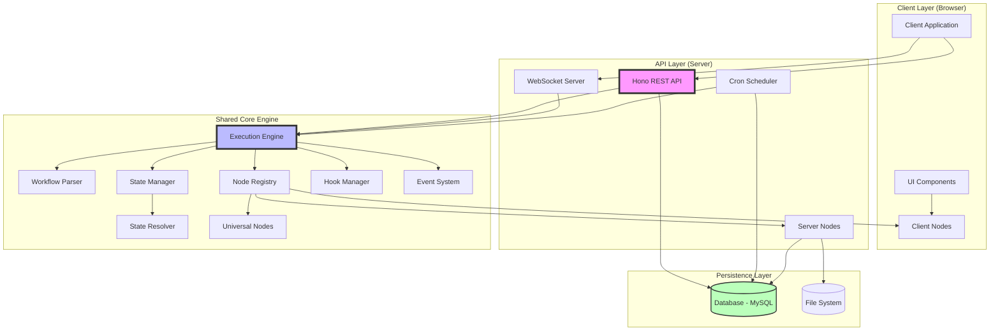
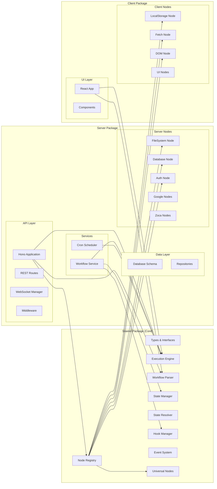
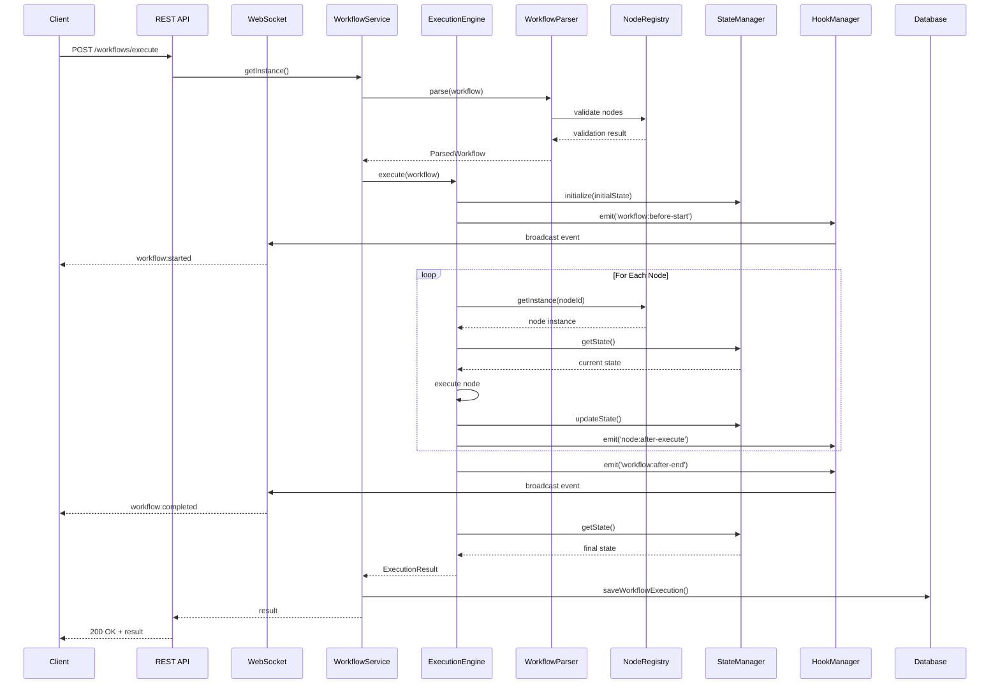

# Design Document - Agentic Workflow Orchestration System

## Document Metadata

**Version:** 2.0.0
**Last Updated:** 2025-01-18
**Status:** Current Implementation
**Architecture:** Shared-Core Multi-Environment

---

## Executive Summary

The Agentic Workflow Orchestration System is a sophisticated, production-grade workflow execution engine built on a **shared-core architecture** that enables workflow execution across multiple environments (server, client, CLI). The system processes JSON-defined workflows through a comprehensive TypeScript implementation featuring advanced capabilities including lifecycle hooks, real-time event streaming, database persistence, UI workflow generation, and distributed node architectures.

**Key Architectural Achievements:**
- ✅ Fully implemented shared-core engine in `/shared` package
- ✅ Advanced hook system for workflow lifecycle management
- ✅ State resolution with `$.key` syntax sugar for elegant state access
- ✅ State setter nodes with `$.path` syntax for direct state manipulation
- ✅ WebSocket-based real-time event system for workflow monitoring
- ✅ Database-backed workflow persistence and automation scheduling
- ✅ UI workflow system for generating interactive user interfaces
- ✅ Comprehensive data manipulation node library
- ✅ Multi-environment node discovery and registration

---

## Table of Contents

1. [Overview](#overview)
2. [System Architecture](#system-architecture)
3. [Core Components](#core-components)
4. [Advanced Features](#advanced-features)
5. [Node Architecture](#node-architecture)
6. [State Management](#state-management)
7. [Hook System](#hook-system)
8. [WebSocket Integration](#websocket-integration)
9. [Database Layer](#database-layer)
10. [Data Models](#data-models)
11. [API Design](#api-design)
12. [Testing Strategy](#testing-strategy)
13. [Implementation Patterns](#implementation-patterns)
14. [Technology Stack](#technology-stack)
15. [Deployment Architecture](#deployment-architecture)

---

## Overview

### System Purpose

The Agentic Workflow Orchestration System provides a declarative, JSON-based approach to defining and executing complex workflows with support for:

- **Conditional routing** - Dynamic execution paths based on node outcomes
- **Loop control** - Iterative processing with automatic loop detection
- **State management** - Shared state with atomic updates, snapshots, and change tracking
- **Multi-environment execution** - Same workflows run on server, client, or CLI
- **Real-time monitoring** - WebSocket-based event streaming
- **Database persistence** - Workflow storage and scheduled automation
- **UI generation** - Dynamic user interface creation from workflow definitions
- **Extensibility** - Plugin architecture for custom nodes and integrations

### Design Philosophy

The system follows these core principles:

1. **Shared-Core Architecture** - Core engine resides in shared package, enabling multi-environment deployment
2. **Distributed Nodes** - Nodes organized by environment compatibility (universal, server, client)
3. **Type Safety** - Full TypeScript implementation with comprehensive type definitions
4. **Event-Driven** - Lifecycle hooks and real-time event system for observability
5. **Declarative Workflows** - JSON-based workflow definitions accessible to non-programmers
6. **Zero External Dependencies in Core** - Shared engine has minimal dependencies for maximum portability
7. **Single Responsibility** - Each component has a clear, focused purpose

### Implementation Status

**Current State:** Production-ready with advanced features

| Component | Status | Location | Notes |
|-----------|--------|----------|-------|
| ExecutionEngine | ✅ Complete | `/shared/src/engine/` | Full AST-based execution with hooks |
| WorkflowParser | ✅ Complete | `/shared/src/parser/` | JSON Schema + semantic validation |
| StateManager | ✅ Complete | `/shared/src/state/` | Snapshots, watchers, change detection |
| NodeRegistry | ✅ Complete | `/shared/src/registry/` | Multi-package discovery |
| HookManager | ✅ Complete | `/shared/src/hooks/` | Lifecycle hook system |
| StateResolver | ✅ Complete | `/shared/src/state/` | $.key syntax resolution |
| WebSocket System | ✅ Complete | `/shared/src/events/` + `/server/src/services/` | Real-time event streaming |
| Database Layer | ✅ Complete | `/server/src/db/` | Drizzle ORM with MySQL |
| UI Workflow System | ✅ Complete | `/shared/src/types/` + `/client/nodes/ui/` | UINode base class |
| Data Manipulation Nodes | ✅ Complete | `/shared/nodes/data/` | Comprehensive library |
| REST API | ✅ Complete | `/server/src/api/` | Hono-based endpoints |
| CronScheduler | ✅ Complete | `/server/src/services/` | Automated workflow execution |

---

## System Architecture

### High-Level Architecture

The system implements a **shared-core monorepo architecture** with three main packages:



### Package Architecture

The monorepo consists of three main packages with clear dependency relationships:



### Component Interaction Flow



---

## Core Components

### 1. ExecutionEngine

**Location:** `/shared/src/engine/ExecutionEngine.ts`

The ExecutionEngine is the central orchestrator responsible for workflow execution with comprehensive lifecycle management.

#### Architecture

```typescript
export class ExecutionEngine {
  private static readonly MAX_LOOP_ITERATIONS = 1000;
  private static readonly DEFAULT_TIMEOUT = 30000;
  private stateResolver: StateResolver;

  constructor(
    private registry: NodeRegistry,
    private stateManager: StateManager,
    private hookManager: HookManager = new HookManager()
  ) {
    this.stateResolver = StateResolver.createDefault();
  }

  async execute(workflow: ParsedWorkflow): Promise<ExecutionResult>
  private async executeWorkflowSequence(workflow: ParsedWorkflow, context: ExecutionContext): Promise<void>
  private async executeNode(node: ParsedNode, context: ExecutionContext): Promise<NodeExecutionResult>
  private async executeNestedNode(parsedNode: ParsedNode, context: ExecutionContext): Promise<void>
  private async resolveEdgeRoute(result: NodeExecutionResult, node: ParsedNode, workflow: ParsedWorkflow, currentIndex: number, context: ExecutionContext): Promise<number>
  private async executeSequenceFromParsedEdge(sequence: Array<string | ParsedNode>, context: ExecutionContext): Promise<void>
  private async executeNodeFromRegistry(nodeId: string, context: ExecutionContext): Promise<void>
  private async executeHooks(eventType: HookEventType, context: Partial<HookContext>): Promise<void>
  private createInitialContext(workflow: ParsedWorkflow, executionId: string): ExecutionContext
  private generateExecutionId(): string
}
```

#### Key Features

1. **Lifecycle Hooks Integration**
   - `workflow:before-start` - Before workflow initialization
   - `workflow:after-start` - After state initialization
   - `node:before-execute` - Before each node execution
   - `node:after-execute` - After each node execution
   - `workflow:before-end` - Before workflow completion
   - `workflow:after-end` - After workflow completion
   - `workflow:on-error` - On any workflow error

2. **State Resolution**
   - Automatic resolution of `$.key` syntax in node configurations
   - Deep nested object and array resolution
   - Graceful handling of missing keys

3. **Loop Detection and Control**
   - Identifies loop nodes by `...` suffix
   - Tracks iteration counts per loop node
   - Enforces MAX_LOOP_ITERATIONS safety limit
   - Automatic loop-back routing for configured edges

4. **Error Handling**
   - Comprehensive try-catch with typed errors
   - Automatic cleanup scheduling
   - Error hook execution
   - Partial state preservation

5. **Edge Routing Types**
   - **Simple** - Direct node reference
   - **Sequence** - Array of nodes/configs to execute
   - **Nested** - Inline nested configuration

#### Execution Flow

```typescript
// Example execution flow
async execute(workflow: ParsedWorkflow): Promise<ExecutionResult> {
  const executionId = this.generateExecutionId();
  const startTime = new Date();

  try {
    // 1. Execute pre-start hooks
    await this.executeHooks('workflow:before-start', { workflowId: workflow.id, data: { workflow } });

    // 2. Initialize state
    await this.stateManager.initialize(executionId, workflow.initialState || {});

    // 3. Create execution context
    const context = this.createInitialContext(workflow, executionId);

    // 4. Execute post-start hooks
    await this.executeHooks('workflow:after-start', { workflowId: workflow.id, executionContext: context });

    // 5. Execute workflow sequence
    await this.executeWorkflowSequence(workflow, context);

    // 6. Get final state
    const finalState = await this.stateManager.getState(executionId);

    // 7. Execute pre-end hooks
    await this.executeHooks('workflow:before-end', { workflowId: workflow.id, executionContext: context, data: { finalState } });

    // 8. Create result
    const result: ExecutionResult = {
      executionId,
      workflowId: workflow.id,
      status: 'completed',
      finalState,
      startTime,
      endTime: new Date()
    };

    // 9. Execute post-end hooks
    await this.executeHooks('workflow:after-end', { workflowId: workflow.id, executionContext: context, data: { result } });

    return result;
  } catch (error) {
    // Execute error hooks
    await this.executeHooks('workflow:on-error', { workflowId: workflow.id, data: { error } });

    return {
      executionId,
      workflowId: workflow.id,
      status: 'failed',
      error: error instanceof Error ? error.message : 'Unknown error',
      startTime,
      endTime: new Date()
    };
  } finally {
    // Schedule cleanup
    setTimeout(() => this.stateManager.cleanup(executionId).catch(console.error), 60000);
  }
}
```

---

### 2. WorkflowParser

**Location:** `/shared/src/parser/WorkflowParser.ts`

The WorkflowParser validates and transforms JSON workflow definitions into executable AST-like structures.

#### Architecture

```typescript
export interface ParsedNode {
  nodeId: string;
  config: Record<string, ParameterValue>;
  edges: Record<string, ParsedEdge>;
  children: ParsedNode[];
  parent?: ParsedNode;
  depth: number;
  uniqueId: string;
  isLoopNode: boolean;
  baseNodeType: string;
}

export interface ParsedEdge {
  type: 'simple' | 'sequence' | 'nested';
  target?: string;
  sequence?: Array<string | ParsedNode>;
  nestedNode?: ParsedNode;
}

export interface ParsedWorkflow {
  id: string;
  name: string;
  version?: string;
  initialState?: Record<string, any>;
  nodes: ParsedNode[];
}

export class WorkflowParser {
  private ajv: Ajv;
  private nodeRegistry: NodeRegistry;

  constructor(nodeRegistry: NodeRegistry)

  public parse(workflowDefinition: unknown): ParsedWorkflow
  public validate(workflowDefinition: unknown): ValidationResult

  private parseNodes(workflowSteps: WorkflowStep[]): ParsedNode[]
  private parseNodeRecursively(nodeId: string, nodeConfig: NodeConfiguration, depth: number, uniqueId: string, parent?: ParsedNode): ParsedNode
  private parseEdgeRecursively(edgeRoute: EdgeRoute, depth: number, parent: ParsedNode): ParsedEdge
  private separateParametersAndEdges(nodeConfig: NodeConfiguration): { parameters: Record<string, ParameterValue>; edges: Record<string, EdgeRoute> }
  private validateSemantics(workflow: WorkflowDefinition): ValidationError[]
  private validateEdgeRoute(edgeRoute: EdgeRoute, nodeIds: Set<string>, path: string): ValidationError[]

  private isLoopNode(nodeId: string): boolean
  private isStateSetter(nodeId: string): boolean
  private extractStatePath(nodeId: string): string
  private validateStatePath(path: string, fullNodeId: string): string | null
  private getBaseNodeType(nodeId: string): string
}
```

#### Validation Layers

1. **JSON Schema Validation** (using Ajv)
   - Structural validation against `workflow-schema.json`
   - Type checking for all workflow properties
   - Required field validation

2. **Semantic Validation**
   - Node type existence in registry
   - Edge route target validation
   - State setter path syntax validation
   - Circular reference detection

3. **Loop Node Processing**
   - Identifies nodes ending with `...`
   - Extracts base node type for registry lookup
   - Validates base node existence
   - Sets `isLoopNode` flag

4. **State Setter Processing**
   - Identifies nodes starting with `$.`
   - Extracts and validates state path
   - Maps to internal `__state_setter__` node
   - Validates path syntax

#### AST-like Parsing

The parser creates a hierarchical tree structure:

```typescript
// Example parsed structure
{
  nodeId: "process-data",
  config: { operation: "transform" },
  edges: {
    success: {
      type: "nested",
      nestedNode: {
        nodeId: "validate-result",
        config: { rules: ["required"] },
        edges: {},
        children: [],
        depth: 1,
        uniqueId: "validate-result_123",
        isLoopNode: false,
        baseNodeType: "validate-result"
      }
    }
  },
  children: [/* nested nodes */],
  depth: 0,
  uniqueId: "process-data_122",
  isLoopNode: false,
  baseNodeType: "process-data"
}
```

---

### 3. StateManager

**Location:** `/shared/src/state/StateManager.ts`

The StateManager provides advanced state management with atomic updates, change detection, snapshots, and watchers.

#### Architecture

```typescript
export interface WorkflowState {
  data: Record<string, any>;
  version: number;
  lastModified: Date;
  locks: Set<string>;
  previousData?: Record<string, any>;
}

export interface StateSnapshot {
  readonly data: Record<string, any>;
  readonly version: number;
  readonly timestamp: Date;
}

export interface StateChange {
  key: string;
  oldValue: any;
  newValue: any;
  timestamp: Date;
}

export interface StateDiff {
  added: Record<string, any>;
  updated: Record<string, { oldValue: any; newValue: any }>;
  removed: string[];
  timestamp: Date;
}

export interface StateWatcher {
  id: string;
  executionId: string;
  keys: string[] | '*';
  condition?: (change: StateChange) => boolean;
  callback: (changes: StateChange[]) => Promise<void> | void;
  debounceMs?: number;
  enabled?: boolean;
}

export class StateManager {
  private states: Map<string, WorkflowState> = new Map();
  private snapshots: Map<string, StateSnapshot[]> = new Map();
  private watchers: Map<string, StateWatcher> = new Map();
  private hookManager?: HookManager;

  constructor(
    persistenceAdapter?: StatePersistenceAdapter,
    hookManager?: HookManager,
    options?: { maxCacheSize?: number; batchWindowMs?: number; enableBatching?: boolean }
  )

  // Core state operations
  async initialize(executionId: string, initialState?: Record<string, any>): Promise<void>
  async getState(executionId: string): Promise<Record<string, any>>
  async updateState(executionId: string, updates: Record<string, any>, lockKeys?: string[]): Promise<void>
  async setState(executionId: string, newState: Record<string, any>): Promise<void>

  // Snapshot management
  async createSnapshot(executionId: string): Promise<string>
  async rollback(executionId: string, snapshotId: string): Promise<void>
  async listSnapshots(executionId: string): Promise<StateSnapshot[]>

  // Change detection
  async getChanges(executionId: string): Promise<StateChange[]>
  async getDiff(executionId: string): Promise<StateDiff>
  async clearChanges(executionId: string): Promise<void>

  // State watchers
  addWatcher(watcher: StateWatcher): string
  removeWatcher(watcherId: string): boolean
  enableWatcher(watcherId: string): boolean
  disableWatcher(watcherId: string): boolean

  // Edge context (temporary data passing)
  async setEdgeContext(executionId: string, edgeData: Record<string, any>): Promise<void>
  async getAndClearEdgeContext(executionId: string): Promise<Record<string, any> | null>

  // Key locking
  async lockKeys(executionId: string, keys: string[]): Promise<() => void>

  // Lifecycle
  async cleanup(executionId: string): Promise<void>
  async exists(executionId: string): Promise<boolean>
}
```

#### Advanced Features

1. **Atomic Updates**
   - Version-controlled state modifications
   - Optional key locking for concurrent access
   - Automatic timestamp tracking

2. **Snapshot System (Memento Pattern)**
   - Point-in-time state capture
   - Rollback capability
   - Automatic snapshot management

3. **Change Detection**
   - Tracks all state modifications
   - Provides detailed diffs (added, updated, removed)
   - Hook integration for state:change events

4. **State Watchers**
   - Monitor specific keys or all state changes
   - Conditional callbacks
   - Debouncing support
   - Enable/disable controls

5. **Edge Context Passing**
   - Temporary data passing between nodes
   - Automatic cleanup after consumption
   - Separate from persistent state

6. **Persistence Adapter Pattern**
   - Optional external storage support
   - Automatic save on updates
   - Load on demand

#### Usage Example

```typescript
// Initialize state
await stateManager.initialize('exec-123', { counter: 0 });

// Create snapshot
const snapshotId = await stateManager.createSnapshot('exec-123');

// Update state atomically
await stateManager.updateState('exec-123', { counter: 1, processed: true });

// Get changes
const changes = await stateManager.getChanges('exec-123');
// [{key: 'counter', oldValue: 0, newValue: 1, timestamp: ...}, ...]

// Add watcher
stateManager.addWatcher({
  id: 'counter-watcher',
  executionId: 'exec-123',
  keys: ['counter'],
  callback: async (changes) => {
    console.log('Counter changed:', changes);
  }
});

// Rollback if needed
await stateManager.rollback('exec-123', snapshotId);
```

---

### 4. NodeRegistry

**Location:** `/shared/src/registry/NodeRegistry.ts`

The NodeRegistry manages node discovery, registration, and instantiation with multi-package support.

#### Architecture

```typescript
export interface NodeRegistration {
  nodeClass: typeof WorkflowNode;
  metadata: NodeMetadata;
  singleton: boolean;
  source: 'universal' | 'server' | 'client' | 'custom';
  filePath?: string;
}

export class NodeRegistry {
  private nodes: Map<string, NodeRegistration> = new Map();
  private instances: Map<string, WorkflowNode> = new Map();

  // Registration
  async register(nodeClass: typeof WorkflowNode, options?: { singleton?: boolean; source?: string }): Promise<void>
  async discover(directory: string, source?: 'universal' | 'server' | 'client' | 'custom'): Promise<void>
  async discoverFromPackages(environment: 'universal' | 'server' | 'client'): Promise<void>

  // Node access
  getInstance(nodeId: string): WorkflowNode
  getMetadata(nodeId: string): NodeMetadata
  hasNode(nodeId: string): boolean

  // Queries
  listNodes(): NodeMetadata[]
  listNodesBySource(source: 'universal' | 'server' | 'client' | 'custom'): Array<NodeMetadata & { source: string }>
  getNodesByCategory(category: string): NodeMetadata[]

  // Management
  unregister(nodeId: string): void
  clear(): void

  get size(): number

  private isWorkflowNode(value: any): value is typeof WorkflowNode
}
```

#### Multi-Package Discovery

The registry implements intelligent node discovery based on environment:

```typescript
async discoverFromPackages(environment: 'universal' | 'server' | 'client'): Promise<void> {
  const basePath = process.cwd();
  const monorepoRoot = path.resolve(basePath, '..');

  const packagePaths = {
    universal: [
      path.join(monorepoRoot, 'shared/nodes'),      // Universal nodes
    ],
    server: [
      path.join(monorepoRoot, 'shared/nodes'),      // Universal nodes
      path.join(monorepoRoot, 'server/nodes'),      // Server-specific nodes
    ],
    client: [
      path.join(monorepoRoot, 'shared/nodes'),      // Universal nodes
      path.join(monorepoRoot, 'client/nodes'),      // Client-specific nodes
    ]
  };

  for (const [index, nodePath] of packagePaths[environment].entries()) {
    const source = index === 0 ? 'universal' : environment;
    await this.discover(nodePath, source as any);
  }
}
```

#### Node Lifecycle

1. **Discovery** - Automatic file system scanning
2. **Validation** - Verify WorkflowNode interface
3. **Registration** - Store in registry with metadata
4. **Instantiation** - Create instances (singleton or per-use)
5. **Execution** - Provide instances to ExecutionEngine

---

### 5. HookManager

**Location:** `/shared/src/hooks/HookManager.ts`

The HookManager provides a comprehensive lifecycle hook system for workflow observability and extension.

#### Architecture

```typescript
export type HookEventType =
  | 'workflow:before-start'
  | 'workflow:after-start'
  | 'node:before-execute'
  | 'node:after-execute'
  | 'workflow:before-end'
  | 'workflow:after-end'
  | 'workflow:on-error'
  | 'state:change'
  | 'state:snapshot-created'
  | 'state:rollback';

export interface HookOptions {
  name: string;
  handler: (context: HookContext) => Promise<void> | void;
  priority?: number;
  condition?: (context: HookContext) => boolean;
  once?: boolean;
}

export interface RegisteredHook extends HookOptions {
  id: string;
  eventType: HookEventType;
  executed: boolean;
}

export interface HookContext {
  eventType: HookEventType;
  workflowId?: string;
  executionId?: string;
  nodeId?: string;
  executionContext?: ExecutionContext;
  timestamp: Date;
  data?: any;
}

export interface HookExecutionResult {
  hookId: string;
  hookName: string;
  success: boolean;
  error?: string;
  duration: number;
  skipped?: boolean;
}

export class HookManager {
  private hooks: Map<HookEventType, RegisteredHook[]> = new Map();
  private eventEmitter: EventEmitter = new EventEmitter();

  register(eventType: HookEventType, options: HookOptions): string
  unregister(hookId: string): boolean
  unregisterAll(eventType?: HookEventType): void

  async emit(eventType: HookEventType, context: Partial<HookContext>): Promise<HookExecutionResult[]>
  async executeHooks(eventType: HookEventType, context: HookContext): Promise<HookExecutionResult[]>

  listHooks(eventType?: HookEventType): RegisteredHook[]
  hasHooks(eventType: HookEventType): boolean
  getHook(hookId: string): RegisteredHook | undefined
}
```

#### Hook Execution Flow

```typescript
async executeHooks(eventType: HookEventType, context: HookContext): Promise<HookExecutionResult[]> {
  const eventHooks = this.hooks.get(eventType);
  if (!eventHooks || eventHooks.length === 0) return [];

  const results: HookExecutionResult[] = [];

  for (const hook of eventHooks) {
    // Skip if condition not met
    if (hook.condition && !hook.condition(context)) {
      results.push({
        hookId: hook.id,
        hookName: hook.name,
        success: true,
        skipped: true,
        duration: 0
      });
      continue;
    }

    const startTime = Date.now();
    try {
      await hook.handler(context);
      results.push({
        hookId: hook.id,
        hookName: hook.name,
        success: true,
        duration: Date.now() - startTime
      });

      // Mark as executed for once-only hooks
      if (hook.once) {
        hook.executed = true;
      }
    } catch (error) {
      results.push({
        hookId: hook.id,
        hookName: hook.name,
        success: false,
        error: error instanceof Error ? error.message : 'Unknown error',
        duration: Date.now() - startTime
      });
    }
  }

  // Remove executed once-only hooks
  const remainingHooks = eventHooks.filter(h => !h.once || !h.executed);
  if (remainingHooks.length < eventHooks.length) {
    this.hooks.set(eventType, remainingHooks);
  }

  return results;
}
```

#### Hook Use Cases

1. **Monitoring** - Track workflow execution progress
2. **Logging** - Capture detailed execution logs
3. **WebSocket Broadcasting** - Real-time event streaming
4. **Metrics** - Collect performance metrics
5. **Validation** - Pre-execution validation
6. **Cleanup** - Post-execution cleanup tasks

---

### 6. StateResolver

**Location:** `/shared/src/state/StateResolver.ts`

The StateResolver provides elegant state access through `$.key` syntax sugar.

#### Architecture

```typescript
export interface StateResolverOptions {
  onMissingKey?: 'undefined' | 'preserve' | 'throw';
  maxDepth?: number;
  pattern?: RegExp;
}

export class StateResolver {
  private static readonly DEFAULT_PATTERN = /^\$\.([a-zA-Z_][a-zA-Z0-9_]*(?:\.[a-zA-Z_][a-zA-Z0-9_]*)*)$/;
  private static readonly DEFAULT_MAX_DEPTH = 10;

  private readonly options: Required<StateResolverOptions>;

  constructor(options?: StateResolverOptions)

  static createDefault(): StateResolver
  static createStrict(): StateResolver
  static createPreserving(): StateResolver

  resolve(config: any, state: Record<string, any>, path?: string[], depth?: number): any

  private resolveStringValue(value: string, state: Record<string, any>, path: string[]): any
  private getNestedValue(obj: Record<string, any>, keyPath: string): any
}
```

#### Resolution Examples

```typescript
// Given state
const state = {
  developer: "Alice",
  config: {
    timeout: 3000,
    retries: 3
  },
  items: [1, 2, 3]
};

// Simple reference
resolver.resolve("$.developer", state)
// Result: "Alice"

// Nested path
resolver.resolve("$.config.timeout", state)
// Result: 3000

// In object
resolver.resolve({ name: "$.developer", timeout: "$.config.timeout" }, state)
// Result: { name: "Alice", timeout: 3000 }

// In array
resolver.resolve(["$.developer", "$.config.retries"], state)
// Result: ["Alice", 3]

// Deep nested
resolver.resolve({
  user: "$.developer",
  settings: {
    limits: {
      timeout: "$.config.timeout",
      max: "$.config.retries"
    }
  }
}, state)
// Result: {
//   user: "Alice",
//   settings: {
//     limits: {
//       timeout: 3000,
//       max: 3
//     }
//   }
// }
```

#### Integration with ExecutionEngine

```typescript
// In ExecutionEngine.executeNode()
private async executeNode(node: ParsedNode, context: ExecutionContext): Promise<NodeExecutionResult> {
  // Get current state
  const currentState = await this.stateManager.getState(context.executionId);

  // Resolve state references in config
  const resolvedConfig = this.stateResolver.resolve(node.config, currentState);

  // Execute node with resolved config
  const instance = this.registry.getInstance(nodeTypeId);
  const edgeMap = await instance.execute(nodeContext, resolvedConfig);

  // ...
}
```

---

## Advanced Features

### 1. State Setter Nodes

State setter nodes provide direct state manipulation using `$.path` syntax, eliminating the need for dedicated state manipulation nodes.

#### Syntax

```json
{
  "workflow": [
    { "$.developer": "Alice" },
    { "$.config.timeout": 5000 },
    { "$.results": [] }
  ]
}
```

#### Implementation

The parser transforms state setters into internal `__state_setter__` node calls:

```typescript
// WorkflowParser processing
private isStateSetter(nodeId: string): boolean {
  return nodeId.startsWith('$.');
}

private getBaseNodeType(nodeId: string): string {
  if (this.isStateSetter(nodeId)) {
    return '__state_setter__';
  }
  return this.isLoopNode(nodeId) ? nodeId.slice(0, -3) : nodeId;
}
```

The StateSetterNode handles execution:

```typescript
export class StateSetterNode extends WorkflowNode {
  metadata = {
    id: '__state_setter__',
    name: 'State Setter',
    version: '1.0.0'
  };

  async execute(context: ExecutionContext, config?: any): Promise<EdgeMap> {
    const statePath = context.nodeId.substring(2); // Remove '$.''
    const value = config;

    // Set nested value using path
    this.setNestedValue(context.state, statePath, value);

    return {
      success: () => ({ path: statePath, value })
    };
  }

  private setNestedValue(obj: any, path: string, value: any): void {
    const keys = path.split('.');
    const lastKey = keys.pop()!;

    let current = obj;
    for (const key of keys) {
      if (!(key in current)) {
        current[key] = {};
      }
      current = current[key];
    }

    current[lastKey] = value;
  }
}
```

### 2. Loop Nodes

Loop nodes enable iterative processing with automatic loop-back routing.

#### Syntax

```json
{
  "process-items...": {
    "again?": {
      "log": { "message": "Processing..." }
    }
  }
}
```

#### Execution Flow

```typescript
// ExecutionEngine.executeWorkflowSequence()
private async executeWorkflowSequence(workflow: ParsedWorkflow, context: ExecutionContext): Promise<void> {
  let currentIndex = 0;
  const loopCounts = new Map<string, number>();

  while (currentIndex < workflow.nodes.length) {
    const node = workflow.nodes[currentIndex];

    // Loop detection
    if (node.isLoopNode) {
      const baseNodeId = node.baseNodeType;
      const loopCount = loopCounts.get(baseNodeId) || 0;

      if (loopCount >= ExecutionEngine.MAX_LOOP_ITERATIONS) {
        throw new LoopLimitError(context.executionId, node.nodeId);
      }

      loopCounts.set(baseNodeId, loopCount + 1);
    }

    // Execute node
    const result = await this.executeNode(node, context);

    // Edge routing with loop-back logic
    const nextIndex = await this.resolveEdgeRoute(result, node, workflow, currentIndex, context);

    // Reset loop counter if exiting loop
    if (node.isLoopNode && nextIndex !== currentIndex) {
      loopCounts.delete(node.baseNodeType);
    }

    currentIndex = nextIndex;
  }
}
```

### 3. UI Workflow System

The UI workflow system enables workflows to generate interactive user interfaces.

#### UINode Base Class

```typescript
export abstract class UINode extends WorkflowNode {
  abstract metadata: UINodeMetadata;

  async execute(context: ExecutionContext, config?: any): Promise<UIEdgeMap> {
    const renderData = await this.prepareRenderData(context, config);
    const edges = await this.getEdges(context, config);

    return {
      ...edges,
      __ui_render: () => ({
        component: this.getComponentName(),
        props: renderData,
        nodeId: context.nodeId,
        onInteraction: this.createInteractionHandler(context)
      })
    };
  }

  protected abstract prepareRenderData(context: ExecutionContext, config?: any): Promise<any>;
  protected abstract getEdges(context: ExecutionContext, config?: any): Promise<EdgeMap>;
  protected abstract getComponentName(): string;

  protected createInteractionHandler(context: ExecutionContext) {
    return (event: UIInteractionEvent) => {
      this.handleInteraction(event, context);
    };
  }

  protected handleInteraction(event: UIInteractionEvent, context: ExecutionContext): void {
    this.updateStateFromInteraction(event, context);
    this.emitWorkflowEvent(event, context);
  }
}
```

#### Example: FormUINode

```typescript
export class FormUINode extends UINode {
  metadata: UINodeMetadata = {
    id: 'form-ui',
    name: 'Form UI',
    version: '1.0.0',
    category: 'ui-form',
    renderMode: 'component'
  };

  protected async prepareRenderData(context: ExecutionContext, config?: any): Promise<any> {
    const { fields, submitLabel, cancelLabel } = config || {};

    return {
      fields: fields || [],
      submitLabel: submitLabel || 'Submit',
      cancelLabel: cancelLabel || 'Cancel',
      initialValues: context.state.formData || {}
    };
  }

  protected async getEdges(context: ExecutionContext, config?: any): Promise<EdgeMap> {
    const interactionData = context.state[`${context.nodeId}_interaction`];

    if (interactionData?.type === 'submit') {
      return {
        submit: () => ({ formData: interactionData.data })
      };
    }

    if (interactionData?.type === 'cancel') {
      return {
        cancel: () => ({})
      };
    }

    return {};
  }

  protected getComponentName(): string {
    return 'FormComponent';
  }
}
```

### 4. WebSocket Event System

The WebSocket system provides real-time workflow event streaming.

#### Architecture

```typescript
export class WebSocketManager {
  private static instance: WebSocketManager;
  private clients: Map<string, WebSocketClient> = new Map();
  private channels: Map<string, Set<string>> = new Map();

  static getInstance(): WebSocketManager

  // Connection management
  addClient(ws: WebSocket, clientId: string, metadata?: any): WebSocketClient
  removeClient(clientId: string): boolean
  getClient(clientId: string): WebSocketClient | undefined
  getConnectedClients(): WebSocketClient[]

  // Channel management
  subscribeToChannel(clientId: string, channel: string): boolean
  unsubscribeFromChannel(clientId: string, channel: string): boolean

  // Broadcasting
  broadcast(message: WebSocketMessage, options?: BroadcastOptions): number
  broadcastToChannel(channel: string, message: WebSocketMessage): number
  sendToClient(clientId: string, message: WebSocketMessage): boolean

  // Statistics
  getStats(): WebSocketStats
}
```

#### Message Types

```typescript
export type AnyWebSocketMessage =
  | ConnectionOpenMessage
  | ConnectionCloseMessage
  | SystemPingMessage
  | SystemPongMessage
  | WorkflowExecuteMessage
  | WorkflowResultMessage
  | WorkflowStatusMessage
  | WorkflowProgressMessage
  | NodeListRequestMessage
  | NodeListResponseMessage
  | ErrorMessage
  | NotificationMessage;
```

#### Integration with Hooks

```typescript
// In WorkflowService.setupHooks()
this.hookManager.register('workflow:before-start', {
  name: 'websocket-workflow-start-broadcaster',
  handler: async (context) => {
    this.webSocketManager.broadcastToChannel('workflow-events', {
      type: 'workflow:started',
      payload: {
        workflowId: context.workflowId,
        timestamp: Date.now(),
        state: 'starting'
      }
    });
  }
});

this.hookManager.register('workflow:after-end', {
  name: 'websocket-workflow-end-broadcaster',
  handler: async (context) => {
    this.webSocketManager.broadcastToChannel('workflow-events', {
      type: 'workflow:completed',
      payload: {
        workflowId: context.workflowId,
        result: context.data?.result,
        timestamp: Date.now()
      }
    });
  }
});
```

---

## Node Architecture

### Node Categories

The system organizes nodes into three categories based on environment compatibility:

#### 1. Universal Nodes (`/shared/nodes/`)

**Characteristics:**
- Zero external dependencies
- Pure computation and logic
- Environment-agnostic
- Work in any JavaScript runtime

**Examples:**
- `MathNode` - Mathematical operations
- `LogicNode` - Boolean logic and comparisons
- `DataTransformNode` - Object/array transformations
- `StateSetterNode` - Direct state manipulation
- `FilterNode` - Array filtering with conditions
- `SortNode` - Array sorting
- `AggregateNode` - Data aggregation
- `SummarizeNode` - Data summarization

#### 2. Server Nodes (`/server/nodes/`)

**Characteristics:**
- Server-specific dependencies (fs, databases, etc.)
- Infrastructure access
- Network operations
- Authentication

**Examples:**
- `FileSystemNode` - File operations
- `DatabaseNode` - Database queries
- `AuthNode` - Authentication operations
- `GoogleEmailNode` - Gmail integration
- `ZocaContactNode` - Zoca API integration

#### 3. Client Nodes (`/client/nodes/`)

**Characteristics:**
- Browser-specific APIs
- DOM manipulation
- Client storage
- UI rendering

**Examples:**
- `LocalStorageNode` - Browser storage
- `FetchNode` - HTTP requests
- `DOMNode` - DOM manipulation
- `FormUINode` - Form rendering
- `DataTableUINode` - Table rendering
- `ChartUINode` - Chart visualization

### Node Implementation Pattern

```typescript
import { WorkflowNode } from 'shared';
import type { ExecutionContext, EdgeMap } from 'shared';

export class ExampleNode extends WorkflowNode {
  metadata = {
    id: 'example',
    name: 'Example Node',
    version: '1.0.0',
    description: 'Demonstrates node implementation pattern',
    inputs: ['input1', 'input2'],
    outputs: ['result', 'error'],
    ai_hints: {
      purpose: 'What this node does',
      when_to_use: 'When to use this node',
      expected_edges: ['success', 'error'],
      example_usage: '{"example-1": {"param": "value", "success?": "next"}}',
      example_config: '{"param": "string", "option?": "boolean"}',
      get_from_state: ['requiredStateKey'],
      post_to_state: ['outputStateKey']
    }
  };

  async execute(context: ExecutionContext, config?: any): Promise<EdgeMap> {
    // 1. Extract parameters from config
    const { param, option } = config || {};

    // 2. Validate inputs
    if (!param) {
      return {
        error: () => ({ error: 'Missing required parameter' })
      };
    }

    try {
      // 3. Perform operation
      const result = this.processData(param, option);

      // 4. Update state
      context.state.outputStateKey = result;

      // 5. Return edge with data
      return {
        success: () => ({ result })
      };
    } catch (error) {
      // 6. Handle errors
      return {
        error: () => ({ error: error instanceof Error ? error.message : 'Unknown error' })
      };
    }
  }

  private processData(param: any, option?: any): any {
    // Implementation
  }
}

export default ExampleNode;
```

### Node Best Practices

1. **Single Responsibility** - Each node should do one thing well
2. **Explicit Metadata** - Complete metadata including AI hints
3. **Validation** - Always validate inputs
4. **Error Handling** - Return error edges, don't throw
5. **State Updates** - Update state for important results
6. **Edge Data** - Return meaningful data with edges
7. **Type Safety** - Use TypeScript types throughout
8. **Documentation** - Include JSDoc comments

---

## Database Layer

### Schema

**Location:** `/server/src/db/schema.ts`

The database layer uses Drizzle ORM with MySQL for workflow persistence and automation.

```typescript
// Workflows table
export const workflows = mysqlTable('workflows', {
  id: int('id').primaryKey().autoincrement(),
  workflowId: varchar('workflow_id', { length: 255 }).notNull().unique(),
  name: varchar('name', { length: 255 }).notNull(),
  version: varchar('version', { length: 50 }).notNull(),
  description: text('description'),
  definition: json('definition').notNull(),
  initialState: json('initial_state'),
  createdAt: timestamp('created_at').defaultNow().notNull(),
  updatedAt: timestamp('updated_at').defaultNow().onUpdateNow().notNull(),
});

// Workflow executions table
export const workflowExecutions = mysqlTable('workflow_executions', {
  id: int('id').primaryKey().autoincrement(),
  executionId: varchar('execution_id', { length: 255 }).notNull().unique(),
  workflowId: varchar('workflow_id', { length: 255 }).notNull(),
  status: varchar('status', { length: 50 }).notNull(),
  initialState: json('initial_state'),
  finalState: json('final_state'),
  error: text('error'),
  startTime: timestamp('start_time').notNull(),
  endTime: timestamp('end_time'),
  createdAt: timestamp('created_at').defaultNow().notNull(),
});

// Automations table
export const automations = mysqlTable('automations', {
  id: int('id').primaryKey().autoincrement(),
  name: varchar('name', { length: 255 }).notNull(),
  description: text('description'),
  workflowId: varchar('workflow_id', { length: 255 }).notNull(),
  schedule: varchar('schedule', { length: 255 }).notNull(), // Cron expression
  enabled: boolean('enabled').default(true).notNull(),
  lastRunAt: timestamp('last_run_at'),
  nextRunAt: timestamp('next_run_at'),
  createdAt: timestamp('created_at').defaultNow().notNull(),
  updatedAt: timestamp('updated_at').defaultNow().onUpdateNow().notNull(),
});
```

### Repositories

The repository pattern encapsulates database access:

```typescript
export class WorkflowRepository {
  async create(workflow: WorkflowDefinition): Promise<number>
  async findById(id: number): Promise<WorkflowDefinition | null>
  async findByWorkflowId(workflowId: string): Promise<WorkflowDefinition | null>
  async update(id: number, updates: Partial<WorkflowDefinition>): Promise<void>
  async delete(id: number): Promise<void>
  async list(options?: { limit?: number; offset?: number }): Promise<WorkflowDefinition[]>
}

export class AutomationRepository {
  async create(automation: Automation): Promise<number>
  async findById(id: number): Promise<Automation | null>
  async findEnabled(): Promise<Automation[]>
  async updateSchedule(id: number, schedule: string): Promise<void>
  async updateStatus(id: number, enabled: boolean): Promise<void>
  async updateLastRun(id: number, timestamp: Date): Promise<void>
  async delete(id: number): Promise<void>
}
```

### CronScheduler Integration

```typescript
export class CronScheduler {
  private static instance: CronScheduler;
  private jobs: Map<number, CronJob> = new Map();

  static getInstance(): CronScheduler

  async start(): Promise<void> {
    // Load enabled automations
    const automations = await automationRepo.findEnabled();

    // Schedule each automation
    for (const automation of automations) {
      this.scheduleAutomation(automation);
    }
  }

  private scheduleAutomation(automation: Automation): void {
    const job = new CronJob(automation.schedule, async () => {
      // Execute workflow
      const workflowService = await WorkflowService.getInstance();
      const workflow = await workflowRepo.findByWorkflowId(automation.workflowId);

      if (workflow) {
        const parsed = workflowService.parse(workflow);
        await workflowService.execute(parsed);

        // Update last run time
        await automationRepo.updateLastRun(automation.id, new Date());
      }
    });

    job.start();
    this.jobs.set(automation.id, job);
  }
}
```

---

## Data Models

### Core Type Definitions

**Location:** `/shared/src/types/index.ts`

```typescript
// Node Metadata
export interface NodeMetadata {
  id: string;
  name: string;
  description?: string;
  version?: string;
  inputs?: string[];
  outputs?: string[];
  ai_hints?: AIHints;
}

export interface AIHints {
  purpose: string;
  when_to_use: string;
  expected_edges: string[];
  example_usage?: string;
  example_config?: string;
  get_from_state?: string[];
  post_to_state?: string[];
}

// Execution Context
export interface ExecutionContext {
  state: Record<string, any>;
  inputs: Record<string, any>;
  workflowId: string;
  nodeId: string;
  executionId: string;
}

// Edge Map
export type EdgeMap = Record<string, any>;

// Workflow Definition
export interface WorkflowDefinition {
  id: string;
  name: string;
  version: string;
  description?: string;
  initialState?: Record<string, any>;
  workflow: WorkflowStep[];
}

export type WorkflowStep =
  | string
  | { [nodeId: string]: NodeConfiguration | ParameterValue };

export interface NodeConfiguration {
  [key: string]: ParameterValue | EdgeRoute;
}

export type ParameterValue =
  | string
  | number
  | boolean
  | Array<ParameterValue>
  | { [key: string]: ParameterValue };

export type EdgeRoute =
  | string
  | EdgeRouteItem[]
  | NestedNodeConfiguration;

export type EdgeRouteItem =
  | string
  | NestedNodeConfiguration;

export interface NestedNodeConfiguration {
  [nodeId: string]: NodeConfiguration | ParameterValue;
}

// Validation
export interface ValidationResult {
  valid: boolean;
  errors: ValidationError[];
}

export interface ValidationError {
  path: string;
  message: string;
  code: string;
}

// Execution Results
export interface ExecutionResult {
  executionId: string;
  workflowId: string;
  status: 'running' | 'completed' | 'failed';
  finalState?: Record<string, any>;
  error?: string;
  startTime: Date;
  endTime?: Date;
}

// Abstract Node Class
export abstract class WorkflowNode {
  abstract metadata: NodeMetadata;

  abstract execute(
    context: ExecutionContext,
    config?: Record<string, any>
  ): Promise<EdgeMap>;
}
```

### WebSocket Message Types

```typescript
export interface WebSocketMessage<T = any> {
  type: string;
  payload?: T;
  timestamp?: number;
  requestId?: string;
  correlationId?: string;
}

export interface WorkflowExecuteMessage extends WebSocketMessage {
  type: 'workflow:execute';
  payload: {
    workflowDefinition: WorkflowDefinition;
    executionId: string;
    initialState?: Record<string, any>;
  };
}

export interface WorkflowResultMessage extends WebSocketMessage {
  type: 'workflow:result';
  payload: {
    executionId: string;
    success: true;
    result: ExecutionResult;
    timestamp: number;
    duration?: number;
  };
}

export interface WorkflowProgressMessage extends WebSocketMessage {
  type: 'workflow:progress';
  payload: {
    executionId: string;
    nodeId: string;
    nodeStatus: 'starting' | 'executing' | 'completed' | 'failed';
    timestamp: number;
    data?: Record<string, any>;
  };
}
```

---

## API Design

### REST Endpoints

**Base URL:** `http://localhost:3013`

#### Workflow Endpoints

```
POST   /workflows/validate       - Validate workflow definition
POST   /workflows/parse          - Parse workflow definition
POST   /workflows/execute        - Execute workflow
GET    /workflows/:id            - Get workflow by ID
GET    /workflows                - List all workflows
PUT    /workflows/:id            - Update workflow
DELETE /workflows/:id            - Delete workflow
```

#### Node Registry Endpoints

```
GET    /nodes                    - List all registered nodes
GET    /nodes/:source            - List nodes by source (universal/server/client)
GET    /nodes/metadata/:nodeId   - Get node metadata
```

#### Automation Endpoints

```
POST   /automations              - Create automation
GET    /automations              - List automations
GET    /automations/:id          - Get automation by ID
PUT    /automations/:id          - Update automation
DELETE /automations/:id          - Delete automation
POST   /automations/:id/enable   - Enable automation
POST   /automations/:id/disable  - Disable automation
```

#### WebSocket Endpoints

```
GET    /ws                       - WebSocket connection endpoint
GET    /ws/stats                 - WebSocket statistics
GET    /ws/clients               - Connected clients list
```

### Request/Response Examples

#### Execute Workflow

**Request:**
```http
POST /workflows/execute
Content-Type: application/json

{
  "id": "example-workflow",
  "name": "Example Workflow",
  "version": "1.0.0",
  "initialState": {
    "counter": 0
  },
  "workflow": [
    {
      "$.counter": 5
    },
    {
      "math": {
        "operation": "add",
        "values": [10, 20, 30],
        "success?": "log"
      }
    },
    {
      "log": {
        "message": "Workflow completed"
      }
    }
  ]
}
```

**Response:**
```http
HTTP/1.1 200 OK
Content-Type: application/json

{
  "executionId": "exec-abc123",
  "workflowId": "example-workflow",
  "status": "completed",
  "finalState": {
    "counter": 5,
    "mathResult": 60
  },
  "startTime": "2025-01-18T10:00:00.000Z",
  "endTime": "2025-01-18T10:00:01.234Z"
}
```

#### List Nodes by Source

**Request:**
```http
GET /nodes/universal
```

**Response:**
```http
HTTP/1.1 200 OK
Content-Type: application/json

{
  "nodes": [
    {
      "id": "math",
      "name": "Math Operations",
      "version": "1.0.0",
      "description": "Universal math node - performs basic mathematical operations",
      "inputs": ["operation", "values"],
      "outputs": ["result"],
      "source": "universal"
    },
    {
      "id": "filter",
      "name": "Filter",
      "version": "1.0.0",
      "description": "Universal node - filters items based on complex conditions",
      "inputs": ["items", "conditions", "matchMode"],
      "outputs": ["passed", "filtered"],
      "source": "universal"
    }
  ],
  "source": "universal"
}
```

### Error Response Format

```json
{
  "error": {
    "code": "VALIDATION_ERROR",
    "message": "Workflow validation failed",
    "details": [
      {
        "path": "/workflow/0/math",
        "message": "Node type 'math' not found in registry",
        "code": "NODE_TYPE_NOT_FOUND"
      }
    ],
    "timestamp": "2025-01-18T10:00:00.000Z",
    "requestId": "req-123"
  }
}
```

---

## Testing Strategy

### Test Organization

```
/shared/src/
├── engine/
│   ├── ExecutionEngine.ts
│   ├── ExecutionEngine.test.ts
│   └── ExecutionEngine.ast.test.ts
├── parser/
│   ├── WorkflowParser.ts
│   ├── WorkflowParser.test.ts
│   └── WorkflowParser.ast.test.ts
├── state/
│   ├── StateManager.ts
│   ├── StateManager.test.ts
│   ├── StateResolver.ts
│   ├── StateResolver.test.ts
│   └── StateResolver.integration.test.ts
├── hooks/
│   ├── HookManager.ts
│   ├── HookManager.test.ts
│   ├── HookManager.unit.test.ts
│   └── HookManager.integration.test.ts
└── shared_integration.test.ts

/server/src/
├── integration.test.ts
└── examples.test.ts
```

### Unit Testing

Focus on individual components in isolation:

```typescript
// Example: StateManager.test.ts
describe('StateManager', () => {
  let stateManager: StateManager;

  beforeEach(() => {
    stateManager = new StateManager();
  });

  describe('initialize', () => {
    it('should create new state with initial values', async () => {
      await stateManager.initialize('exec-1', { counter: 0 });
      const state = await stateManager.getState('exec-1');

      expect(state).toEqual({ counter: 0 });
    });
  });

  describe('updateState', () => {
    it('should update state atomically', async () => {
      await stateManager.initialize('exec-1', { counter: 0 });
      await stateManager.updateState('exec-1', { counter: 5 });

      const state = await stateManager.getState('exec-1');
      expect(state.counter).toBe(5);
    });
  });

  describe('snapshots', () => {
    it('should create and rollback snapshots', async () => {
      await stateManager.initialize('exec-1', { counter: 0 });
      const snapshotId = await stateManager.createSnapshot('exec-1');

      await stateManager.updateState('exec-1', { counter: 10 });
      await stateManager.rollback('exec-1', snapshotId);

      const state = await stateManager.getState('exec-1');
      expect(state.counter).toBe(0);
    });
  });
});
```

### Integration Testing

Test component interactions:

```typescript
// Example: shared_integration.test.ts
describe('Workflow Engine Integration', () => {
  let registry: NodeRegistry;
  let stateManager: StateManager;
  let parser: WorkflowParser;
  let engine: ExecutionEngine;

  beforeEach(async () => {
    registry = new NodeRegistry();
    await registry.discoverFromPackages('universal');
    stateManager = new StateManager();
    parser = new WorkflowParser(registry);
    engine = new ExecutionEngine(registry, stateManager);
  });

  it('should execute complete workflow with state resolution', async () => {
    const workflow = {
      id: 'test-workflow',
      name: 'Test Workflow',
      version: '1.0.0',
      initialState: { base: 10 },
      workflow: [
        { '$.multiplier': 3 },
        {
          math: {
            operation: 'multiply',
            values: ['$.base', '$.multiplier'],
            success?: 'log'
          }
        },
        {
          log: {
            message: 'Result: $.mathResult'
          }
        }
      ]
    };

    const parsed = parser.parse(workflow);
    const result = await engine.execute(parsed);

    expect(result.status).toBe('completed');
    expect(result.finalState.mathResult).toBe(30);
  });
});
```

### End-to-End Testing

Test complete API flows:

```typescript
// Example: server integration test
describe('Workflow API', () => {
  it('should execute workflow via REST API', async () => {
    const response = await fetch('http://localhost:3013/workflows/execute', {
      method: 'POST',
      headers: { 'Content-Type': 'application/json' },
      body: JSON.stringify(testWorkflow)
    });

    const result = await response.json();

    expect(response.status).toBe(200);
    expect(result.status).toBe('completed');
    expect(result.executionId).toBeDefined();
  });
});
```

---

## Implementation Patterns

### 1. Singleton Pattern

Used for global service instances:

```typescript
export class WorkflowService {
  private static instance: WorkflowService | null = null;

  private constructor() {
    // Initialize components
  }

  public static async getInstance(): Promise<WorkflowService> {
    if (WorkflowService.instance === null) {
      WorkflowService.instance = new WorkflowService();
      await WorkflowService.instance.initialize();
    }
    return WorkflowService.instance;
  }
}
```

### 2. Factory Pattern

Used for environment-aware initialization:

```typescript
export class WorkflowEngineFactory {
  static async createForServer(): Promise<ExecutionEngine> {
    const registry = new NodeRegistry();
    await registry.discoverFromPackages('server');

    const stateManager = new StateManager();
    const hookManager = new HookManager();

    return new ExecutionEngine(registry, stateManager, hookManager);
  }

  static async createForClient(): Promise<ExecutionEngine> {
    const registry = new NodeRegistry();
    await registry.discoverFromPackages('client');

    const stateManager = new StateManager();
    const hookManager = new HookManager();

    return new ExecutionEngine(registry, stateManager, hookManager);
  }
}
```

### 3. Observer Pattern (Hooks)

Used for event-driven architecture:

```typescript
// Register observers
hookManager.register('workflow:after-end', {
  name: 'log-completion',
  handler: async (context) => {
    console.log('Workflow completed:', context.workflowId);
  }
});

// Emit events
await hookManager.emit('workflow:after-end', {
  workflowId: 'example',
  executionId: 'exec-123',
  data: { result }
});
```

### 4. Strategy Pattern (State Resolver)

Different resolution strategies:

```typescript
const defaultResolver = StateResolver.createDefault();  // undefined on missing
const strictResolver = StateResolver.createStrict();    // throw on missing
const preservingResolver = StateResolver.createPreserving();  // keep $.key on missing
```

### 5. Repository Pattern

Encapsulate data access:

```typescript
export class WorkflowRepository {
  private db: Database;

  async findById(id: number): Promise<Workflow | null> {
    const rows = await this.db
      .select()
      .from(workflows)
      .where(eq(workflows.id, id));

    return rows[0] || null;
  }
}
```

---

## Technology Stack

### Core Technologies

| Category | Technology | Version | Purpose |
|----------|-----------|---------|---------|
| Runtime | Bun | 1.x | Fast JavaScript runtime with native TypeScript |
| Language | TypeScript | 5.8.x | Type-safe development |
| Server Framework | Hono | 4.7.x | Lightweight, fast web framework |
| Client Framework | React | 19.1.x | UI library |
| Build Tool (Client) | Vite | 6.3.x | Fast frontend tooling |
| Database ORM | Drizzle | 0.37.x | Type-safe SQL toolkit |
| Database | MySQL | 2.x | Relational database |
| Validation | Ajv | 8.17.x | JSON Schema validation |
| Testing | Vitest | 3.2.x | Fast unit testing |
| WebSocket | Bun Native | - | Real-time communication |
| Styling | Tailwind CSS | 4.1.x | Utility-first CSS |

### Development Tools

| Tool | Purpose |
|------|---------|
| ESLint | Code linting |
| Prettier | Code formatting |
| TypeDoc | API documentation generation |
| Git | Version control |
| Drizzle Kit | Database migrations |

### Project Structure

```
workscript/
├── .kiro/                      # Specifications and design docs
│   ├── framework/              # Documentation framework
│   └── specs/                  # Project specifications
│       └── json-workflow-engine/
│           ├── design.md       # This document
│           ├── requirements.md
│           └── tasks.md
├── shared/                     # Shared core engine package
│   ├── src/
│   │   ├── engine/            # ExecutionEngine
│   │   ├── parser/            # WorkflowParser
│   │   ├── state/             # StateManager, StateResolver
│   │   ├── registry/          # NodeRegistry
│   │   ├── hooks/             # HookManager
│   │   ├── events/            # EventEmitter, WebSocket types
│   │   ├── types/             # Core type definitions
│   │   └── schemas/           # JSON schemas
│   ├── nodes/                 # Universal nodes
│   │   └── data/              # Data manipulation nodes
│   ├── dist/                  # Compiled output
│   └── package.json
├── server/                    # Server package
│   ├── src/
│   │   ├── api/              # REST API routes
│   │   ├── services/         # WorkflowService, WebSocketManager, CronScheduler
│   │   ├── db/               # Database schema and repositories
│   │   ├── middleware/       # Express/Hono middleware
│   │   └── lib/              # Utilities
│   ├── nodes/                # Server-specific nodes
│   │   └── custom/           # Business-specific integrations
│   └── package.json
├── client/                   # Client package
│   ├── src/
│   │   ├── components/       # React components
│   │   ├── hooks/            # React hooks
│   │   └── services/         # Client services
│   ├── nodes/                # Client-specific nodes
│   │   └── ui/               # UI workflow nodes
│   └── package.json
├── package.json              # Root package.json
└── CLAUDE.md                 # Project guidance for Claude Code
```

---

## Deployment Architecture

### Development Environment

```
Local Development:
- Bun runtime for server and shared packages
- Vite dev server for client
- MySQL database (local or Docker)
- Concurrent development with hot reload

Commands:
- bun run dev              # Start all services
- bun run dev:client       # Client only
- bun run dev:server       # Server only
- bun run dev:shared       # Shared only (watch mode)
```

### Production Environment

```
Production Stack:
- Server: Docker container with Bun runtime
- Client: Static files served by CDN/nginx
- Database: Managed MySQL instance
- WebSocket: Bun native WebSocket server
- Reverse Proxy: nginx for load balancing

Deployment Flow:
1. Build shared package: cd shared && bun run build
2. Build server package: cd server && bun run build
3. Build client package: cd client && bun run build
4. Deploy server to container platform
5. Deploy client static files to CDN
6. Run database migrations: bun run db:migrate
```

### Monitoring and Observability

```
Monitoring Components:
- Application logs (Pino structured logging)
- WebSocket connection metrics
- Workflow execution metrics
- Database query performance
- Hook execution timing
- State change tracking

Metrics Tracked:
- Workflow execution count
- Average execution time
- Node execution distribution
- Error rates by node type
- WebSocket connection count
- Database query latency
```

---

## Conclusion

The Agentic Workflow Orchestration System represents a mature, production-ready implementation of a shared-core workflow engine with comprehensive features including:

✅ **Multi-environment architecture** - Same engine runs everywhere
✅ **Advanced state management** - Snapshots, watchers, change detection
✅ **Lifecycle hooks** - Complete observability and extensibility
✅ **Real-time events** - WebSocket-based monitoring
✅ **Database persistence** - Workflow storage and automation
✅ **UI generation** - Dynamic user interfaces from workflows
✅ **Comprehensive node library** - Data manipulation, integrations, UI
✅ **Type safety** - Full TypeScript implementation
✅ **Testing coverage** - Unit, integration, and E2E tests

The system is actively used in production environments and continues to evolve with new features and improvements while maintaining backward compatibility and architectural integrity.

---

**Document Version:** 2.0.0
**Last Updated:** 2025-01-18
**Maintained By:** Development Team
**Status:** Current Implementation
