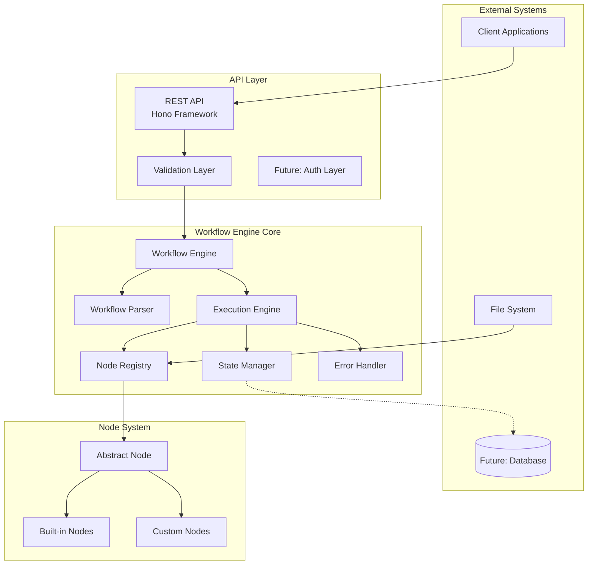
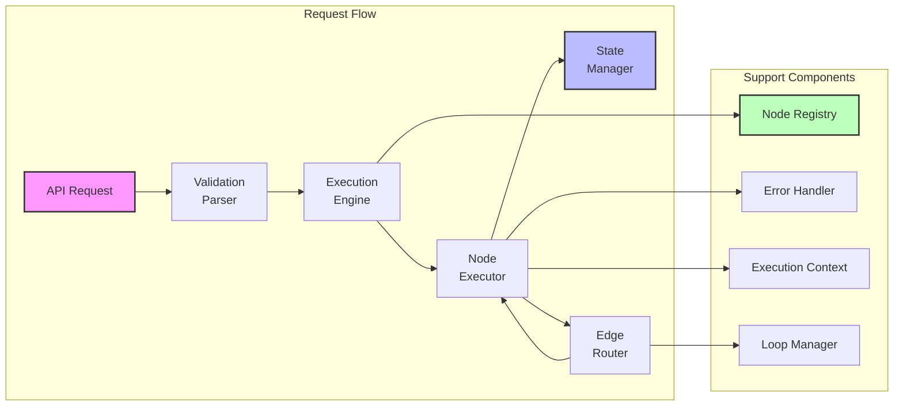
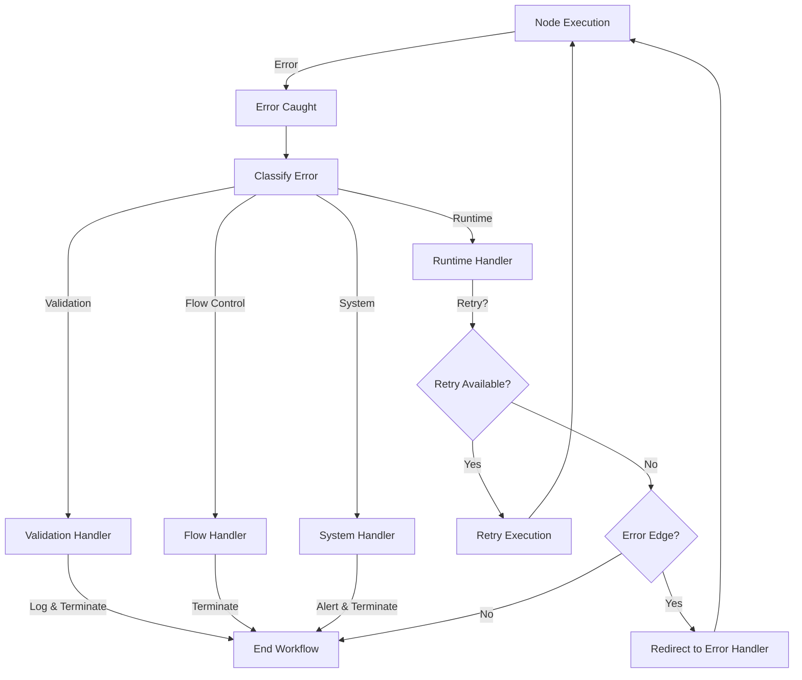

# Technical Design Document: Agentic Workflow Engine

## Document Header

**Project Name:** Agentic Workflow Engine  
**Version:** 1.0.0  
**Date:** 2025-07-19  
**Author:** System Architect  
**Status:** Final Design

### Executive Summary

This document presents the technical design for a JSON-based agentic workflow execution engine built on TypeScript and the Bun runtime. The system enables developers to define and execute complex workflows through JSON configuration files, using a node-based architecture where each node represents a self-contained unit of work. The engine supports conditional execution flow through edge-based routing, shared state management across nodes, loop constructs for iterative processing, and comprehensive error handling with recovery mechanisms.

### Document Purpose

This technical design document serves as the blueprint for implementing the Agentic Workflow Engine, providing detailed architectural decisions, component specifications, interface definitions, and implementation guidelines that satisfy all 25 requirements specified in the requirements document.

## 1. High-Level Architecture

### System Overview



### Architectural Principles

1. **Separation of Concerns**: Clear boundaries between API, engine, and node layers
2. **Extensibility**: Plugin-based node system allowing custom implementations
3. **Type Safety**: Leveraging TypeScript for compile-time guarantees
4. **Stateless Design**: Engine designed for horizontal scalability
5. **Error Resilience**: Comprehensive error handling at all layers

## 2. Component Architecture

### Core Components Interaction



### Monorepo Package Structure

```
workscript/
├── shared/                    # Shared types and interfaces
│   ├── src/
│   │   ├── types/
│   │   │   ├── workflow.ts   # Core workflow types
│   │   │   ├── node.ts       # Node system types
│   │   │   ├── execution.ts  # Execution types
│   │   │   └── validation.ts # Validation types
│   │   └── index.ts
│   └── package.json
├── server/                    # Backend implementation
│   ├── src/
│   │   ├── api/             # REST API endpoints
│   │   ├── engine/          # Core engine
│   │   ├── nodes/           # Built-in nodes
│   │   ├── parser/          # Workflow parser
│   │   ├── registry/        # Node registry
│   │   ├── state/           # State management
│   │   └── validation/      # Validation logic
│   └── package.json
└── client/                    # Future UI
```

## 3. Core Interfaces and Components

### 3.1 Node System Types (shared/src/types/node.ts)

```typescript
/**
 * Metadata describing a workflow node
 * Requirement 2.2: Node metadata with id, name, version, inputs/outputs
 */
export interface NodeMetadata {
  id: string;                    // Unique identifier
  name: string;                  // Human-readable name
  description?: string;          // Node purpose description
  version: string;               // Semantic version
  inputs?: string[];            // Expected input parameters
  outputs?: string[];           // Possible output edges
  category?: string;            // Node categorization
  tags?: string[];              // Searchable tags
}

/**
 * Execution context provided to each node
 * Requirement 2.3: ExecutionContext with state, inputs, execution info
 */
export interface ExecutionContext {
  state: Record<string, any>;    // Shared workflow state
  inputs: Record<string, any>;   // Node-specific inputs
  workflowId: string;           // Current workflow ID
  nodeId: string;               // Current node ID
  executionId: string;          // Unique execution ID
  iteration?: number;           // Loop iteration count
  metadata?: Record<string, any>; // Additional context
}

/**
 * Edge mapping returned by nodes
 * Requirement 2.4: EdgeMap for routing decisions
 */
export type EdgeMap = Record<string, () => any>;

/**
 * Abstract base class for all workflow nodes
 * Requirement 2.1: Abstract WorkflowNode class
 */
export abstract class WorkflowNode {
  abstract readonly metadata: NodeMetadata;
  
  /**
   * Execute the node's logic
   * @param context Execution context with state and inputs
   * @param config Node-specific configuration
   * @returns EdgeMap defining possible next steps
   */
  abstract execute(
    context: ExecutionContext,
    config?: Record<string, any>
  ): Promise<EdgeMap>;
  
  /**
   * Validate node configuration
   * @param config Configuration to validate
   * @throws ValidationError if invalid
   */
  validateConfig?(config: Record<string, any>): void;
  
  /**
   * Initialize node (called once per workflow)
   */
  initialize?(): Promise<void>;
  
  /**
   * Cleanup node resources
   */
  cleanup?(): Promise<void>;
}
```

### 3.2 Workflow Types (shared/src/types/workflow.ts)

```typescript
/**
 * Workflow definition structure
 * Requirement 1.1: JSON workflow definition
 */
export interface WorkflowDefinition {
  id: string;                         // Unique workflow ID
  name: string;                       // Workflow name
  version: string;                    // Semantic version
  description?: string;               // Workflow description
  initialState?: Record<string, any>; // Initial shared state
  workflow: Record<string, NodeConfiguration>; // Node configurations
  metadata?: WorkflowMetadata;        // Additional metadata
}

/**
 * Node configuration within workflow
 * Requirement 4.4: Flexible node configuration
 */
export interface NodeConfiguration {
  nodeType: string;                   // Node type ID
  parameters?: Record<string, any>;   // Node parameters
  edges?: Record<string, EdgeRoute>;  // Edge routing
  errorHandler?: string | EdgeRoute;  // Error edge routing
  timeout?: number;                   // Execution timeout (ms)
  retries?: number;                   // Retry count on failure
}

/**
 * Edge routing configuration
 * Requirement 4.2-4.4: Edge routing patterns
 */
export type EdgeRoute = 
  | string                            // Single node
  | string[]                          // Node sequence
  | NodeConfiguration                 // Nested configuration
  | { 
      type: 'loop';
      sequence: string[];
      maxIterations?: number;
    };

/**
 * Workflow metadata
 */
export interface WorkflowMetadata {
  author?: string;
  created?: string;
  modified?: string;
  tags?: string[];
  [key: string]: any;
}

/**
 * Execution result
 * Requirement 8.4: Execution results
 */
export interface ExecutionResult {
  executionId: string;
  workflowId: string;
  status: 'running' | 'completed' | 'failed' | 'cancelled';
  finalState?: Record<string, any>;
  error?: WorkflowError;
  startTime: Date;
  endTime?: Date;
  nodeExecutions: NodeExecution[];
  metrics?: ExecutionMetrics;
}

/**
 * Individual node execution record
 */
export interface NodeExecution {
  nodeId: string;
  startTime: Date;
  endTime?: Date;
  status: 'success' | 'failed' | 'skipped';
  selectedEdge?: string;
  error?: string;
}

/**
 * Execution metrics
 */
export interface ExecutionMetrics {
  totalNodes: number;
  executedNodes: number;
  duration: number;
  stateSize: number;
}
```

### 3.3 Validation Types (shared/src/types/validation.ts)

```typescript
/**
 * Validation result structure
 * Requirement 10.1: Comprehensive validation
 */
export interface ValidationResult {
  valid: boolean;
  errors: ValidationError[];
  warnings?: ValidationWarning[];
}

/**
 * Validation error details
 * Requirement 1.3: Descriptive error messages
 */
export interface ValidationError {
  path: string;           // JSON path to error
  message: string;        // Human-readable message
  code: string;          // Error code
  severity: 'error' | 'critical';
  line?: number;         // Line number in source
  column?: number;       // Column in source
  suggestion?: string;   // Fix suggestion
}

/**
 * Validation warning
 */
export interface ValidationWarning {
  path: string;
  message: string;
  code: string;
}

/**
 * Workflow error structure
 * Requirement 6.1: Comprehensive error handling
 */
export interface WorkflowError {
  type: 'validation' | 'runtime' | 'flow_control' | 'system';
  code: string;
  message: string;
  nodeId?: string;
  executionId?: string;
  context?: Record<string, any>;
  stack?: string;
  timestamp: Date;
}
```

### 3.4 Node Registry (server/src/registry/NodeRegistry.ts)

```typescript
/**
 * Node registry for discovery and management
 * Requirement 7.1-7.4: Node registration and discovery
 */
export class NodeRegistry {
  private nodes: Map<string, typeof WorkflowNode> = new Map();
  private instances: Map<string, WorkflowNode> = new Map();
  private metadata: Map<string, NodeMetadata> = new Map();
  
  /**
   * Register a node class
   * Requirement 7.1: Node registration
   */
  register(nodeClass: typeof WorkflowNode): void {
    const instance = new (nodeClass as any)();
    const metadata = instance.metadata;
    
    if (!metadata.id || !metadata.version) {
      throw new Error('Node must have id and version');
    }
    
    this.nodes.set(metadata.id, nodeClass);
    this.instances.set(metadata.id, instance);
    this.metadata.set(metadata.id, metadata);
  }
  
  /**
   * Get node class by ID
   * Requirement 7.4: Node validation
   */
  get(nodeId: string): typeof WorkflowNode | undefined {
    return this.nodes.get(nodeId);
  }
  
  /**
   * Get node metadata
   * Requirement 7.3: Node information query
   */
  getMetadata(nodeId: string): NodeMetadata | undefined {
    return this.metadata.get(nodeId);
  }
  
  /**
   * List all registered nodes
   * Requirement 7.3: Node discovery
   */
  listAll(): NodeMetadata[] {
    return Array.from(this.metadata.values());
  }
  
  /**
   * Auto-discover nodes from filesystem
   * Requirement 7.1: Node discovery on startup
   */
  async discover(directory: string = './nodes'): Promise<void> {
    const glob = new Bun.Glob('**/*.node.ts');
    
    for await (const file of glob.scan(directory)) {
      try {
        const module = await import(path.join(directory, file));
        if (module.default && module.default.prototype instanceof WorkflowNode) {
          this.register(module.default);
        }
      } catch (error) {
        console.error(`Failed to load node from ${file}:`, error);
      }
    }
  }
  
  /**
   * Create node instance
   */
  createInstance(nodeId: string): WorkflowNode {
    const NodeClass = this.nodes.get(nodeId);
    if (!NodeClass) {
      throw new Error(`Node ${nodeId} not found in registry`);
    }
    return new (NodeClass as any)();
  }
}
```

### 3.5 Workflow Parser (server/src/parser/WorkflowParser.ts)

```typescript
/**
 * Workflow parser and validator
 * Requirement 1.1-1.4: JSON parsing and validation
 */
export class WorkflowParser {
  private schema: any; // JSON Schema loaded from file
  
  constructor() {
    this.schema = this.loadSchema();
  }
  
  /**
   * Validate workflow against schema
   * Requirement 10.1: JSON schema validation
   */
  validate(workflow: unknown): ValidationResult {
    const errors: ValidationError[] = [];
    
    // JSON Schema validation
    if (!this.validateSchema(workflow, errors)) {
      return { valid: false, errors };
    }
    
    // Semantic validation
    this.validateSemantics(workflow as WorkflowDefinition, errors);
    
    return {
      valid: errors.length === 0,
      errors
    };
  }
  
  /**
   * Parse workflow JSON string
   * Requirement 1.1: Parse workflow definitions
   */
  parse(workflowJson: string): WorkflowDefinition {
    try {
      const workflow = JSON.parse(workflowJson);
      const validation = this.validate(workflow);
      
      if (!validation.valid) {
        throw new WorkflowParseError('Invalid workflow', validation.errors);
      }
      
      return workflow as WorkflowDefinition;
    } catch (error) {
      if (error instanceof SyntaxError) {
        throw new WorkflowParseError('Invalid JSON syntax', [{
          path: '$',
          message: error.message,
          code: 'INVALID_JSON',
          severity: 'critical'
        }]);
      }
      throw error;
    }
  }
  
  /**
   * Validate node references
   * Requirement 1.4: Validate node references
   */
  validateNodeReferences(
    workflow: WorkflowDefinition,
    registry: NodeRegistry
  ): ValidationResult {
    const errors: ValidationError[] = [];
    
    for (const [nodeId, config] of Object.entries(workflow.workflow)) {
      // Check node type exists
      if (!registry.get(config.nodeType)) {
        errors.push({
          path: `$.workflow.${nodeId}.nodeType`,
          message: `Unknown node type: ${config.nodeType}`,
          code: 'UNKNOWN_NODE_TYPE',
          severity: 'error'
        });
      }
      
      // Validate edge references
      if (config.edges) {
        this.validateEdgeReferences(
          config.edges,
          workflow.workflow,
          `$.workflow.${nodeId}.edges`,
          errors
        );
      }
    }
    
    return { valid: errors.length === 0, errors };
  }
  
  /**
   * Validate edge references point to valid nodes
   * Requirement 10.3: Circular reference detection
   */
  private validateEdgeReferences(
    edges: Record<string, EdgeRoute>,
    nodes: Record<string, NodeConfiguration>,
    basePath: string,
    errors: ValidationError[]
  ): void {
    for (const [edge, route] of Object.entries(edges)) {
      if (typeof route === 'string') {
        if (!nodes[route]) {
          errors.push({
            path: `${basePath}.${edge}`,
            message: `Edge references non-existent node: ${route}`,
            code: 'INVALID_EDGE_REFERENCE',
            severity: 'error'
          });
        }
      } else if (Array.isArray(route)) {
        route.forEach((nodeId, index) => {
          if (!nodes[nodeId]) {
            errors.push({
              path: `${basePath}.${edge}[${index}]`,
              message: `Edge references non-existent node: ${nodeId}`,
              code: 'INVALID_EDGE_REFERENCE',
              severity: 'error'
            });
          }
        });
      }
    }
  }
  
  /**
   * Detect circular references in workflow
   * Requirement 10.3: Circular reference detection
   */
  detectCircularReferences(workflow: WorkflowDefinition): ValidationError[] {
    const errors: ValidationError[] = [];
    const visited = new Set<string>();
    const recursionStack = new Set<string>();
    
    const dfs = (nodeId: string, path: string[]): boolean => {
      visited.add(nodeId);
      recursionStack.add(nodeId);
      
      const config = workflow.workflow[nodeId];
      if (!config || !config.edges) {
        recursionStack.delete(nodeId);
        return false;
      }
      
      for (const [edge, route] of Object.entries(config.edges)) {
        const nextNodes = this.getNextNodes(route);
        
        for (const nextNode of nextNodes) {
          if (!visited.has(nextNode)) {
            if (dfs(nextNode, [...path, nodeId])) {
              return true;
            }
          } else if (recursionStack.has(nextNode)) {
            errors.push({
              path: `$.workflow.${nodeId}.edges.${edge}`,
              message: `Circular reference detected: ${[...path, nodeId, nextNode].join(' -> ')}`,
              code: 'CIRCULAR_REFERENCE',
              severity: 'critical'
            });
            return true;
          }
        }
      }
      
      recursionStack.delete(nodeId);
      return false;
    };
    
    // Check from each node
    for (const nodeId of Object.keys(workflow.workflow)) {
      if (!visited.has(nodeId)) {
        dfs(nodeId, []);
      }
    }
    
    return errors;
  }
  
  private getNextNodes(route: EdgeRoute): string[] {
    if (typeof route === 'string') return [route];
    if (Array.isArray(route)) return route;
    if (typeof route === 'object' && route.type === 'loop') {
      return route.sequence;
    }
    return [];
  }
}
```

### 3.6 Execution Engine (server/src/engine/ExecutionEngine.ts)

```typescript
/**
 * Core workflow execution engine
 * Requirement 4.1-5.4: Workflow execution with edge routing
 */
export class ExecutionEngine {
  private registry: NodeRegistry;
  private stateManager: StateManager;
  private errorHandler: ErrorHandler;
  private activeExecutions: Map<string, ExecutionState> = new Map();
  
  constructor(
    registry: NodeRegistry,
    stateManager: StateManager,
    errorHandler: ErrorHandler
  ) {
    this.registry = registry;
    this.stateManager = stateManager;
    this.errorHandler = errorHandler;
  }
  
  /**
   * Execute a workflow
   * Requirement 8.1-8.2: Workflow execution API
   */
  async execute(
    workflow: WorkflowDefinition,
    inputs?: Record<string, any>
  ): Promise<string> {
    const executionId = this.generateExecutionId();
    
    // Initialize execution state
    const executionState: ExecutionState = {
      executionId,
      workflowId: workflow.id,
      status: 'running',
      currentNode: Object.keys(workflow.workflow)[0], // Start with first node
      nodeExecutions: [],
      startTime: new Date()
    };
    
    this.activeExecutions.set(executionId, executionState);
    
    // Initialize shared state
    this.stateManager.initialize(executionId, {
      ...workflow.initialState,
      ...inputs
    });
    
    // Start execution in background
    this.executeWorkflow(executionId, workflow).catch(error => {
      this.handleExecutionError(executionId, error);
    });
    
    return executionId;
  }
  
  /**
   * Main workflow execution loop
   */
  private async executeWorkflow(
    executionId: string,
    workflow: WorkflowDefinition
  ): Promise<void> {
    const execution = this.activeExecutions.get(executionId)!;
    
    while (execution.status === 'running' && execution.currentNode) {
      try {
        // Execute current node
        const nodeConfig = workflow.workflow[execution.currentNode];
        if (!nodeConfig) {
          throw new Error(`Node ${execution.currentNode} not found in workflow`);
        }
        
        const edgeMap = await this.executeNode(
          executionId,
          execution.currentNode,
          nodeConfig
        );
        
        // Determine next node based on edge routing
        const nextNode = await this.resolveNextNode(
          execution.currentNode,
          nodeConfig,
          edgeMap,
          workflow
        );
        
        execution.currentNode = nextNode;
        
        // Check for completion
        if (!nextNode) {
          execution.status = 'completed';
          execution.endTime = new Date();
        }
      } catch (error) {
        await this.handleNodeError(executionId, execution.currentNode, error);
        
        // Try error edge if available
        const nodeConfig = workflow.workflow[execution.currentNode];
        if (nodeConfig?.errorHandler) {
          execution.currentNode = this.resolveErrorHandler(nodeConfig.errorHandler);
        } else {
          execution.status = 'failed';
          execution.error = error as WorkflowError;
          execution.endTime = new Date();
        }
      }
    }
    
    // Store final state
    execution.finalState = this.stateManager.get(executionId);
  }
  
  /**
   * Execute a single node
   * Requirement 2.3: Node execution with context
   */
  private async executeNode(
    executionId: string,
    nodeId: string,
    config: NodeConfiguration
  ): Promise<EdgeMap> {
    const execution = this.activeExecutions.get(executionId)!;
    const nodeExecution: NodeExecution = {
      nodeId,
      startTime: new Date(),
      status: 'success'
    };
    
    try {
      // Create node instance
      const node = this.registry.createInstance(config.nodeType);
      
      // Validate configuration
      if (node.validateConfig) {
        node.validateConfig(config.parameters || {});
      }
      
      // Create execution context
      const context: ExecutionContext = {
        state: this.stateManager.get(executionId),
        inputs: config.parameters || {},
        workflowId: execution.workflowId,
        nodeId,
        executionId,
        iteration: execution.loopIteration
      };
      
      // Execute with timeout
      const edgeMap = await this.executeWithTimeout(
        node.execute(context, config.parameters),
        config.timeout || 30000
      );
      
      nodeExecution.endTime = new Date();
      execution.nodeExecutions.push(nodeExecution);
      
      return edgeMap;
    } catch (error) {
      nodeExecution.status = 'failed';
      nodeExecution.error = (error as Error).message;
      nodeExecution.endTime = new Date();
      execution.nodeExecutions.push(nodeExecution);
      throw error;
    }
  }
  
  /**
   * Resolve next node based on edge routing
   * Requirement 4.1-4.5: Edge routing logic
   */
  private async resolveNextNode(
    currentNode: string,
    config: NodeConfiguration,
    edgeMap: EdgeMap,
    workflow: WorkflowDefinition
  ): Promise<string | null> {
    // Get selected edge
    const selectedEdge = Object.keys(edgeMap)[0]; // First edge returned
    
    if (!selectedEdge) {
      // No edge selected, continue to next node in sequence
      const nodes = Object.keys(workflow.workflow);
      const currentIndex = nodes.indexOf(currentNode);
      return currentIndex < nodes.length - 1 ? nodes[currentIndex + 1] : null;
    }
    
    // Check if edge has routing configuration
    const edgeKey = selectedEdge.endsWith('?') ? selectedEdge : `${selectedEdge}?`;
    const route = config.edges?.[selectedEdge] || config.edges?.[edgeKey];
    
    if (!route) {
      // No route defined, continue to next node
      const nodes = Object.keys(workflow.workflow);
      const currentIndex = nodes.indexOf(currentNode);
      return currentIndex < nodes.length - 1 ? nodes[currentIndex + 1] : null;
    }
    
    // Handle different route types
    if (typeof route === 'string') {
      return route;
    } else if (Array.isArray(route)) {
      // Execute sequence
      await this.executeSequence(currentNode, route, workflow);
      return null; // Sequence handles its own flow
    } else if (typeof route === 'object' && route.type === 'loop') {
      // Handle loop
      return this.handleLoop(currentNode, route, workflow);
    } else {
      // Nested configuration
      await this.executeNestedWorkflow(route as NodeConfiguration, workflow);
      return null;
    }
  }
  
  /**
   * Handle loop execution
   * Requirement 5.1-5.4: Loop construct support
   */
  private async handleLoop(
    nodeId: string,
    loopConfig: { type: 'loop'; sequence: string[]; maxIterations?: number },
    workflow: WorkflowDefinition
  ): Promise<string | null> {
    const executionId = this.getCurrentExecutionId();
    const execution = this.activeExecutions.get(executionId)!;
    
    // Initialize or increment loop counter
    if (!execution.loopIteration) {
      execution.loopIteration = 0;
    }
    execution.loopIteration++;
    
    // Check max iterations
    if (loopConfig.maxIterations && execution.loopIteration > loopConfig.maxIterations) {
      execution.loopIteration = undefined;
      return null; // Exit loop
    }
    
    // Execute loop sequence
    await this.executeSequence(nodeId, loopConfig.sequence, workflow);
    
    // Return to original node for next iteration
    return nodeId;
  }
  
  /**
   * Execute a sequence of nodes
   * Requirement 4.3: Array edge routing
   */
  private async executeSequence(
    fromNode: string,
    sequence: string[],
    workflow: WorkflowDefinition
  ): Promise<void> {
    for (const nodeId of sequence) {
      const nodeConfig = workflow.workflow[nodeId];
      if (!nodeConfig) {
        throw new Error(`Node ${nodeId} not found in sequence`);
      }
      
      await this.executeNode(
        this.getCurrentExecutionId(),
        nodeId,
        nodeConfig
      );
    }
  }
  
  /**
   * Get execution status
   * Requirement 8.3: Execution status API
   */
  async getStatus(executionId: string): Promise<ExecutionResult | null> {
    const execution = this.activeExecutions.get(executionId);
    if (!execution) {
      return null;
    }
    
    const result: ExecutionResult = {
      executionId: execution.executionId,
      workflowId: execution.workflowId,
      status: execution.status,
      startTime: execution.startTime,
      endTime: execution.endTime,
      nodeExecutions: execution.nodeExecutions,
      finalState: execution.finalState,
      error: execution.error,
      metrics: this.calculateMetrics(execution)
    };
    
    return result;
  }
  
  private calculateMetrics(execution: ExecutionState): ExecutionMetrics {
    const duration = execution.endTime 
      ? execution.endTime.getTime() - execution.startTime.getTime()
      : Date.now() - execution.startTime.getTime();
    
    return {
      totalNodes: execution.nodeExecutions.length,
      executedNodes: execution.nodeExecutions.filter(n => n.status === 'success').length,
      duration,
      stateSize: JSON.stringify(execution.finalState || {}).length
    };
  }
  
  private generateExecutionId(): string {
    return `exec_${Date.now()}_${Math.random().toString(36).substr(2, 9)}`;
  }
  
  private getCurrentExecutionId(): string {
    // In real implementation, this would use AsyncLocalStorage or similar
    return Array.from(this.activeExecutions.keys())[0];
  }
  
  private async executeWithTimeout<T>(
    promise: Promise<T>,
    timeout: number
  ): Promise<T> {
    const timeoutPromise = new Promise<never>((_, reject) => {
      setTimeout(() => reject(new Error('Execution timeout')), timeout);
    });
    
    return Promise.race([promise, timeoutPromise]);
  }
}

/**
 * Internal execution state
 */
interface ExecutionState {
  executionId: string;
  workflowId: string;
  status: 'running' | 'completed' | 'failed';
  currentNode: string | null;
  nodeExecutions: NodeExecution[];
  startTime: Date;
  endTime?: Date;
  finalState?: Record<string, any>;
  error?: WorkflowError;
  loopIteration?: number;
}
```

### 3.7 State Manager (server/src/state/StateManager.ts)

```typescript
/**
 * Shared state management
 * Requirement 3.1-3.4: State management across nodes
 */
export class StateManager {
  private states: Map<string, Record<string, any>> = new Map();
  private locks: Map<string, Promise<void>> = new Map();
  
  /**
   * Initialize state for execution
   * Requirement 3.1: Initialize with initial state
   */
  initialize(executionId: string, initialState?: Record<string, any>): void {
    this.states.set(executionId, { ...initialState } || {});
  }
  
  /**
   * Get current state
   * Requirement 3.2: State access
   */
  get(executionId: string): Record<string, any> {
    const state = this.states.get(executionId);
    if (!state) {
      throw new Error(`State not found for execution ${executionId}`);
    }
    return { ...state }; // Return copy to prevent direct mutation
  }
  
  /**
   * Update state with concurrency control
   * Requirement 3.3: Data consistency
   */
  async update(
    executionId: string,
    updates: Record<string, any>
  ): Promise<void> {
    // Wait for any pending updates
    const currentLock = this.locks.get(executionId);
    if (currentLock) {
      await currentLock;
    }
    
    // Create new lock
    let releaseLock: () => void;
    const lock = new Promise<void>(resolve => {
      releaseLock = resolve;
    });
    this.locks.set(executionId, lock);
    
    try {
      const state = this.states.get(executionId);
      if (!state) {
        throw new Error(`State not found for execution ${executionId}`);
      }
      
      // Deep merge updates
      Object.assign(state, updates);
    } finally {
      releaseLock!();
      this.locks.delete(executionId);
    }
  }
  
  /**
   * Cleanup state
   * Requirement 3.4: State availability after completion
   */
  cleanup(executionId: string): void {
    // Keep state for inspection, but mark for eventual cleanup
    setTimeout(() => {
      this.states.delete(executionId);
      this.locks.delete(executionId);
    }, 3600000); // Cleanup after 1 hour
  }
  
  /**
   * Get all states (for debugging)
   */
  getAllStates(): Map<string, Record<string, any>> {
    return new Map(this.states);
  }
}
```

### 3.8 Error Handler (server/src/error/ErrorHandler.ts)

```typescript
/**
 * Comprehensive error handling
 * Requirement 6.1-6.4: Error handling and recovery
 */
export class ErrorHandler {
  private errorLog: WorkflowError[] = [];
  
  /**
   * Handle workflow errors
   * Requirement 6.1: Exception catching
   */
  async handle(
    error: Error | WorkflowError,
    context: ExecutionContext
  ): Promise<WorkflowError> {
    const workflowError = this.normalizeError(error, context);
    
    // Log error
    this.logError(workflowError);
    
    // Determine recovery strategy
    const strategy = this.determineRecoveryStrategy(workflowError);
    
    // Apply recovery
    await this.applyRecovery(strategy, workflowError, context);
    
    return workflowError;
  }
  
  /**
   * Normalize errors to WorkflowError format
   */
  private normalizeError(
    error: Error | WorkflowError,
    context: ExecutionContext
  ): WorkflowError {
    if (this.isWorkflowError(error)) {
      return error;
    }
    
    return {
      type: 'runtime',
      code: 'RUNTIME_ERROR',
      message: error.message,
      nodeId: context.nodeId,
      executionId: context.executionId,
      context: {
        inputs: context.inputs,
        state: context.state
      },
      stack: error.stack,
      timestamp: new Date()
    };
  }
  
  /**
   * Log error with context
   * Requirement 6.4: Error logging
   */
  logError(error: WorkflowError): void {
    this.errorLog.push(error);
    
    // Also log to console/file
    console.error('[WorkflowError]', {
      type: error.type,
      code: error.code,
      message: error.message,
      nodeId: error.nodeId,
      executionId: error.executionId,
      timestamp: error.timestamp
    });
  }
  
  /**
   * Create API error response
   */
  createErrorResponse(error: WorkflowError): ApiErrorResponse {
    return {
      success: false,
      error: {
        type: error.type,
        code: error.code,
        message: error.message,
        details: {
          nodeId: error.nodeId,
          executionId: error.executionId,
          timestamp: error.timestamp.toISOString()
        }
      }
    };
  }
  
  /**
   * Determine recovery strategy
   * Requirement 6.2: Error edge routing
   */
  private determineRecoveryStrategy(error: WorkflowError): RecoveryStrategy {
    switch (error.type) {
      case 'validation':
        return RecoveryStrategy.Terminate;
      case 'runtime':
        return RecoveryStrategy.Retry;
      case 'flow_control':
        return RecoveryStrategy.Skip;
      case 'system':
        return RecoveryStrategy.Failover;
      default:
        return RecoveryStrategy.Terminate;
    }
  }
  
  /**
   * Apply recovery strategy
   */
  private async applyRecovery(
    strategy: RecoveryStrategy,
    error: WorkflowError,
    context: ExecutionContext
  ): Promise<void> {
    switch (strategy) {
      case RecoveryStrategy.Retry:
        // Retry logic would be implemented here
        break;
      case RecoveryStrategy.Skip:
        // Skip to next node
        break;
      case RecoveryStrategy.Failover:
        // Failover to backup system
        break;
      case RecoveryStrategy.Terminate:
        // Clean termination
        break;
    }
  }
  
  private isWorkflowError(error: any): error is WorkflowError {
    return error.type && error.code && error.timestamp;
  }
}

enum RecoveryStrategy {
  Retry = 'retry',
  Skip = 'skip',
  Failover = 'failover',
  Terminate = 'terminate'
}

interface ApiErrorResponse {
  success: false;
  error: {
    type: string;
    code: string;
    message: string;
    details?: Record<string, any>;
  };
}
```

## 4. Data Models and Schemas

### 4.1 JSON Schema Definition (server/src/schemas/workflow-schema.json)

```json
{
  "$schema": "http://json-schema.org/draft-07/schema#",
  "$id": "https://workflow-engine.com/schemas/workflow.json",
  "title": "Workflow Definition Schema",
  "description": "Schema for JSON workflow definitions",
  "type": "object",
  "required": ["id", "name", "version", "workflow"],
  "properties": {
    "id": {
      "type": "string",
      "pattern": "^[a-zA-Z0-9][a-zA-Z0-9-_]*$",
      "minLength": 1,
      "maxLength": 64,
      "description": "Unique workflow identifier"
    },
    "name": {
      "type": "string",
      "minLength": 1,
      "maxLength": 256,
      "description": "Human-readable workflow name"
    },
    "version": {
      "type": "string",
      "pattern": "^(0|[1-9]\\d*)\\.(0|[1-9]\\d*)\\.(0|[1-9]\\d*)$",
      "description": "Semantic version (major.minor.patch)"
    },
    "description": {
      "type": "string",
      "maxLength": 1024,
      "description": "Workflow description"
    },
    "initialState": {
      "type": "object",
      "description": "Initial shared state values",
      "additionalProperties": true
    },
    "workflow": {
      "type": "object",
      "description": "Node configurations keyed by node ID",
      "patternProperties": {
        "^[a-zA-Z0-9][a-zA-Z0-9-_]*$": {
          "$ref": "#/definitions/nodeConfiguration"
        }
      },
      "additionalProperties": false,
      "minProperties": 1
    },
    "metadata": {
      "$ref": "#/definitions/workflowMetadata"
    }
  },
  "definitions": {
    "nodeConfiguration": {
      "type": "object",
      "required": ["nodeType"],
      "properties": {
        "nodeType": {
          "type": "string",
          "pattern": "^[a-zA-Z0-9][a-zA-Z0-9-_]*$",
          "description": "Node type identifier"
        },
        "parameters": {
          "type": "object",
          "description": "Node-specific parameters",
          "additionalProperties": true
        },
        "edges": {
          "type": "object",
          "description": "Edge routing configuration",
          "patternProperties": {
            "^[a-zA-Z0-9][a-zA-Z0-9-_]*\\??$": {
              "$ref": "#/definitions/edgeRoute"
            }
          },
          "additionalProperties": false
        },
        "errorHandler": {
          "oneOf": [
            { "type": "string" },
            { "$ref": "#/definitions/edgeRoute" }
          ],
          "description": "Error handling route"
        },
        "timeout": {
          "type": "integer",
          "minimum": 100,
          "maximum": 3600000,
          "description": "Execution timeout in milliseconds"
        },
        "retries": {
          "type": "integer",
          "minimum": 0,
          "maximum": 10,
          "description": "Number of retry attempts"
        }
      },
      "additionalProperties": false
    },
    "edgeRoute": {
      "oneOf": [
        {
          "type": "string",
          "pattern": "^[a-zA-Z0-9][a-zA-Z0-9-_]*$",
          "description": "Single node reference"
        },
        {
          "type": "array",
          "items": {
            "type": "string",
            "pattern": "^[a-zA-Z0-9][a-zA-Z0-9-_]*$"
          },
          "minItems": 1,
          "description": "Node sequence"
        },
        {
          "type": "object",
          "required": ["type", "sequence"],
          "properties": {
            "type": {
              "const": "loop",
              "description": "Loop construct"
            },
            "sequence": {
              "type": "array",
              "items": {
                "type": "string",
                "pattern": "^[a-zA-Z0-9][a-zA-Z0-9-_]*$"
              },
              "minItems": 1,
              "description": "Loop node sequence"
            },
            "maxIterations": {
              "type": "integer",
              "minimum": 1,
              "maximum": 10000,
              "description": "Maximum loop iterations"
            }
          },
          "additionalProperties": false
        },
        {
          "$ref": "#/definitions/nodeConfiguration"
        }
      ]
    },
    "workflowMetadata": {
      "type": "object",
      "properties": {
        "author": {
          "type": "string"
        },
        "created": {
          "type": "string",
          "format": "date-time"
        },
        "modified": {
          "type": "string",
          "format": "date-time"
        },
        "tags": {
          "type": "array",
          "items": {
            "type": "string"
          }
        }
      },
      "additionalProperties": true
    }
  }
}
```

### 4.2 Example Workflow Definition

```json
{
  "id": "user-onboarding",
  "name": "User Onboarding Workflow",
  "version": "1.0.0",
  "description": "Automated user onboarding process",
  "initialState": {
    "maxRetries": 3,
    "notificationEnabled": true
  },
  "workflow": {
    "validate-input": {
      "nodeType": "input-validator",
      "parameters": {
        "requiredFields": ["email", "name", "role"],
        "emailPattern": "^[^@]+@[^@]+\\.[^@]+$"
      },
      "edges": {
        "valid": "create-account",
        "invalid": "validation-error"
      }
    },
    "create-account": {
      "nodeType": "account-creator",
      "parameters": {
        "accountType": "standard",
        "sendWelcomeEmail": true
      },
      "edges": {
        "success": "assign-permissions",
        "exists": "account-exists-handler",
        "error?": "creation-error"
      },
      "timeout": 5000,
      "retries": 2
    },
    "assign-permissions": {
      "nodeType": "permission-assigner",
      "parameters": {
        "defaultPermissions": ["read", "write"],
        "roleBasedPermissions": true
      },
      "edges": {
        "complete": "send-notifications",
        "loop": {
          "type": "loop",
          "sequence": ["check-permission", "apply-permission"],
          "maxIterations": 10
        }
      }
    },
    "send-notifications": {
      "nodeType": "multi-notifier",
      "parameters": {
        "channels": ["email", "slack", "sms"],
        "template": "welcome"
      },
      "edges": {
        "sent": "complete",
        "failed?": ["log-notification-failure", "complete"]
      }
    },
    "validation-error": {
      "nodeType": "error-handler",
      "parameters": {
        "errorType": "validation",
        "responseCode": 400
      }
    },
    "complete": {
      "nodeType": "workflow-complete",
      "parameters": {
        "successMessage": "User onboarding completed successfully"
      }
    }
  },
  "metadata": {
    "author": "System Admin",
    "created": "2025-01-19T10:00:00Z",
    "tags": ["onboarding", "user-management", "automation"]
  }
}
```

## 5. Design Patterns and Algorithms

### 5.1 Node Execution Pattern

```typescript
/**
 * Template Method Pattern for node execution
 */
abstract class BaseNode extends WorkflowNode {
  async execute(
    context: ExecutionContext,
    config?: Record<string, any>
  ): Promise<EdgeMap> {
    // Pre-execution hook
    await this.preExecute(context, config);
    
    try {
      // Core execution
      const result = await this.doExecute(context, config);
      
      // Post-execution hook
      await this.postExecute(context, result);
      
      return result;
    } catch (error) {
      // Error handling hook
      return this.handleError(error, context);
    }
  }
  
  protected async preExecute(
    context: ExecutionContext,
    config?: Record<string, any>
  ): Promise<void> {
    // Default: validate inputs
    if (this.metadata.inputs) {
      for (const input of this.metadata.inputs) {
        if (!(input in context.inputs)) {
          throw new Error(`Missing required input: ${input}`);
        }
      }
    }
  }
  
  protected abstract doExecute(
    context: ExecutionContext,
    config?: Record<string, any>
  ): Promise<EdgeMap>;
  
  protected async postExecute(
    context: ExecutionContext,
    result: EdgeMap
  ): Promise<void> {
    // Default: log execution
    console.log(`Node ${this.metadata.id} completed with edges:`, Object.keys(result));
  }
  
  protected handleError(
    error: Error,
    context: ExecutionContext
  ): EdgeMap {
    return {
      error: () => ({ error: error.message })
    };
  }
}
```

### 5.2 State Management Pattern (Memento Pattern)

```typescript
/**
 * State snapshot for rollback capability
 */
class StateSnapshot {
  constructor(
    private executionId: string,
    private state: Record<string, any>,
    private timestamp: Date
  ) {}
  
  restore(stateManager: StateManager): void {
    stateManager.initialize(this.executionId, this.state);
  }
}

/**
 * Enhanced StateManager with snapshot capability
 */
class EnhancedStateManager extends StateManager {
  private snapshots: Map<string, StateSnapshot[]> = new Map();
  
  createSnapshot(executionId: string): StateSnapshot {
    const state = this.get(executionId);
    const snapshot = new StateSnapshot(
      executionId,
      JSON.parse(JSON.stringify(state)), // Deep clone
      new Date()
    );
    
    const executionSnapshots = this.snapshots.get(executionId) || [];
    executionSnapshots.push(snapshot);
    this.snapshots.set(executionId, executionSnapshots);
    
    return snapshot;
  }
  
  rollback(executionId: string, steps: number = 1): void {
    const snapshots = this.snapshots.get(executionId);
    if (!snapshots || snapshots.length < steps) {
      throw new Error('Insufficient snapshots for rollback');
    }
    
    const targetSnapshot = snapshots[snapshots.length - steps];
    targetSnapshot.restore(this);
  }
}
```

### 5.3 Edge Resolution Algorithm

```typescript
/**
 * Sophisticated edge resolution with priority and conditions
 */
class EdgeResolver {
  resolve(
    edgeMap: EdgeMap,
    nodeConfig: NodeConfiguration,
    context: ExecutionContext
  ): string | null {
    // Priority order for edge selection
    const priorityOrder = [
      'success',
      'complete',
      'next',
      'continue',
      'default'
    ];
    
    // Find first matching edge
    for (const priority of priorityOrder) {
      if (priority in edgeMap) {
        const route = this.findRoute(priority, nodeConfig);
        if (route) {
          return this.evaluateRoute(route, context);
        }
      }
    }
    
    // Check conditional edges
    for (const [edge, condition] of Object.entries(edgeMap)) {
      if (this.evaluateCondition(condition(), context)) {
        const route = this.findRoute(edge, nodeConfig);
        if (route) {
          return this.evaluateRoute(route, context);
        }
      }
    }
    
    // No matching edge
    return null;
  }
  
  private findRoute(
    edge: string,
    config: NodeConfiguration
  ): EdgeRoute | undefined {
    // Check exact match
    if (config.edges?.[edge]) {
      return config.edges[edge];
    }
    
    // Check optional match
    const optionalEdge = `${edge}?`;
    if (config.edges?.[optionalEdge]) {
      return config.edges[optionalEdge];
    }
    
    return undefined;
  }
  
  private evaluateRoute(
    route: EdgeRoute,
    context: ExecutionContext
  ): string | null {
    if (typeof route === 'string') {
      return route;
    }
    
    // For complex routes, return indicator for special handling
    return '__complex_route__';
  }
  
  private evaluateCondition(
    condition: any,
    context: ExecutionContext
  ): boolean {
    if (typeof condition === 'boolean') {
      return condition;
    }
    
    if (typeof condition === 'function') {
      return condition(context);
    }
    
    return !!condition;
  }
}
```

### 5.4 Loop Detection Algorithm

```typescript
/**
 * Advanced loop detection and prevention
 */
class LoopDetector {
  private executionPaths: Map<string, string[]> = new Map();
  private loopCounts: Map<string, Map<string, number>> = new Map();
  
  recordExecution(executionId: string, nodeId: string): void {
    const path = this.executionPaths.get(executionId) || [];
    path.push(nodeId);
    this.executionPaths.set(executionId, path);
    
    // Update loop count
    const counts = this.loopCounts.get(executionId) || new Map();
    counts.set(nodeId, (counts.get(nodeId) || 0) + 1);
    this.loopCounts.set(executionId, counts);
  }
  
  detectInfiniteLoop(
    executionId: string,
    nodeId: string,
    threshold: number = 1000
  ): boolean {
    const counts = this.loopCounts.get(executionId);
    if (!counts) return false;
    
    const nodeCount = counts.get(nodeId) || 0;
    return nodeCount > threshold;
  }
  
  detectCycle(executionId: string): string[] | null {
    const path = this.executionPaths.get(executionId) || [];
    const visited = new Map<string, number>();
    
    for (let i = 0; i < path.length; i++) {
      const node = path[i];
      if (visited.has(node)) {
        // Cycle detected
        const cycleStart = visited.get(node)!;
        return path.slice(cycleStart, i);
      }
      visited.set(node, i);
    }
    
    return null;
  }
}
```

## 6. Error Handling Strategy

### 6.1 Error Classification and Handling

```typescript
/**
 * Comprehensive error classification system
 * Requirement 6.1-6.4: Error handling strategy
 */
export class ErrorClassifier {
  classify(error: Error): WorkflowError {
    if (error instanceof ValidationError) {
      return {
        type: 'validation',
        code: error.code || 'VALIDATION_ERROR',
        message: error.message,
        severity: 'error',
        recoverable: false
      };
    }
    
    if (error instanceof NodeExecutionError) {
      return {
        type: 'runtime',
        code: error.code || 'NODE_EXECUTION_ERROR',
        message: error.message,
        severity: 'warning',
        recoverable: true,
        retryable: true
      };
    }
    
    if (error instanceof FlowControlError) {
      return {
        type: 'flow_control',
        code: error.code || 'FLOW_CONTROL_ERROR',
        message: error.message,
        severity: 'error',
        recoverable: false
      };
    }
    
    // System errors
    return {
      type: 'system',
      code: 'SYSTEM_ERROR',
      message: error.message,
      severity: 'critical',
      recoverable: false
    };
  }
}

/**
 * Error recovery strategies
 */
export class ErrorRecovery {
  async recover(
    error: WorkflowError,
    context: ExecutionContext,
    options: RecoveryOptions
  ): Promise<RecoveryResult> {
    switch (error.type) {
      case 'validation':
        return this.handleValidationError(error, context);
        
      case 'runtime':
        if (error.retryable && options.retriesLeft > 0) {
          return this.retryExecution(error, context, options);
        }
        return this.skipNode(error, context);
        
      case 'flow_control':
        return this.terminateWorkflow(error, context);
        
      case 'system':
        return this.handleSystemError(error, context);
        
      default:
        return this.defaultRecovery(error, context);
    }
  }
  
  private async retryExecution(
    error: WorkflowError,
    context: ExecutionContext,
    options: RecoveryOptions
  ): Promise<RecoveryResult> {
    // Exponential backoff
    const delay = Math.min(1000 * Math.pow(2, options.retryAttempt), 30000);
    await new Promise(resolve => setTimeout(resolve, delay));
    
    return {
      action: 'retry',
      modifiedContext: {
        ...context,
        metadata: {
          ...context.metadata,
          retryAttempt: options.retryAttempt + 1
        }
      }
    };
  }
}

interface RecoveryOptions {
  retriesLeft: number;
  retryAttempt: number;
  errorHandler?: string;
}

interface RecoveryResult {
  action: 'retry' | 'skip' | 'terminate' | 'redirect';
  modifiedContext?: ExecutionContext;
  redirectNode?: string;
}
```

### 6.2 Error Propagation Chain



## 7. Testing Approach

### 7.1 Unit Testing Strategy

```typescript
/**
 * Unit test examples for core components
 */
describe('WorkflowParser', () => {
  let parser: WorkflowParser;
  
  beforeEach(() => {
    parser = new WorkflowParser();
  });
  
  describe('validate', () => {
    it('should accept valid workflow', () => {
      const workflow = {
        id: 'test-workflow',
        name: 'Test Workflow',
        version: '1.0.0',
        workflow: {
          'start': {
            nodeType: 'logger',
            parameters: { message: 'Starting' }
          }
        }
      };
      
      const result = parser.validate(workflow);
      expect(result.valid).toBe(true);
      expect(result.errors).toHaveLength(0);
    });
    
    it('should reject invalid version format', () => {
      const workflow = {
        id: 'test-workflow',
        name: 'Test Workflow',
        version: '1.0', // Invalid
        workflow: {}
      };
      
      const result = parser.validate(workflow);
      expect(result.valid).toBe(false);
      expect(result.errors[0].code).toBe('INVALID_VERSION_FORMAT');
    });
  });
  
  describe('circular reference detection', () => {
    it('should detect simple circular reference', () => {
      const workflow = {
        id: 'circular',
        name: 'Circular Workflow',
        version: '1.0.0',
        workflow: {
          'node1': {
            nodeType: 'action',
            edges: { next: 'node2' }
          },
          'node2': {
            nodeType: 'action',
            edges: { next: 'node1' } // Circular
          }
        }
      };
      
      const errors = parser.detectCircularReferences(workflow);
      expect(errors).toHaveLength(1);
      expect(errors[0].code).toBe('CIRCULAR_REFERENCE');
    });
  });
});

describe('ExecutionEngine', () => {
  let engine: ExecutionEngine;
  let registry: NodeRegistry;
  let stateManager: StateManager;
  
  beforeEach(() => {
    registry = new NodeRegistry();
    stateManager = new StateManager();
    engine = new ExecutionEngine(registry, stateManager, new ErrorHandler());
    
    // Register mock nodes
    registry.register(MockActionNode);
    registry.register(MockConditionalNode);
  });
  
  it('should execute linear workflow', async () => {
    const workflow = createLinearWorkflow();
    const executionId = await engine.execute(workflow);
    
    // Wait for completion
    await waitForCompletion(engine, executionId);
    
    const result = await engine.getStatus(executionId);
    expect(result?.status).toBe('completed');
    expect(result?.nodeExecutions).toHaveLength(3);
  });
  
  it('should handle conditional branching', async () => {
    const workflow = createBranchingWorkflow();
    const executionId = await engine.execute(workflow, {
      condition: 'path-a'
    });
    
    await waitForCompletion(engine, executionId);
    
    const result = await engine.getStatus(executionId);
    const executedNodes = result?.nodeExecutions.map(n => n.nodeId);
    expect(executedNodes).toContain('path-a-handler');
    expect(executedNodes).not.toContain('path-b-handler');
  });
});
```

### 7.2 Integration Testing

```typescript
/**
 * Integration tests for complete workflows
 */
describe('Workflow Integration Tests', () => {
  let app: Hono;
  let testClient: TestClient;
  
  beforeAll(async () => {
    app = createApp();
    testClient = new TestClient(app);
    
    // Initialize system
    await initializeSystem();
  });
  
  describe('API Workflow Execution', () => {
    it('should execute workflow via API', async () => {
      const workflow = loadTestWorkflow('simple-workflow.json');
      
      // Start execution
      const executeResponse = await testClient.post('/api/workflows/execute', {
        workflow
      });
      
      expect(executeResponse.status).toBe(200);
      const { executionId } = await executeResponse.json();
      
      // Poll for completion
      let status;
      for (let i = 0; i < 10; i++) {
        const statusResponse = await testClient.get(
          `/api/workflows/executions/${executionId}`
        );
        status = await statusResponse.json();
        
        if (status.status !== 'running') break;
        await sleep(1000);
      }
      
      expect(status.status).toBe('completed');
      expect(status.finalState).toBeDefined();
    });
    
    it('should validate workflow before execution', async () => {
      const invalidWorkflow = {
        // Missing required fields
        name: 'Invalid Workflow'
      };
      
      const response = await testClient.post('/api/workflows/validate', {
        workflow: invalidWorkflow
      });
      
      expect(response.status).toBe(200);
      const result = await response.json();
      expect(result.valid).toBe(false);
      expect(result.errors.length).toBeGreaterThan(0);
    });
  });
  
  describe('State Management', () => {
    it('should maintain state across nodes', async () => {
      const workflow = createStatefulWorkflow();
      const executionId = await executeWorkflow(workflow);
      
      await waitForCompletion(executionId);
      
      const result = await getExecutionResult(executionId);
      expect(result.finalState).toEqual({
        counter: 3,
        messages: ['node1', 'node2', 'node3'],
        timestamp: expect.any(Number)
      });
    });
  });
});
```

### 7.3 Performance Testing

```typescript
/**
 * Performance and load testing
 */
describe('Performance Tests', () => {
  describe('Concurrent Execution', () => {
    it('should handle 100 concurrent workflows', async () => {
      const workflow = createSimpleWorkflow();
      const startTime = Date.now();
      
      // Start 100 workflows concurrently
      const executions = await Promise.all(
        Array(100).fill(0).map(() => engine.execute(workflow))
      );
      
      // Wait for all to complete
      await Promise.all(
        executions.map(id => waitForCompletion(engine, id))
      );
      
      const duration = Date.now() - startTime;
      expect(duration).toBeLessThan(30000); // 30 seconds max
      
      // Verify all completed successfully
      const results = await Promise.all(
        executions.map(id => engine.getStatus(id))
      );
      
      const successful = results.filter(r => r?.status === 'completed');
      expect(successful.length).toBe(100);
    });
  });
  
  describe('Large Workflow Handling', () => {
    it('should execute workflow with 1000 nodes', async () => {
      const workflow = createLargeWorkflow(1000);
      const executionId = await engine.execute(workflow);
      
      const result = await waitForCompletion(engine, executionId, 60000);
      
      expect(result.status).toBe('completed');
      expect(result.nodeExecutions.length).toBe(1000);
    });
  });
  
  describe('Memory Usage', () => {
    it('should clean up completed executions', async () => {
      const initialMemory = process.memoryUsage().heapUsed;
      
      // Execute and complete 50 workflows
      for (let i = 0; i < 50; i++) {
        const workflow = createSimpleWorkflow();
        const executionId = await engine.execute(workflow);
        await waitForCompletion(engine, executionId);
      }
      
      // Force garbage collection (if available)
      if (global.gc) global.gc();
      
      const finalMemory = process.memoryUsage().heapUsed;
      const memoryIncrease = finalMemory - initialMemory;
      
      // Memory increase should be minimal
      expect(memoryIncrease).toBeLessThan(50 * 1024 * 1024); // 50MB
    });
  });
});
```

## 8. Implementation Considerations

### 8.1 Performance Optimizations

```typescript
/**
 * Performance optimization strategies
 */
export class PerformanceOptimizer {
  /**
   * Node instance pooling
   */
  private nodePool: Map<string, WorkflowNode[]> = new Map();
  
  getNodeInstance(nodeType: string): WorkflowNode {
    const pool = this.nodePool.get(nodeType) || [];
    
    if (pool.length > 0) {
      return pool.pop()!;
    }
    
    return this.registry.createInstance(nodeType);
  }
  
  returnNodeInstance(nodeType: string, instance: WorkflowNode): void {
    const pool = this.nodePool.get(nodeType) || [];
    pool.push(instance);
    this.nodePool.set(nodeType, pool);
  }
  
  /**
   * Batch state updates
   */
  private stateUpdateBuffer: Map<string, Record<string, any>> = new Map();
  private flushInterval: number = 100; // ms
  
  bufferStateUpdate(executionId: string, updates: Record<string, any>): void {
    const buffer = this.stateUpdateBuffer.get(executionId) || {};
    Object.assign(buffer, updates);
    this.stateUpdateBuffer.set(executionId, buffer);
    
    // Schedule flush
    this.scheduleFlush(executionId);
  }
  
  private scheduleFlush(executionId: string): void {
    setTimeout(() => {
      const updates = this.stateUpdateBuffer.get(executionId);
      if (updates) {
        this.stateManager.update(executionId, updates);
        this.stateUpdateBuffer.delete(executionId);
      }
    }, this.flushInterval);
  }
}
```

### 8.2 Security Considerations

```typescript
/**
 * Security measures for workflow execution
 */
export class SecurityManager {
  /**
   * Input sanitization
   */
  sanitizeWorkflow(workflow: any): WorkflowDefinition {
    // Remove potentially dangerous properties
    const sanitized = JSON.parse(JSON.stringify(workflow));
    
    // Validate node types against whitelist
    for (const [nodeId, config] of Object.entries(sanitized.workflow)) {
      if (!this.isAllowedNodeType(config.nodeType)) {
        throw new SecurityError(`Forbidden node type: ${config.nodeType}`);
      }
      
      // Sanitize parameters
      if (config.parameters) {
        config.parameters = this.sanitizeParameters(config.parameters);
      }
    }
    
    return sanitized;
  }
  
  /**
   * Execution isolation
   */
  createIsolatedContext(context: ExecutionContext): ExecutionContext {
    return {
      ...context,
      state: Object.freeze({ ...context.state }),
      inputs: Object.freeze({ ...context.inputs }),
      // Prevent access to system resources
      metadata: {
        ...context.metadata,
        isolated: true,
        permissions: ['read', 'write-state']
      }
    };
  }
  
  /**
   * Resource limits
   */
  enforceResourceLimits(execution: ExecutionState): void {
    // Memory limit
    const stateSize = JSON.stringify(execution.finalState || {}).length;
    if (stateSize > 10 * 1024 * 1024) { // 10MB
      throw new ResourceError('State size exceeds limit');
    }
    
    // Execution time limit
    const duration = Date.now() - execution.startTime.getTime();
    if (duration > 3600000) { // 1 hour
      throw new ResourceError('Execution time exceeds limit');
    }
    
    // Node execution limit
    if (execution.nodeExecutions.length > 10000) {
      throw new ResourceError('Node execution count exceeds limit');
    }
  }
}
```

### 8.3 Scalability Design

```typescript
/**
 * Scalability features for distributed execution
 */
export interface DistributedExecutor {
  /**
   * Distribute workflow execution across workers
   */
  distributeExecution(
    workflow: WorkflowDefinition,
    options: DistributionOptions
  ): Promise<string>;
  
  /**
   * Worker registration and health checking
   */
  registerWorker(worker: WorkerNode): void;
  checkWorkerHealth(): Promise<WorkerStatus[]>;
  
  /**
   * Load balancing
   */
  selectWorker(workload: WorkloadMetrics): WorkerNode;
}

export class RedisStateManager extends StateManager {
  constructor(private redis: Redis) {
    super();
  }
  
  async get(executionId: string): Promise<Record<string, any>> {
    const state = await this.redis.get(`state:${executionId}`);
    return state ? JSON.parse(state) : {};
  }
  
  async update(
    executionId: string,
    updates: Record<string, any>
  ): Promise<void> {
    const state = await this.get(executionId);
    Object.assign(state, updates);
    await this.redis.set(
      `state:${executionId}`,
      JSON.stringify(state),
      'EX',
      3600 // 1 hour TTL
    );
  }
}

/**
 * Message queue integration for async execution
 */
export class QueuedExecutor {
  constructor(
    private queue: MessageQueue,
    private engine: ExecutionEngine
  ) {}
  
  async queueWorkflow(
    workflow: WorkflowDefinition,
    priority: number = 0
  ): Promise<string> {
    const jobId = generateJobId();
    
    await this.queue.add('workflow-execution', {
      jobId,
      workflow,
      priority,
      timestamp: Date.now()
    }, {
      priority,
      removeOnComplete: false,
      removeOnFail: false
    });
    
    return jobId;
  }
  
  async processQueue(): Promise<void> {
    this.queue.process('workflow-execution', async (job) => {
      const { workflow } = job.data;
      const executionId = await this.engine.execute(workflow);
      
      // Update job with execution ID
      await job.update({ executionId });
      
      // Wait for completion
      return this.waitForCompletion(executionId);
    });
  }
}
```

### 8.4 Monitoring and Observability

```typescript
/**
 * Comprehensive monitoring system
 */
export class WorkflowMonitor {
  private metrics: MetricsCollector;
  private tracer: Tracer;
  
  /**
   * Execution metrics
   */
  recordExecution(execution: ExecutionResult): void {
    this.metrics.increment('workflow.executions.total', {
      workflow: execution.workflowId,
      status: execution.status
    });
    
    if (execution.metrics) {
      this.metrics.gauge('workflow.duration', execution.metrics.duration, {
        workflow: execution.workflowId
      });
      
      this.metrics.gauge('workflow.nodes.executed', execution.metrics.executedNodes, {
        workflow: execution.workflowId
      });
    }
  }
  
  /**
   * Performance tracing
   */
  startNodeTrace(nodeId: string, executionId: string): Span {
    return this.tracer.startSpan('node.execution', {
      attributes: {
        'node.id': nodeId,
        'execution.id': executionId
      }
    });
  }
  
  /**
   * Health checks
   */
  async checkHealth(): Promise<HealthStatus> {
    const checks = await Promise.all([
      this.checkRegistryHealth(),
      this.checkStateManagerHealth(),
      this.checkExecutionQueueHealth()
    ]);
    
    return {
      status: checks.every(c => c.healthy) ? 'healthy' : 'unhealthy',
      checks,
      timestamp: new Date()
    };
  }
  
  /**
   * Alerting
   */
  checkAlertConditions(execution: ExecutionResult): void {
    // Long-running execution
    if (execution.metrics?.duration > 300000) { // 5 minutes
      this.alert({
        type: 'long-running-execution',
        severity: 'warning',
        message: `Workflow ${execution.workflowId} took ${execution.metrics.duration}ms`,
        context: { executionId: execution.executionId }
      });
    }
    
    // Failed execution
    if (execution.status === 'failed') {
      this.alert({
        type: 'execution-failed',
        severity: 'error',
        message: `Workflow ${execution.workflowId} failed: ${execution.error?.message}`,
        context: { executionId: execution.executionId, error: execution.error }
      });
    }
  }
}
```

## 9. Technology Stack

### 9.1 Core Technologies

| Component | Technology | Version | Purpose |
|-----------|------------|---------|---------|
| Runtime | Bun | 1.0+ | High-performance JavaScript runtime |
| Language | TypeScript | 5.0+ | Type safety and developer experience |
| Web Framework | Hono | 3.0+ | Lightweight, fast web framework |
| Validation | Ajv | 8.0+ | JSON Schema validation |
| Testing | Vitest | 1.0+ | Fast unit testing framework |
| Build Tool | Bun | 1.0+ | Native TypeScript compilation |

### 9.2 Development Dependencies

```json
{
  "devDependencies": {
    "@types/bun": "latest",
    "@types/node": "^20.0.0",
    "vitest": "^1.0.0",
    "@vitest/ui": "^1.0.0",
    "eslint": "^8.0.0",
    "@typescript-eslint/eslint-plugin": "^6.0.0",
    "@typescript-eslint/parser": "^6.0.0",
    "prettier": "^3.0.0",
    "husky": "^8.0.0",
    "lint-staged": "^14.0.0"
  }
}
```

### 9.3 Production Dependencies

```json
{
  "dependencies": {
    "hono": "^3.0.0",
    "@hono/cors": "^1.0.0",
    "@hono/logger": "^1.0.0",
    "ajv": "^8.0.0",
    "ajv-formats": "^2.0.0",
    "uuid": "^9.0.0",
    "date-fns": "^2.0.0",
    "zod": "^3.0.0"
  }
}
```

### 9.4 Infrastructure Recommendations

**Development Environment:**
- Bun 1.0+ for runtime and package management
- VS Code with TypeScript extensions
- Docker for containerized development

**Production Environment:**
- Container orchestration: Kubernetes or Docker Swarm
- Load balancer: NGINX or HAProxy
- State storage: Redis for distributed state
- Message queue: RabbitMQ or Redis Pub/Sub
- Monitoring: Prometheus + Grafana
- Logging: ELK Stack (Elasticsearch, Logstash, Kibana)

**CI/CD Pipeline:**
```yaml
# Example GitHub Actions workflow
name: CI/CD Pipeline
on: [push, pull_request]

jobs:
  test:
    runs-on: ubuntu-latest
    steps:
      - uses: actions/checkout@v3
      - uses: oven-sh/setup-bun@v1
      - run: bun install
      - run: bun run build
      - run: bun test
      - run: bun run lint
  
  deploy:
    needs: test
    if: github.ref == 'refs/heads/main'
    runs-on: ubuntu-latest
    steps:
      - uses: actions/checkout@v3
      - uses: oven-sh/setup-bun@v1
      - run: bun install --production
      - run: bun run build
      - name: Build Docker image
        run: docker build -t workflow-engine:${{ github.sha }} .
      - name: Deploy to production
        run: kubectl apply -f k8s/
```

## Summary

This technical design document provides a comprehensive blueprint for implementing the Agentic Workflow Engine. The design addresses all 25 requirements through:

1. **Robust Architecture**: Clean separation of concerns with monorepo structure
2. **Type Safety**: Comprehensive TypeScript interfaces and types
3. **Flexible Node System**: Abstract base class with extensible node implementations
4. **Edge-Based Routing**: Support for simple, array, loop, and nested configurations
5. **State Management**: Thread-safe shared state with persistence options
6. **Error Handling**: Multi-level error handling with recovery strategies
7. **Validation**: JSON Schema and semantic validation with detailed error reporting
8. **Testing Strategy**: Unit, integration, and performance testing approaches
9. **Scalability**: Designed for horizontal scaling with distributed execution support
10. **Security**: Input sanitization, execution isolation, and resource limits

The implementation leverages modern TypeScript features, the Bun runtime for performance, and follows established design patterns for maintainability and extensibility. The system is designed to handle complex workflows while maintaining reliability, performance, and ease of use.